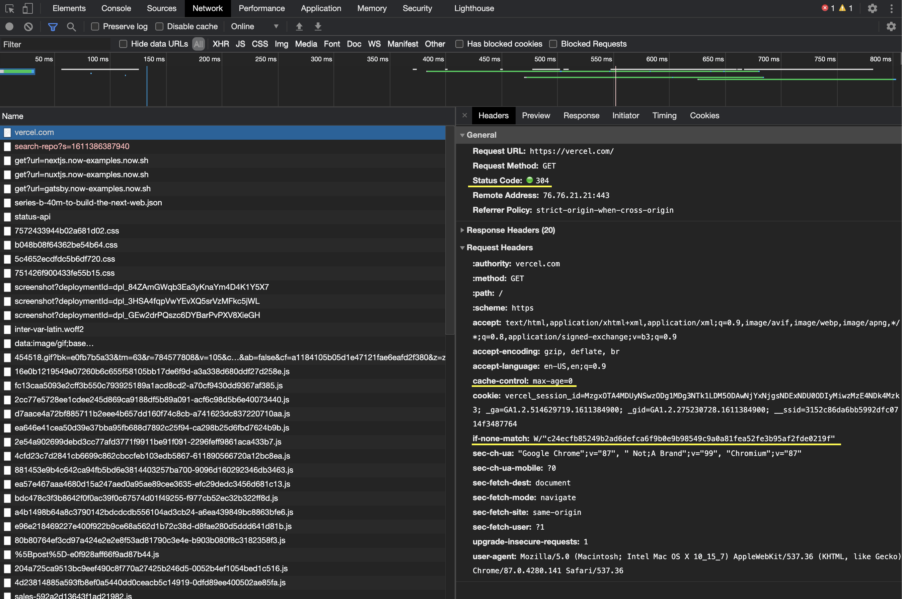
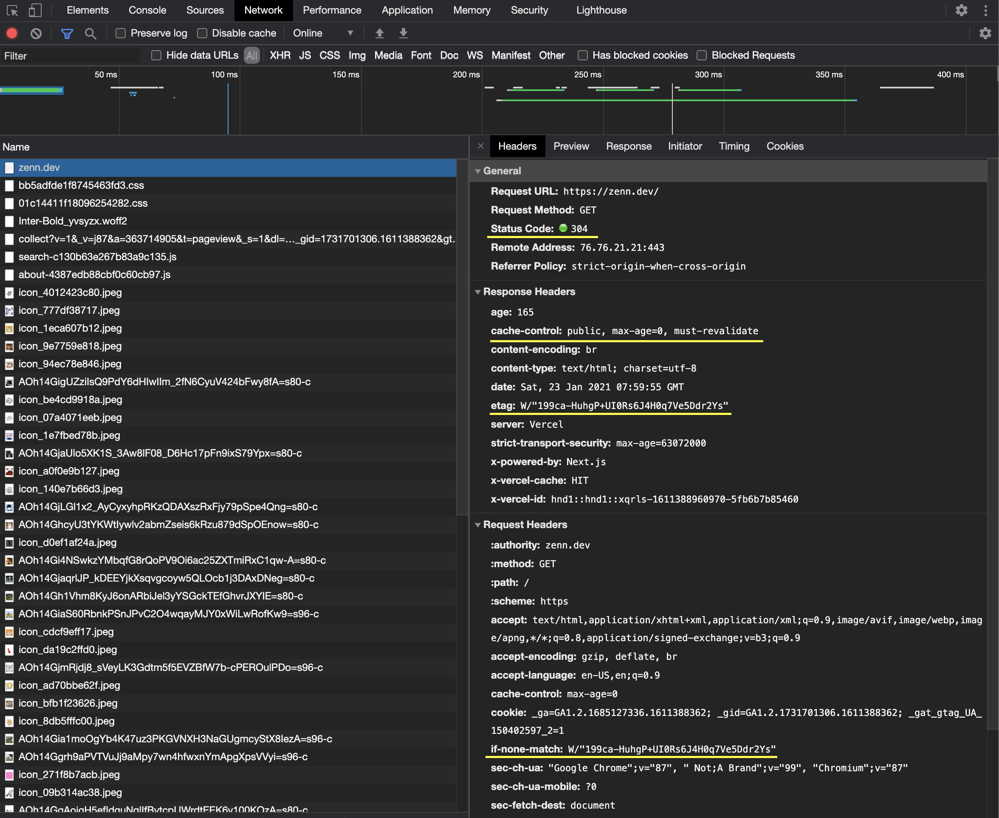
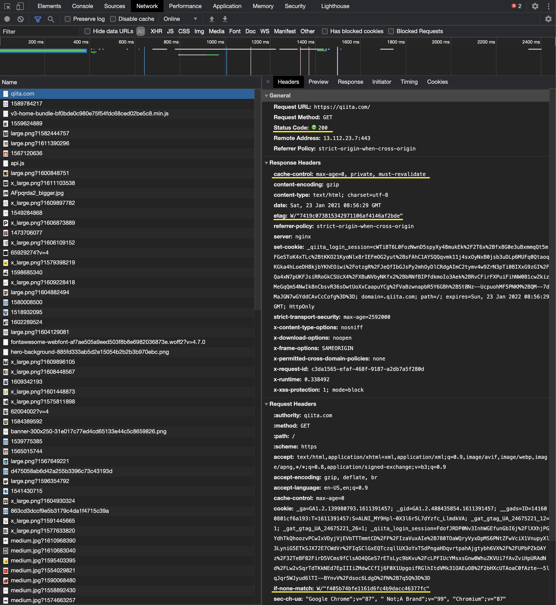
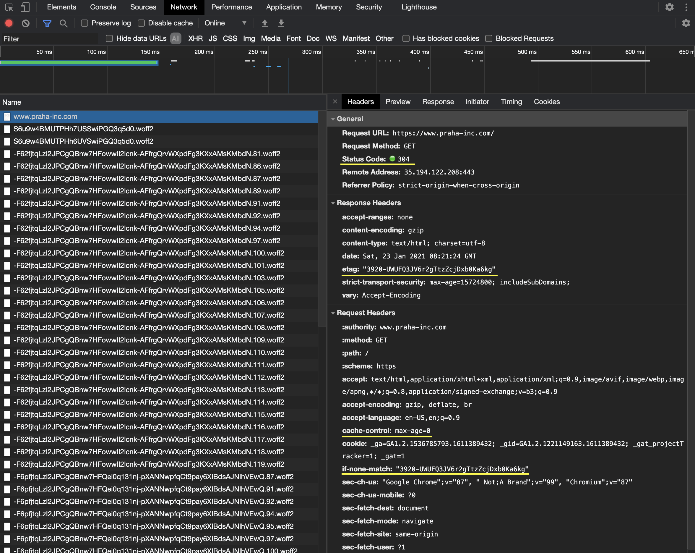

# キャッシュについて理解する

## 課題 1 (質問)

### 1

キャッシュはパフォーマンス向上のために必要。読み込みが高速になる。

[HTTP キャッシュ - HTTP | MDN](https://developer.mozilla.org/ja/docs/Web/HTTP/Caching#freshness) より、

> 過去に取得したリソースを再使用すると、ウェブサイトやアプリケーションのパフォーマンスが大きく向上するでしょう。ウェブキャッシュは遅延やネットワークのトラフィックを削減して、リソースを表示するために必要な時間も短縮します。HTTP キャッシュを使用すると、ウェブサイトの応答性が高まります。

[Prevent unnecessary network requests with the HTTP Cache](https://web.dev/http-cache/) より、

> ネットワーク経由でリソースを取得するのは、時間も費用もかかります。
>
> - 大きなレスポンスを得るためには、ブラウザとサーバーの間で何度も往復する必要があります。
> - 重要なリソースがすべて完全にダウンロードされるまで、ページは読み込まれません。
> - 限られたモバイルデータプランでサイトにアクセスしている人がいる場合、不必要なネットワークリクエストはすべて無駄になります。

### 2

キャッシュの保存場所が違う。「ブラウザキャッシュ」はブラウザに保存される個人的なもので、「プロキシキャッシュ」はプロキシに保存され、共有される。

### 3

ブラウザがキャッシュを制御するために存在するヘッダー

#### `Cache-Control`

一般ヘッダー。キャッシュを保存するかどうか、キャッシュの保存期間、再検証等を指示できる。

- no-cache
  - 毎回キャッシュを検証することを指示する
- no-store
  - キャッシュを保存しないことを指示する
- private
  - ブラウザにのみキャッシュを保存できることを指示する（プロキシには保存できない）
- public
  - 任意のキャッシュに保存できる
- max-age, s-max-age
  - キャッシュの有効期限を示す (秒)
  - s-max-age は共有キャッシュの期限を示す
  - 期限が切れると、サーバーに条件付きリクエストを送信し、キャッシュを検証・更新する
- must-revalidate
  - オリジンサーバーでの検証が成功しない限り、キャッシュは古くなったコピーを使用してはならないことを示す

#### `Expires`

レスポンスヘッダー。リソースの期限を表す。  
`max-age` `s-maxage` を持つ `Cache-Control` ヘッダーがある場合、`Expires`ヘッダーは無視される。

#### `Etag`

レスポンスヘッダー。別名エンティティタグ。リソースが同じものかどうかを判断する識別子のようなもの。  
条件付きリクエストの際に `If-Match` や `If-None-Match` ヘッダーの値として送信され、検証される。

値は二重引用符で囲む。弱い検証を使用する場合、先頭に `W/` をつける。

#### `If-Match` `If-None-Match`

リクエストヘッダー。リクエストメソッドを条件付きにする。

`If-Match` は サーバーの`Etag`と指定した etag が等しい時にのみ、リクエストされたメソッドを行うことを要求する。  
マッチしない場合、代わりに `2xx (Successful)` や `412 (Precondition Failed)` でレスポンドする。

`If-None-Match` は等しくない時にのみリクエストされたメソッドを行うことを要求する。  
マッチする場合、 `304 (Not Modified)` や `412 (Precondition Failed)` でレスポンドする。

```text
GETメソッドによるキャッシュの更新の際に使われるのが `If-None-Match` (サーバーとキャッシュが等しくない時にのみ、メソッドを実行)
PUTメソッドの際に コンフリクトを防ぐために用いられるのが `If-Match` (編集元のドキュメントとサーバーのドキュメントが等しい時にのみ、メソッドを実行)
```

- [HTTP 条件付きリクエスト - HTTP | MDN](https://developer.mozilla.org/ja/docs/Web/HTTP/Conditional_requests)
- [HTTP 入門 - とほほの WWW 入門](http://www.tohoho-web.com/ex/http.htm#If-None-Match)
- [RFC 7232 — HTTP/1.1: Conditional Requests（日本語訳）](https://triple-underscore.github.io/RFC7232-ja.html#header.if-match)

> - GET などの安全なメソッドは、一般に文書を取得するメソッドであり、条件付きリクエストは関連する文書のみを返信するために利用することができます。これによって、帯域を節約します。
> - PUT などの安全ではないメソッドは、一般に文書をアップロードするメソッドであり、条件付きリクエストは文書がサーバーに格納されているものと同じものに基づいたものである場合に限ってアップロードするようにするために利用することができます。

#### `Last-Modified`

レスポンスヘッダー。リソースが最後に変更されたとされる日時を表す。  
`If-Modified-Since` や `If-Unmodified-Since` ヘッダーの値として送信され、検証される。

#### `If-Modified-Since` `If-Unmodified-Since`

リクエストヘッダー。リクエストメソッドを条件付きにする。 etag を使用した検証よりも精度は低く、弱い検証に用いられる。

サーバーの `Last-Modified` とこのヘッダーで指定される値を比較し、サーバーの方が新しい場合に成功するのが `If-Modified-Since`。サーバーと同じまたはサーバーの方が古い場合に成功するのが `If-Unmodified-Since` 。

#### `Vary`

レスポンスヘッダー。動的コンテンツを提供する場合に使用される。  
`Vary` ヘッダーで指定された全てのヘッダーフィールドが一致しなければ、キャッシュを使用できないことを示す。

#### メモ(キャッシュの流れ)

キャッシュの流れ
キャッシュ -> ... -> 期限切れによる検証 -> 期限をリフレッシュ or リソースを取得してキャッシュを新しいものに更新

- client -> server にリクエストを送る
- client <- server レスポンス、ブラウザのキャッシュにデータが保存される (`Etag`, `Last-Modified` と共に)
- ...
- (期限内) client -> server にリクエストを送る
  - キャッシュの期限内であれば、サーバーにリクエストは送らず、キャッシュから返される
- ...
- (期限切れ) client -> server に条件付きリクエストを送る
  - `Etag`, `Last-Modified` は `If-Match` や `If-Modified-Since` ヘッダーの値として送信される
  - サーバーで`Etag` や `Last-Modified` を検証する
    - リソースに変更がない場合、`304 Not Modified` レスポンスを返す（期限が更新され、キャッシュからリソースを読み込む）
    - リソースが変更された場合、`200 OK` レスポンスで新しいリソースを送信する

[HTTP 条件付きリクエスト - HTTP | MDN](https://developer.mozilla.org/ja/docs/Web/HTTP/Conditional_requests) の図がわかりやすかったです。

#### メモ(キャッシュの検証)

- 検証には `強い検証` と `弱い検証` があり、HTTP では規定で `強い検証` 使用する。
- `強い検証` はバイト単位の同一性が求められる場合に、`弱い検証` はそこそこの同一性で良い場合に使用する。
- 検証の材料として使用されるヘッダーが `Etag` `Last-Modified` で、`強い検証` には `Etag` を使用する。

### 4

各ブラウザのキャッシュサイズの上限、上限を超えるとどうなる？

- FireFox
  - サイズ: デフォルト -> 256000kB (256 MB, v72.0.2)、空き容量に応じて変化 (`browser.cache.disk.smart_size.enabled`)、
  - 上限は特になし？(適当に大きな数字を入れたところ `2147483647 以下の値を選択してください` の表示) (32 ビット符号つき 2 進整数の最大値)
    - FireFox の設定で `browser.cache.disk.capacity` を確認
    - [Hello. How to change the size of disk cache in Firefox quantum 69.0.2 or later ? I need more cache space for my tasks. | Firefox Support Forum | Mozilla Support](https://support.mozilla.org/en-US/questions/1270059)
  - 超えた際の動作: 古いものから削除される？
    - [Disable the automatic cleaning of cache files on disk | Firefox Support Forum | Mozilla Support](https://support.mozilla.org/en-US/questions/1269059#answer-1253018)
  - SearchFox の見方がわからない
- Chrome
  - サイズ: 起動時に計算される（おおよそ ディスク空き容量の 10%）
  - 上限は特になし？
    - https://superuser.com/a/1577693
  - 超えた際の動作: 上書きする？
    - [In which scenarios will Google Chrome clear its cache itself, not by user request? - Super User](https://superuser.com/questions/766866/in-which-scenarios-will-google-chrome-clear-its-cache-itself-not-by-user-reques)
- Edge
  - 上限: 2000000000 byte (2 GB)
    - [Set disk cache size, in bytes](https://admx.help/?Category=EdgeChromium&Policy=Microsoft.Policies.Edge::DiskCacheSize)
  - 超えた際の動作: 不明

### 5,6

> なぜ、動的なサイトをキャッシュする際に `Expires` ヘッダーを使用しない方がいいのか？どうすべきなのか？

動的なサイトはリソースが変わる頻度が高いため、キャッシュが古くなりやすい。よって、 `Expires` `Cach-Control: max-age=xxx` を使用して検証なしで使用できる期間を定めるのは適切ではない。

`Cache-Control` ヘッダーに `no-cache` を指定して毎回キャッシュの検証を行うことを指示し、`Etag` 等を検証することでリソースが変更されているかを細かく確認するべき。

### 7

キャッシュが用いられている実例

- vercel.com
- zenn.dev
- qiita.com
- www.praha-inc.com

#### vercel.com

画像はトップページ (vercel.com) に再リクエストしたときのもの。

max-age=0 のためリクエストのたびにキャッシュの検証が行われる。`If-None-Match` に含めた etag を検証し、変更がなかったためリソースを取得せず、`304 (Not Modified)` ステータスコードがレスポンドされている。



- トップページ
  - キャッシュを毎回検証する、弱い検証を使用する
  - `cache-control: public, max-age=0, must-revalidate`
  - `Etag` + `W/` オプション
- css ファイル, js ファイル
  - キャッシュを 1 年間保持する、不変
  - `cache-control: public,max-age=31536000,immutable`
  - `Etag`+ `W/` オプション
- font ファイル
  - キャッシュを 1 年間保持する、不変、プロキシが内容を変更してはならない
  - `cache-control: public, no-transform, immutable, max-age=31536000`
  - `Etag`
- svg ファイル, jpg ファイル
  - キャッシュを 7 日間保持する、不変、プロキシが内容を変更してはならない
  - `cache-control: public, no-transform, immutable, max-age=604800`
  - `Etag` + `W/`
- fetch (series....build-the-next-web.json)
  - キャッシュを毎回検証する、弱い検証を使用する
  - `cache-control: public, max-age=0, must-revalidate`
  - `Etag` + `W/`
- fetch (/status-api)
  - キャッシュを毎回検証する、**強い検証**を使用する
  - `cache-control: public, max-age=0, must-revalidate`
  - `Etag`

#### zenn.dev

画像はトップページ (zenn.dev) に再リクエストしたときのもの。

中身が Vercel にホスティングされた Next.js なので（おそらく）vercel.com とあまり変わらなかった。



- トップページ
  - `cache-control: public, max-age=0, must-revalidate`
  - `Etag` + `W/`
- jpeg ファイル
  - `cache-control: max-age=31536000`
  - `Etag`
- font ファイル
  - `cache-control: public, no-transform, immutable, max-age=2592000`
  - `Etag`
- css ファイル、js ファイル
  - `cache-control: public,max-age=31536000,immutable`
  - `Etag` + `W/`
- xhr (api.zenn.dev/articles)
  - `cache-control: max-age=0, private, must-revalidate`
  - `Etag` + `W/`

#### qiita.com

トップページに (qiita.com) に再リクエストしたときのもの。

max-age=0 のためリクエストのたびにキャッシュの検証が行われる。`If-None-Match` に含まれる etag を検証し、一致しなかったため新しくリソースを取得している (`200 OK` がレスポンドされた)。

何度再読み込みしてもトップページからは 304 が返ってこなかった。トップページが高頻度で更新されており、`Etag` が常に変化している？



- トップページ
  - `cache-control: max-age=0, private, must-revalidate`
  - `Etag` + `W/`
- css, js (from cdn.qiita.com)
  - `cache-control` なし
  - `Etag` + `W/` `Last-Modified`
- jpeg (S3)
  - `cache-control` なし
  - `Etag` `Last-Modified`

#### www.praha-inc.com

画像はトップページ (www.praha-inc.com) に再リクエストしたときのもの。

`cache-control`, `Expires`, `Last-Modified` が設定されていないため、リクエストのたびに検証が行われる？（確証なし）`If-None-Match` に含めた etag を検証し、変更がなかったため `304` がレスポンドされている。

> If Expires is invalid (e.g., the string 0), they’ll consider the response stale – unless there’s a Cache-Control: max-age.

[mnot’s blog: The State of Browser Caching, Revisited](https://www.mnot.net/blog/2017/03/16/browser-caching#heuristic-freshness)

google フォントからのレスポンスには `Etag`ヘッダーが含まれておらず、 `Last-Modified` のみが含まれていたのが特徴的だと感じた。



- トップページ
  - `cache-control` なし & `Expires` なし
  - `Etag`
- font ファイル (google font)
  - `cache-control: public, max-age=31536000`
  - `Last-Modified`
- gif ファイル、png ファイル (cloud storage)
  - `cache-control: public, max-age=3600`
  - `Etag` `Last-Modified`
- js ファイル
  - `cache-control: public, max-age=31536000`
  - `Etag` + `W/` `Last-Modified`

## 課題 2 (実装)

```sh
npm run start
or
yarn start
```

- localhost:8000
  - /: ページを表示して以下のエンドポイントから画像を取得
  - /cache: 同じクライアントの場合ブラウザキャッシュ
    - `Cache-Control: private, max-age=86400`
  - /no-cache: ブラウザキャッシュしない
    - `Cache-Control: no-store, max-age=0`
  - [Cache-Control - HTTP | MDN](https://developer.mozilla.org/en-US/docs/Web/HTTP/Headers/Cache-Control) に、no-storeではだけではすでにキャッシュされているリソースが使用されるのを防ぐことはできない、という記述があったため、キャッシュのクリアのために max-age=0をつけた

## 課題 3 (質問)

ブラウザキャッシュしてはいけないケース

- 機密情報・個人情報を含むページ
  - CDN 使用時・設定変更時にキャッシュ流出している事例が多い
  - あるユーザーキャッシュが別のユーザーに表示されている
    - [CDN 切り替え作業における、Web 版メルカリの個人情報流出の原因につきまして | メルカリエンジニアリング](https://engineering.mercari.com/blog/entry/2017-06-22-204500/)
    - [成人動画サービスの顧客情報漏えい続報、原因はＣＤＮのキャッシュか（ソフト・オン・デマンド） | ScanNetSecurity](https://scan.netsecurity.ne.jp/article/2020/03/31/43887.html)
  - 共有の端末の場合、他のユーザーが確認できてしまう? (クッキーでセッション維持されていたらキャッシュ関係なく見れてしまうのであまり関係ない？)
  - > 保護されたコンテンツがブラウザにキャッシュされないようにすることで、権限のないユーザーが保護されたコンテンツを閲覧できてしまうリスクを減らすことができる。
  - [6.7. ブラウザのセキュリティ対策機能との連携 — TERASOLUNA Server Framework for Java (5.x) Development Guideline 5.1.0.RELEASE documentation](https://terasolunaorg.github.io/guideline/5.1.0.RELEASE/ja/Security/LinkageWithBrowser.html)
  - [重要情報の漏えいにつながるスマホアプリのキャッシュ問題と対策 | セキュリティ対策のラック](https://www.lac.co.jp/lacwatch/people/20180228_001581.html)
- 変更の頻度が高い・リアルタイム性のあるページやその API
  - 高頻度で更新されるため、もちろん期限を決めてキャッシュしてはいけない
  - リクエストのたびに検証する(no-cache, max-age=0)のもパフォーマンスの無駄？
  - `no-store` 設定されていた WEB サービス
    - twitter.com のタイムラインのページ (twitter.com/home)
    - figma.com の編集ページ (figma.com/file/XXXXXX)
    - グーグル翻訳のページ (translate.google.com)
    - airtable
- 放置されそうなもの
  - > 5 年後の担当者が地雷を踏むといった事にならないようにしつつやっていきましょう！
  - [CDN に動的コンテンツを安全に通すにはどうするべきか - 方向](https://vector.hateblo.jp/entry/2017/06/24/122724)

## 課題 4 (クイズ)

### クイズ 1

`If-Match` ヘッダー `If-None-Match` ヘッダーはどちらも条件付きリクエストの際に使用されるヘッダーです。それぞれどのような場合に使用されますか？

<details><summary>回答例</summary>

GET メソッドによるキャッシュの更新の際に使われるのが `If-None-Match` (サーバーとキャッシュが等しくない時にのみ、メソッドを実行)

PUT メソッドの際に コンフリクトを防ぐために用いられるのが `If-Match` (編集元のドキュメントとサーバーのドキュメントが等しい時にのみ、メソッドを実行)

[HTTP 条件付きリクエスト - HTTP | MDN](https://developer.mozilla.org/ja/docs/Web/HTTP/Conditional_requests)

> - GET などの安全なメソッドは、一般に文書を取得するメソッドであり、条件付きリクエストは関連する文書のみを返信するために利用することができます。これによって、帯域を節約します。
> - PUT などの安全ではないメソッドは、一般に文書をアップロードするメソッドであり、条件付きリクエストは文書がサーバーに格納されているものと同じものに基づいたものである場合に限ってアップロードするようにするために利用することができます。

</details>

### クイズ 2

`Cache-Control: max-age=xxx`, `Expires`, `Last-Modified` はそれぞれどのように違いますか？

<details><summary>回答例</summary>

`Cache-Control: max-age=xxx`, `Expires` キャッシュの有効期限を表す。`max-age`は秒数で指定し、`Expires`は日時で指定する。両方指定されている場合は `max-age` が優先される。

`Last-Modified` はリソースが最後に変更されたとされる日時を表す。主にキャッシュを更新 (検証) する時に使用される。

</details>

### クイズ 3

`Cache-Control: must-revalidate`, `Cache-Control: no-cache`, `Cache-Control: max-age=0` はどれもキャッシュの検証を要求する効果があります。それぞれに違いはありますか？それとも大きな違いはないでしょうか？

<details><summary>回答例</summary>

大きな違いはない。

[Cache-Control - HTTP | MDN](https://developer.mozilla.org/en-US/docs/Web/HTTP/Headers/Cache-Control) (英語版の方) より、

> no-cache and max-age=0, must-revalidate indicates same meaning.

しかし RFC によると、`must-revalidate` はサーバーにより正常に検証されるまで、キャッシュを使用しないことを要求するとの記載がある(接続が切断した場合など)。RFC7234 ではサーバーにリクエストが到達しなかった場合 `504 (Gateway Timeout)` を返すべきとしている。

[RFC 7234 - Hypertext Transfer Protocol (HTTP/1.1): Caching](https://tools.ietf.org/html/rfc7234#section-5.2.2.1) より、

> The must-revalidate directive is necessary to support reliable
> operation for certain protocol features. In all circumstances a
> cache MUST obey the must-revalidate directive; in particular, if a
> cache cannot reach the origin server for any reason, it MUST generate
> a 504 (Gateway Timeout) response.

が、実際は実装されていない場合が多い、、？

[Cache-Control ヘッダは仕様通り実装されていない？(2) - Qiita](https://qiita.com/shibukawa/items/85fca33a96704737c075) より、

> Squid のソースを眺めてみたところ一応異なる制御になっているが厳密に 504 とする部分は TODO と読めた。

また、`max-age=0`の場合は古いキャッシュが使われてしまう可能性があるようだ。

[Cache-Control - HTTP | MDN](https://developer.mozilla.org/en-US/docs/Web/HTTP/Headers/Cache-Control) (英語版の方) より、

> Note: Following may serve stale resource if server is down or lose connectivity.
>
> ```http
> Cache-Control: max-age=0
> ```
</details>
