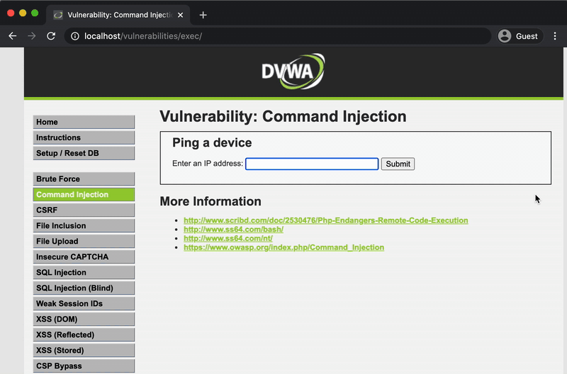
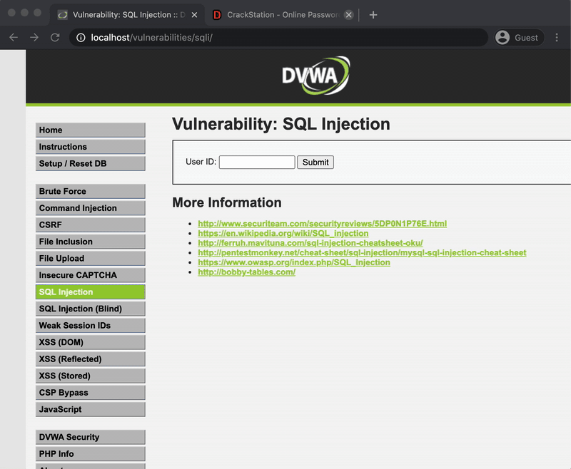
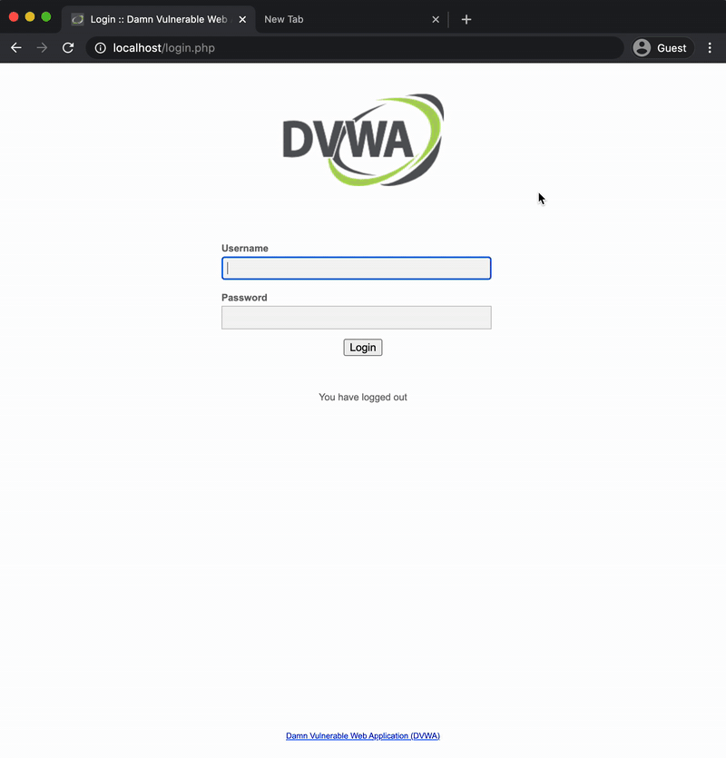
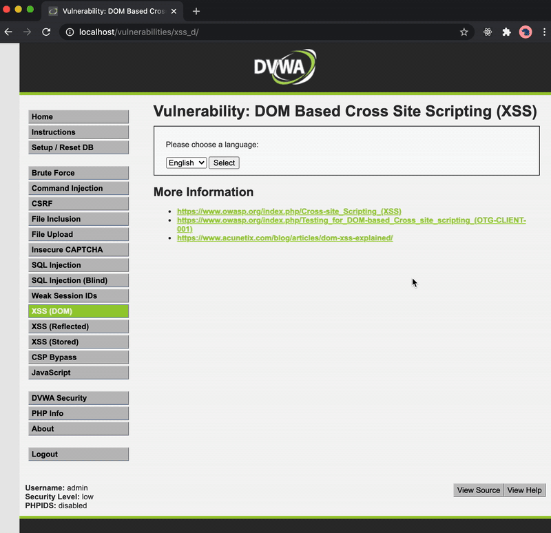

# WEBサービスの代表的な脆弱性を理解する

## 課題1 (質問)

### XSS

#### 仕組み

クロスサイトスクリプティング。悪意のあるスクリプトをWEBサイト上に紛れ込ませ、ユーザーのブラウザ上で実行させる攻撃手法。

#### 被害

差し込まれたスクリプトは、同じオリジン上の (信頼された) スクリプトとして動作するため、Same-Origin Policyの制約を受けず、同サイト上へのリクエストにはクッキーが送信される。よって、HttpOnly属性のついていないクッキーを外部サイトに送信されてしまったり、別の認証が必要なページにアクセスして機密情報を盗み出されるような被害が考えられる。

#### 対処法

外部から受け取った値はすべて危険なものとして扱い、エスケープ処理を行うことが必要。

> クロスサイトスクリプティング（XSS）とは、悪意あるクライアントサイドのコードを Web サイトに差し込むセキュリティ攻撃です。差し込まれたコードは被害者のブラウザー上で実行され、アクセス制限の回避やユーザーへのなりすましなどにつながります。

[Cross-site scripting (クロスサイトスクリプティング) - MDN Web Docs 用語集: ウェブ関連用語の定義 | MDN](https://developer.mozilla.org/ja/docs/Glossary/Cross-site_scripting)

### コマンドインジェクション

#### 仕組み

> コマンドインジェクションは、攻撃者が Web アプリケーションを通して、Web サーバが動作する OS でコマンドを実行できてしまう脆弱性です。

ユーザーから受け取ったデータを元にOSでコマンドを実行する処理で、入力の検証が不十分だった場合、意図しないコマンドが実行されてしまう。

#### 被害

サーバーのコントロール権を取得できれば、大抵のことはできそう。

> - 情報の漏えい（顧客のデータの読み取り）
> - サーバー内にあるファイルへのアクセス・改ざん・削除
> - データベースの変更・破壊
> - ウィルスなどのマルウェア感染
> - サーバー自体の乗っ取り
> - DDoS 攻撃の踏み台サーバー化

#### 対処法

なるべくOSコマンドをWEBアプリケーション上から呼び出さなくてもいいような実装にする。OSコマンドを実行する場合は厳格なホワイトリスト方式のバリデーションを実施することが必要。サニイジングでは迂回される可能性が高い。

> ホワイトリスト方式で受け付けるデータを限定する（例えば英数字のみしか受け付けない）バリデーションを必ず実施するようにしてください。
>
> シェルのメタ文字をエスケープして入力をサニタイジングすることは避けるべきでしょう。
> 完全なサニタイジングは難しく、豊富な経験を持つ攻撃者であれば迂回する方法を見つけてしまう可能性があるためです。

引用は全て [OS コマンドインジェクション その危険性と対策 | yamory Blog](https://yamory.io/blog/about-os-command-injection/) より。

#### メモ

最近、VSCodeのレポジトリにこの脆弱性があったらしい ([VSCodeのGitHubリポジトリに対する不正なPushアクセス - RyotaK's Blog](https://blog.ryotak.me/post/vscode-write-access/))

### SQLインジェクション

#### 仕組み

悪意のあるユーザーの入力を元にSQL文を組み立てることで、意図しないSQL文を実行できてしまう脆弱性。

#### 被害

データベースの流出・改ざんによる被害が考えられる。

> - データベースに蓄積された非公開情報の閲覧
>   - 個人情報の漏えい 等
> - データベースに蓄積された情報の改ざん、消去
>   - ウェブページの改ざん、パスワード変更、システム停止 等
> - 認証回避による不正ログイン（*1）
>   - ログインした利用者に許可されている全ての操作を不正に行われる
> - ストアドプロシージャ等を利用したOSコマンドの実行
>   - システムの乗っ取り、他への攻撃の踏み台としての悪用 等

[安全なウェブサイトの作り方 - 1.1 SQLインジェクション：IPA 独立行政法人 情報処理推進機構](https://www.ipa.go.jp/security/vuln/websecurity-HTML-1_1.html)

#### 対処法

対策として、エスケープ処理よりもバインド機構 (あらかじめ組み立てた文にパラメータを埋め込む方法) というものが推奨されているようだ。

[SQLインジェクション - Wikipedia](https://ja.wikipedia.org/wiki/SQL%E3%82%A4%E3%83%B3%E3%82%B8%E3%82%A7%E3%82%AF%E3%82%B7%E3%83%A7%E3%83%B3) より、

> 言語毎に用意されたバインド機構の利用
>
> SQLインジェクションを防ぐには、入力値を適切にエスケープできればよい。しかしながら、前節に挙げたように、入力値を適切にエスケープすることは、それほど単純に行えるわけではない。データベースシステムやライブラリによっては、バインド機構と呼ばれる仕組みを用いてエスケープ処理不要で安全にSQLを発行する方法が設けられているものがあり、対策もれを防ぐ上で有用である。

[SQLインジェクション対策について - IPA](https://www.ipa.go.jp/files/000024396.pdf) より、

> - SQL文の組み立てには必ずエスケープ処理を実装する
>   - バインド機構を推奨

### CSRF

#### 仕組み

[CSRF - MDN Web Docs 用語集: ウェブ関連用語の定義 | MDN](https://developer.mozilla.org/ja/docs/Glossary/CSRF) より、

> 信頼されたユーザーになりすまし、ウェブサイトに対して不正なコマンドを送信する攻撃です。

ユーザーのセッションやリクエスト時に自動的に付与される情報 (主にクッキー) を利用することでユーザーに成りすますことができる。攻撃者が用意したURLに権限をもったユーザーがアクセスすることで、サーバーに不正なリクエストが送信されサーバー上でユーザーの意図しない処理が行われる。

#### 被害

不正書き込みや閲覧・意図しない設定の変更などの被害が考えられる。

#### 対処法

対策としては、Same-Site属性をstrictに設定して外部のサイトからのリクエストの際にクッキーを送信しないようにする方法、予測不可能な値 (CSRFトークン) をページに埋め込み、一致するか検証することで意図したページからのリクエストかどうかを検証する方法がある。

## 課題2 (クイズ)

### クイズ1

CSRF対策として、 `Same-Site=Strict` をセッションクッキーに設定したときに考えられる弊害は何でしょうか？

回答例

別のサイトから遷移した際にもクッキーが送信されないため、毎回ログインが必要になりユーザーの利便性が損なわれる。

### クイズ2

CSRF対策としてよく使用される、CSRFトークンとは何か説明してください。

回答例

意図したフォームからのリクエストかどうかを判断するための、予測不可能な値。サーバーはページ生成時にトークンを発行し、フォームに埋め込む。その後、フォームからのリクエストの際に、発行したものと一致する (= 意図したフォームからのリクエストである) かを検証する。

### クイズ3

CSRFトークンはどのような値にするべきですか？

回答例

ワンタイムで予測不能な値。総当たり攻撃や予測によってトークンが特定されようにしなければならない。

## 課題3 (実演)

docker環境での実演を行った。

### コマンドインジェクション

`sed` コマンドを実行し、`index.php` を置換することでページの一部を書き換えた。

#### 対策

- 入力をサーバーで検証する
- IPアドレス・ドメイン名 かどうかをサーバーで検証し、それ以外のものを受け付けないようにする

### SQLインジェクション

[SQL Injection Exploitation – DVWA – Penetration Testing Lab](https://pentestlab.blog/2012/09/18/sql-injection-exploitation-dvwa/) を参考に、

`' union select from null,password form users #` を実行し、パスワード一覧を取得。

[CrackStation](https://crackstation.net/) でハッシュを解析してパスワードを奪取した。

#### 対策

- 入力をそのままSQLに渡さない
- 今回のケースであれば、数字 (user ID) かどうかをサーバーで検証し、数字以外のものを受け付けないようにする

### CSRF

普通にログインしてセッションクッキーを取得。その後攻撃用のサイトに移動。

攻撃用のサイトには `<form>` が埋め込まれており、3秒後に DVWAのパスワード変更ページにリクエストを送信するような仕掛けをしてある。

パスワードを変更するリクエストがセッションクッキーとともに送信され、パスワードが変更された。

#### 対策

- クッキーに `Same-Site=Lax` 属性をつけることで、他のサイトからクッキー付きのリクエストを送信できないようにする
- フォームにCSRFトークンを埋め込み、正しいページからのリクエストかどうかを検証する

### XSS

`` をクエリパラメータに渡し、ブラウザ上で実行させた。

#### 対策

- ユーザーの入力をそのまま出力せず、エスケープ処理を行う
