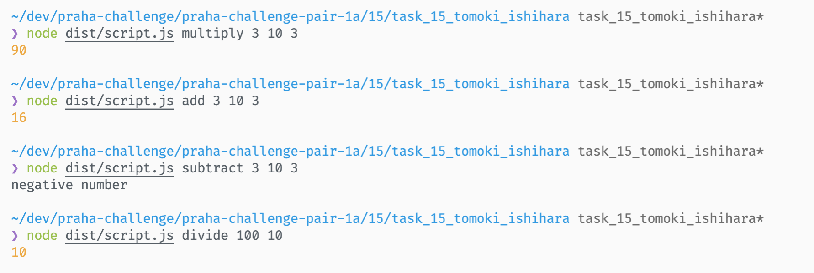

# TDD（テスト駆動開発）でコードを書いてみる

## 質問

### 1

- メリット
  - 小さなタスクに分解することで、仕様がはっきりする
    - コードを書きやすい
    - 実装し忘れが起きにくい
    - 疎結合な実装・シンプルな実装に強制される
  - 「作る前に使う」ので使いやすいものができやすい
  - テストコードがドキュメント・仕様書になる
  - 仕様を満たしていることが明らかになる
    - → コードに変更を加えやすくなる
  - デバッグの時間が減る
  - 達成感がある (レッドグリーンリファクタリングの小さなサイクルを回すので)
  - 細かい単位で作業を進められる (工数見積もりをやりやすそう？)
- その他メリット
  - 最大の理由は心理的なもの
    - 即座にフィードバックが得られる
    - 書いたコードに自信を持つことができる
    - これから書くコードに自信を持つことができる
    - [TDD のこころ](https://www.slideshare.net/t_wada/the-spirit-of-tdd)
  - TDDはテスト技法ではなく設計手法
    - [テスト駆動開発（TDD）とは何か。コードで実践方法を解説します - パンダのプログラミングブログ](https://panda-program.com/posts/test-driven-development)
- デメリット
  - 強いて言うなら、1個ずつ実装していくことの煩わしさがあった
  - あまりなさそう、、？
  - 学習コスト・教育コストがかかる? (でもTDDに限った話ではないような、、)
  - 仕様変更が頻繁にあった場合大変? (でもTDDをやらない場合よりも変更はしやすいのでは、、？)
  - プロジェクトが巨大だとテストの実行に時間がかかる? (ツールでカバーできそう、、？テスト実行範囲を状況に合わせて変えるなど)

### 2

### 三点測量

- 三角測量とも。仮実装に対して別のテストケース与えることによってまともな実装に戻していくこと。
- 一般的な実装がわからないときにテスケースを増やすテクニック

一般的な実装がわかる場合は、三角測量を行わず `明白な実装` に移って良い。

[テスト駆動開発（TDD）とは何か。コードで実践方法を解説します - パンダのプログラミングブログ](https://panda-program.com/posts/test-driven-development)


### レッド・グリーン・リファクタリング

- レッド: テストコードを実行して失敗することを確認する
- グリーン: できる限り最短でテストが通るように実装する
- リファクタリング: テストが通るままでプロダクトコードとテストコードを理解が容易になるように改善する

「動作するきれいなコード」を実現するために、まず動作するコードを書き (グリーン)、その後動作する状態を保ちつつきれいなコードにしていく (リファクタリング)。

逆の順番だと、ソフトウェア開発は予測が立ちにくいため、どこまでもきれいな設計を求めてしまい時間がかかるのに加え、きれいだが動かないコードができる可能性がある。

> - 「きれいで動かない」という状態から抜けられない。  
> → つまり、「きれいな設計にしたい」という欲求から抜けられない。完璧を求めてしまう。
> - システム開発にはスケジュールがある。
> - コードを書き始めてから、いろいろ分かり始める。  
> →　「ここまで設計する必要は無かった」とか「きれいな設計だけど遅すぎて使えない」とかが分かり始める。
> - ソフトウェア開発は登場人物が多すぎるので、予測が立ちにくい。  
> →　手を動かしてみて初めてわかる。
>
> [テスト駆動開発(TDD) - Qiita](https://qiita.com/takagi-shun/items/a7465ccaffbf6108e1b6)

### 仮実装

テストに要求される値そのものをハードコーディングすること。テストコードに誤りがないかを確認するために行う。(テストのテスト)

> テストに要求される値そのものをハードコーディングする
>
> [テスト駆動開発 - Wikipedia](https://ja.wikipedia.org/wiki/%E3%83%86%E3%82%B9%E3%83%88%E9%A7%86%E5%8B%95%E9%96%8B%E7%99%BA)

> ベタなコードを書いてテストを成功させにいくテクニック。テストのテストを先にやっていくテクニック。
>
> [TDD Boot Camp 2020 Online #1 基調講演/ライブコーディング - YouTube](https://www.youtube.com/watch?v=Q-FJ3XmFlT8)

## 実装

### 実行コマンド

インストール & ビルド

```sh
yarn
yarn build
```

実行例

```sh
node dist/script.js multiply 3 10 3
```

### 実行結果



[TODOリスト](TODO.md)

### メモ

- `node script.js add 100 100` をどのように実現するか？
  - main関数を用意して、CLI引数によって呼び出した
  - [コマンドライン引数を処理する · JavaScript Primer #jsprimer](https://jsprimer.net/use-case/nodecli/argument-parse/)
- 環境構築
  - yarn init
  - typesciprt
    - yarn add -D typescript
    - yarn tsc --init
    - tsconfig.json の outDirとrootDirを修正
    - scirptsにbuildコマンドを追加
  - jest
    - yarn add -D jest
    - yarn add -D ts-jest @types/jest
    - yarn ts-jset config:init
    - scriptsに testコマンドを追加
  - husky, lint-staged
    - npx mrm lint-staged
    - pre-commitコマンドを少し修正
  - build時にテストファイルをignore
    - tsconfig.prod.jsonを作り、build時に読み込むようにした
