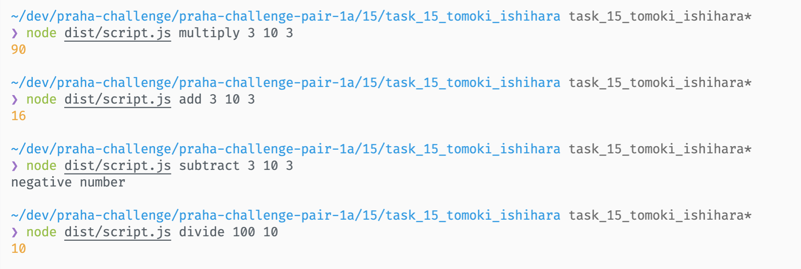

- 分割統治・各個撃破
- 重要・テスト容易性高い ものと 重要でない・容易性低いものにわける
- 作る前に使う
- テストの構造化とリファクタリング

---

- [x] 四則演算を行うscript.js
  - [x] node script.js multiply 3 10 3 を実行すると 90 を出力する
  - [x] node script.js add 3 10 3 を実行すると 16 を出力する
  - [x] node script.js subtract 3 10 3 を実行すると negative number を出力する
  - [x] node script.js divide 100 10 を実行すると 10 を出力する

目視にて確認

---

- fourArithmeticOperationsクラスは四則演算を実行する
  - [x] exec関数は渡された引数に対して計算を行い結果を返す
    - [x] 先頭の引数 (任意の文字列) をみて、対応する計算を実行する
      - [x] 先頭が multiply の場合 multiply関数を実行する
        - [x] "multiply", 2, 3 を渡すと 6 を返す
      - [x] 先頭が add の場合 add関数を実行する
        - [x] "add", 1, 1 を渡すと 2を返す
      - [x] 先頭が subtract の場合 subtract関数を実行する
        - [x] "subtract", 10, 3 を渡すと 7 を返す
      - [x] 先頭が divide の場合 divide関数を実行する
        - [x] "divide", 7, 2 を渡すと 3.5 を返す
      - [x] 先頭が multiply/add/subtract/divide 以外の場合、エラーが発生する
        - [x] "mod", 2 を渡すと エラーが発生する
        - [x] "mod" を渡すとエラーが発生する
        - [x] 何も渡さない場合 エラーが発生する
    - [x] 先頭以外の引数についての制限
      - [x] 1個〜30個までの引数を受け取る
        - [x] 31個以上の引数を渡すとエラーが発生する
        - [x] 30個の引数を渡すと結果をそのまま返す
        - [x] 引数を渡さない場合エラーが発生する
      - [x] 数字ではない場合エラーが発生する
        - [x] "add", "zero" を渡すとエラーが発生する
- multiply 関数は引数を全て乗算して結果を返す
  - [x] 計算結果が1000以下の場合は結果をそのまま返す
    - [x] 2, 3 を渡すと 6 を返す
    - [x] 2, 3, 0 を渡すと 0 を返す
  - [x] 計算結果が1000を越える場合は "big big number" という文字列を返す
    - [x] 1001 を渡すと "big big number" を返す
    - [x] 10, 10, 10 を渡すと 1000 を返す
- add 関数は引数を全て加算して結果を返す
  - [x] 結果が1000以下の場合 結果をそのまま返す
    - [x] 1, 1 を渡すと 2 を返す -> 仮実装
    - [x] 1, 1, 1 を渡すと 3 を返す -> 三角測量 // 削除
  - [x] 結果が1000より大きい場合は "too big" という文字列を返す
    - [x] 1001 を渡すと "too big" を返す
    - [x] 1000 を渡すと 1000 を返す
  - [x] 引数がない場合
    - [x] 引数が一つも無い場合は 0 を返す
- subtract 関数は先頭の引数から残りの引数を減算して結果を返す
  - [x] 結果が0以上の場合は結果をそのまま返す
    - [x] 10, 1 を渡すと 9 を返す
    - [x] 10, 2, 1 を渡すと 7 を返す
  - [x] 結果が0より小さい場合は "negative number" という文字列を返す
    - [x] 1, 10 を渡すと "negative number" を返す
    - [x] 1, 1 を渡すと 0 を返す
  - [x] 引数がない場合
    - [x] 引数が一つも無い場合は 0 を返す
- divide 関数は先頭の引数から残りの引数を除算して結果を返す
  - [x] 結果の少数点以下の桁数が10桁未満の場合はそのまま返す
    - [x] 10, 2 を渡すと 5 を返す
    - [x] 1, 10, 10, 10 を渡すと 0.001 を返す
  - [x] それ以外の場合は 小数第10位で四捨五入した結果を返す
    - [x] 0.12345678905 を渡すと 0.1234567891 を返す
  - [x] 引数に関する例外
    - [x] 引数がない場合 0 を返す
    - [x] 先頭の引数以外に0が含まれる場合、例外を発生させる

---

- 有効桁数が15桁のようなので、キリの良い10桁とした
  - [数値 | JavaScript プログラミング解説](https://so-zou.jp/web-app/tech/programming/javascript/grammar/data-type/number/#floating-point)
  - [JavaScriptの数値計算はどれくらい正確なのか](https://zenn.dev/uhyo/articles/javascript-math-accuracy#%E3%81%8A%E3%81%BE%E3%81%91%3A-webassembly%E3%81%AE%E6%95%B0%E5%80%A4%E8%A8%88%E7%AE%97%E3%81%AE%E6%AD%A3%E7%A2%BA%E3%81%95)
  - [倍精度浮動小数点数 - Wikipedia](https://ja.wikipedia.org/wiki/%E5%80%8D%E7%B2%BE%E5%BA%A6%E6%B5%AE%E5%8B%95%E5%B0%8F%E6%95%B0%E7%82%B9%E6%95%B0)
