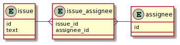

# データベースにおけるNULLの扱い

## 1

### 1, 2, 3

`NULL = 0`, `NULL = NULL`, `NULL <> NULL`

-> NULLは値との比較ができないため、 `NULL` になる

> NULL に関する算術比較は、結果もすべて NULL になるため、このような比較から意味のある結果を得ることはできません。
>
> [MySQL :: MySQL 5.6 リファレンスマニュアル :: 3.3.4.6 NULL 値の操作](https://dev.mysql.com/doc/refman/5.6/ja/working-with-null.html)

### 4, 5

`NULL AND TRUE`, `NULL AND FALSE`

MySQLのAND演算の結果は、以下のようにまとめられる。

| NULLの数 | 結果 |
| --- | --- |
| どちらもNULLではない (0) | 0が含まれる → 0<br>含まれない → 1 |
| 少なくとも片方がNULL (1以上) | 0が含まれる → 0<br>含まれない → NULL |

`NULL AND TRUE`

-> NULLが含まれており、0が含まれていないため、 `NULL` になる

`NULL AND FALSE`

-> NULLが含まれており、0 (FALSE) が含まれているため `0` になる

> AND 演算。すべてのオペランドがゼロ以外で非 NULL の場合は 1 に、1 つ以上のオペランドが 0 の場合は 0 に評価され、それ以外の場合は NULL が返されます。
>
> [MySQL :: MySQL 5.6 リファレンスマニュアル :: 12.3.3 論理演算子](https://dev.mysql.com/doc/refman/5.6/ja/logical-operators.html#operator_or)

### 6

`NULL OR TRUE`

MySQLのOR演算の結果は、以下のようにまとめられる。

| NULLの数 | 結果 |
| --- | --- |
| どちらもNULLではない (0) | 0,NULL以外が含まれる → 1<br>含まれない → 0 |
| 少なくとも片方がNULL (1以上) | 0,NULL以外が含まれる → 1<br>含まれない → NULL |

`NULL OR TRUE` は、片方がNULLであり、0,NULL以外 (1) が含まれているため、 `1` になる

> 論理 OR。両方のオペランドが非 NULL であれば、オペランドのいずれかがゼロ以外である場合の結果は 1、それ以外の場合は 0 になります。NULL オペランドが 1 つあれば、ほかのオペランドがゼロ以外である場合の結果は 1、それ以外の場合は NULL になります。両方のオペランドが NULL であれば、結果は NULL になります。
>
> [MySQL :: MySQL 5.6 リファレンスマニュアル :: 12.3.3 論理演算子](https://dev.mysql.com/doc/refman/5.6/ja/logical-operators.html#operator_or)

実行結果。websqlでも同じ結果が得られた。

```sh

mysql> select NULL = 0, NULL = NULL, NULL <> NULL, NULL AND TRUE, NULL AND FALSE, NULL OR TRUE;
+----------+-------------+--------------+---------------+----------------+--------------+
| NULL = 0 | NULL = NULL | NULL <> NULL | NULL AND TRUE | NULL AND FALSE | NULL OR TRUE |
+----------+-------------+--------------+---------------+----------------+--------------+
|     NULL |        NULL |         NULL |          NULL |              0 |            1 |
+----------+-------------+--------------+---------------+----------------+--------------+
1 row in set (0.00 sec)
```

## 2

issueテーブルにNULLが含まれないようにするためには、新しく issue_assignee テーブル (中間テーブル) を作成するとよい。



参考: [やさしい図解で学ぶ　中間テーブル　多対多　概念編 - Qiita](https://qiita.com/ramuneru/items/db43589551dd0c00fef9)

## 3

クイズ

### 1

以下のようなテーブルで、`ORDER BY name` を実行すると、NULLはどのように並び替えられますか？

| id | name |
| --- | --- |
| 1 | a |
| 2 | NULL |
| 3 | b |
| 4 | c |

<details><summary>回答例</summary>

NULLが先頭に並び替えられる。

> ORDER BY を実行する場合、NULL 値は ORDER BY ... ASC では最初に表示され、ORDER BY ... DESC では最後に表示されます。
>
> [MySQL :: MySQL 5.6 リファレンスマニュアル :: 3.3.4.6 NULL 値の操作](https://dev.mysql.com/doc/refman/5.6/ja/working-with-null.html)

</details>

### 2

`TRUE OR NULL AND NULL` の実行結果はどうなりますか？

<details><summary>回答</summary>

`1` になる。

MySQLにおける演算子の優先順位は AND > OR のため、まず `NULL AND NULL` が実行され `NULL` が得られる。その後残った `TRUE OR NULL` が実行され、結果は `1` となる。

```sh
mysql> SELECT TRUE OR NULL AND NULL;
+-----------------------+
| TRUE OR NULL AND NULL |
+-----------------------+
|                     1 |
+-----------------------+
1 row in set (0.00 sec)
```

`(TRUE OR NULL) AND NULL` のように括弧をつけてORを優先するように変更すると、`TRUE OR NULL = 1` が先に実行されるため、残った `1 AND NULL` より結果は `NULL` となる。

```sh
mysql> SELECT (TRUE OR NULL) AND NULL;
+-------------------------+
| (TRUE OR NULL) AND NULL |
+-------------------------+
|                    NULL |
+-------------------------+
1 row in set (0.01 sec)
```

参考

- [MySQL :: MySQL 5.6 リファレンスマニュアル :: 12.3.3 論理演算子](https://dev.mysql.com/doc/refman/5.6/ja/logical-operators.html#operator_or)
- [MySQL :: MySQL 5.6 リファレンスマニュアル :: 12.3.1 演算子の優先順位](https://dev.mysql.com/doc/refman/5.6/ja/operator-precedence.html)

</details>

### 3

`NOT 100 + 1` の結果はどうなりますか？ (MySQLデフォルトの設定において)

<details><summary>回答</summary>

`0` になる。

デフォルトの設定において、MySQLにおける演算子の優先順位は `+` > `NOT` となるため、まず `100 + 1` が実行され `101` が得られる。その後残った `NOT 101` が実行され、 NOT 演算子は `0 の場合は 1, 0以外 の場合は 0, NULL の場合は NULL` を返す演算子のため、結果は `0` となる。

```sh
mysql> select NOT 100 + 1;
+-------------+
| NOT 100 + 1 |
+-------------+
|           0 |
+-------------+
1 row in set (0.00 sec)
```

`NOT` 演算子の代わりに `!` を使う場合、優先順位は `!` > `+` となるため、`(! 100) + 1` = `0 + 1` となり、結果は `1` になる。

```sh
mysql> SELECT ! 100 + 1;
+-----------+
| ! 100 + 1 |
+-----------+
|         1 |
+-----------+
1 row in set (0.00 sec)
```

また、 `HIGH_NOT_PRECEDENCE` を有効にした場合、 `NOT` の優先順位が `!` と同じ順位まで引き上げられるため、 `NOT 100 + 1` の結果は先ほどとは変わって `1` となる。

```sh
mysql> show variables like 'sql_mode';
+---------------+---------------------+
| Variable_name | Value               |
+---------------+---------------------+
| sql_mode      | HIGH_NOT_PRECEDENCE |
+---------------+---------------------+
1 row in set (0.00 sec)

mysql> SELECT NOT 100 + 1;
+-------------+
| NOT 100 + 1 |
+-------------+
|           1 |
+-------------+
1 row in set (0.00 sec)
```

参考

- [MySQL :: MySQL 5.6 リファレンスマニュアル :: 12.3.3 論理演算子](https://dev.mysql.com/doc/refman/5.6/ja/logical-operators.html#operator_or)
- [MySQL :: MySQL 5.6 リファレンスマニュアル :: 12.3.1 演算子の優先順位](https://dev.mysql.com/doc/refman/5.6/ja/operator-precedence.html)
- [MySQL SQLモードの設定、確認について | kakiro-web カキローウェブ](https://www.kakiro-web.com/memo/mysql-sql-mode.html)

</details>
