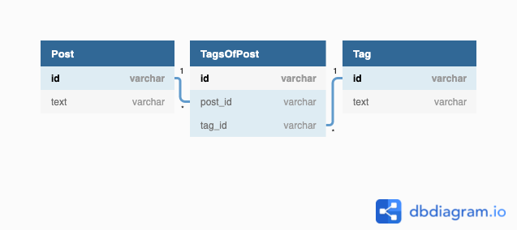
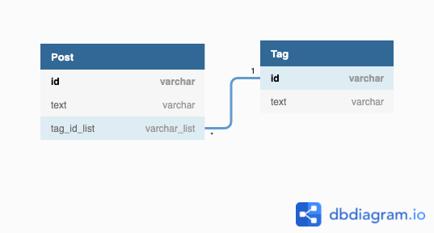

# データベース設計のアンチパターンを学ぶ1

## 1

設計の問題点

- カンマ区切りの文字列 -> パースが必要
  - 登録時も変換が必要
- 検索が難しい、インデックスを使用できない
- POST間でのタグの共有ができない
  - 過去のPOSTのtagAを全部tagAAに変更したい！という処理が難しくなる
  - タグの表記ゆれが発生する
- タグ一覧を取得ができない

## 2

### 案1 Tagテーブル、中間テーブルの作成



```dbml
table Post {
  id varchar [pk]
  text varchar
}

table TagsOfPost {
  id varchar [pk]
  post_id varchar [ref: > Tag.id]
  tag_id varchar [ref: > Post.id]
}

table Tag {
  id varchar [pk]
  text varchar
}
```

### 案2 Tagテーブル、配列の使用

配列を使うのはアンチパターンだと思われるが、妥協案としてはありか？



```dbml
table Post {
  id varchar [pk]
  text varchar
  tag_id_list varchar_list
}

table Tag {
  id varchar [pk]
  text varchar
}

ref: Post.tag_id_list > Tag.id
```
