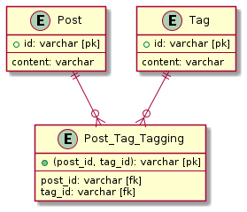
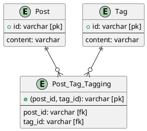
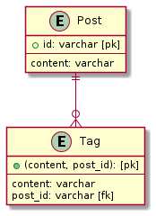
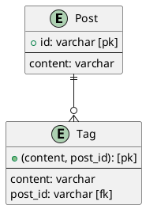

# データベース設計のアンチパターンを学ぶ2

## 課題1

- 問題点
- タグが増えるたびにカラムを増やす必要がある
- クエリの結果が横長で見づらくなりそう
- あるタグに紐付くPostを検索したい時
  - ORが `Post.tag{n}` の数だけ必要になるため、複雑
  - `Post.tag{n}` を増やすたびにクエリを変更しなければならない

『SQLアンチパターン』には、この他に以下のような問題点が紹介されていた。

- タグを追加する際にどの `Post.tag{n}` が空いているかを確認しなければならない、空きがない場合はタグの追加が行えない
- タグを削除する際にどの `Post.tag{n}` が削除対象のタグかを確認しなければならない
- 一つのPostに同じTagが複数付与されるのを防ぐことができない

## 課題2

アンチパターン1のときと同様に、中間テーブル (交差テーブル) を作る。

- `Post` 1 --- 0..多 `Post_Tag_Tagging`
- `Tag` 1 --- 0..多 `Post_Tag_Tagging`

『SQLアンチパターン』には以下のように従属テーブルを作成する解決策が紹介されていた。が、以下の理由からあまり使う場面が無さそうだと感じた。

- Post間でのTagの共有ができない
  - 見かけ上同じタグを使うことはできるが、タグ名を変更したいときに複数のタグを更新しなければならない

### 疑問

- 従属テーブルはこれであっている？
- 従属テーブルを使う場面とは？
