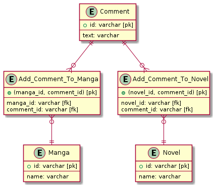
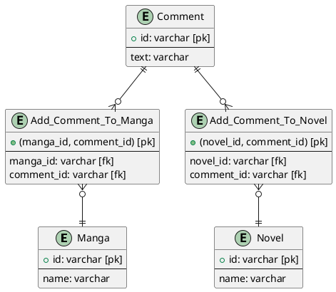
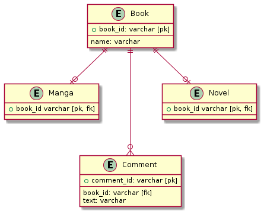
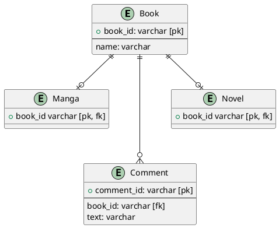
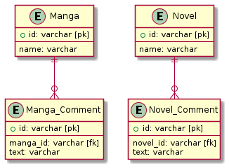
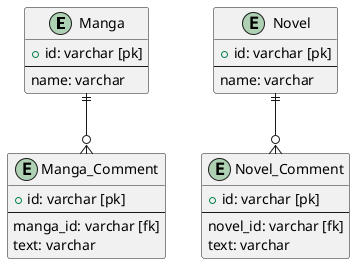

# データベース設計のアンチパターンを学ぶ3

## 課題1

- 問題点
- 漫画または小説に紐付くコメントを取得するときに困る
  - `manga_id` と `novel_id` が被らないようにする必要がある
  - `belong_to_id` がどちらに紐付くのかがわからなくなるので
- あるコメントに紐付く漫画 (または小説) を取得したいときに困る
  - どちらのテーブルから取得するのかの判定が必要になるので
  - コメントをピックアップしてトップページに表示して、「このコメントがついている小説を読む」機能をつけるときに使う
- 漫画・小説別のコメント量を取得したいとき困る
  - コメントを取得 ->　一件ずつ `belong_to_id` が小説と漫画どちらのテーブルに紐付いているかを確認する処理になる

『SQLアンチパターン』には、その他に以下の問題点が紹介されていた。

- アンチパターン名は、「ポリモーフィック関連」
- 外部キー宣言ができない (外部キーは一つのテーブルのみを指定しなければならないから)
  - したがって、参照整合性制約を定義できない
  - 参照整合性 = 親テーブルの値と一致することを保証する
- どちらのテーブルに紐付くのかがわからない
  - comment.type を導入することで一応は解決するが、comment.typeが各テーブルと対応していることを保証できない

## 課題2

交差テーブルを2つ作る。



<details><summary>ER図コード</summary>


</details>

これにより、先述の問題が解決できる。

- ある漫画または小説に紐付くコメントを取得したい時

```sql
-- id 1 の漫画に紐付くコメントを取得する
select * from Comment join (
  select comment_id from Add_Comment_To_Manga
  where manga_id = 1
) as coms
on Comment.id = coms.comment_id;
```

- あるコメントに紐付く漫画または小説を取得したい時

```sql
-- id 1 のコメントに紐づく小説または漫画を取得する
select * from Comment
  LEFT OUTER JOIN (
    Add_Comment_To_Manga JOIN Manga
    ON Add_Comment_To_Manga.manga_id = Manga.id
  ) as mangas ON Comment.id = mangas.comment_id
  LEFT OUTER JOIN (
    Add_Comment_To_Novel JOIN Novel
    ON Add_Comment_To_Novel.novel_id = Novel.id
  ) as novels ON Comment.id = novels.comment_id
WHERE Comment.id = 1
```

- 漫画・小説別のコメント量を取得する時

```sql
-- 漫画の総コメント量を取得
select count(*) from Add_Comment_To_Manga;
```

### 疑問 (1)

- `Add_Comment_To_Manga` 長すぎ？
- `Comment` --- `Add_Comment_To_~~`　間は1対1？1対多？
  - アプリケーション的には 1対1になりそう (`Comment` 一つに対して `Add_Comment_To~~` のレコードが生成されるので)
  - データベース設計的には 1対多になり得る
  - 1対1とか1対多はどちらに則って決める？
  - ---
  - → 『SQLアンチパターン』を見る限り1対多っぽい！

## 補足

### 1. 問題の本質

「SQLアンチパターン」では、問題の本質は「本来あるべき関連が、逆さまになっている」ことであると書かれていた。

> 小テーブル側であるCommentsの外部キーでは、複数の親テーブルを参照できません。変わりに、複数の外部キーを、Commentsテーブルを参照するために使用しましょう。

小テーブル側から親を指定しようとしているのが間違い、ということか？

### 2. 解決策の弱点

『SQLアンチパターン』には複数の交差テーブルを作る解決策の弱点として、許可したくない関連付けが許可されてしまう可能性が指摘されていた。

- 1つのコメントが漫画テーブルと小説テーブルの両方に結びつく可能性
- 1つのコメントがあるテーブルの複数レコードに結びつく可能性

各交差テーブルの `comment_id` に `UNIQUE` を宣言することで `あるテーブルの複数レコードに結びつく` のを防ぐことができる とのこと。

### 3. もう一つの解決策

『SQLアンチパターン』にはもう一つの解決策として、「クラステーブル継承」が紹介されていた。



<details><summary>ER図コード</summary>


</details>

**Book**

| book_id | name |
| --- | --- |
| 1001 | ホカベン |
| 1002 | あれがあれな件について |
| 1003 | デコピンズ |
| 1004 | モジャー |

**Manga**

| book_id |
| --- |
| 1001 |
| 1003 |
| 1004 |

**Novel**

| book_id |
| --- |
| 1002 |

**Comment**

| comment_id | book_id | text |
| --- | --- | --- |
| 1 | 1001 | 面白い！ |
| 2 | 1001 | サイコー！ |
| 3 | 1003 | 微妙、、、 |
| 4 | 1002 | これも微妙 |

```sql
-- id 1 の漫画に紐づくコメントを取得
select * from Comment
  where book_id = 1;
```

```sql
-- id 1 のコメントに紐づく漫画または小説を取得
select * from Book
  join (
    select book_id from Comment
    where comment_id = 1
  ) as filtered_comment
  on filtered_comment.book_id = Book.book_id;

-- 本はこのクエリだった
select * from Comment
  outer left join Manga
  on Comment.book_id = Manga.book_id
  outer left join Novel
  on Comment.book_id = Novel.book_id
where Comment.comment_id = 1
```

```sql
-- 漫画の総コメント量
select count(*) from Comment
  join Manga
  on Manga.book_id = Comment.book_id;
```

小規模なプロジェクトには向いてい無さそうという印象を受けた。共通項目が多い場合に便利になるのだろうか？

### 4. もう一つの解決策2

「テーブルの分割」という方法もあるようだ。シンプルで良さそう。

> そもそも、本当にcommentsを一つのテーブルに保存する必要性があるのか？というアプローチです。
>
> ...(中略)
>
> 現状で紐づく対象のテーブルが少なく、今後も増える可能性が低い場合には考慮したい設計です。
>
> [複数のテーブルに対して多対一で紐づくテーブルの設計アプローチ｜スパイスファクトリー株式会社](https://spice-factory.co.jp/development/has-and-belongs-to-many-table/)



<details><summary>ER図コード</summary>


</details>

### 疑問 (2)

1. 複数の交差テーブル
1. クラステーブル継承
1. テーブルの分割

どのような時にどの方法を用いるべき？  
個人的にはシンプルになるので テーブル分割 または 複数の交差テーブル を使用したいと考えた。

クラステーブル継承を使うメリットとは？ (共通項目が多い場合に使うと便利になる？)
