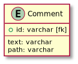
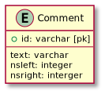
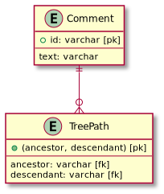
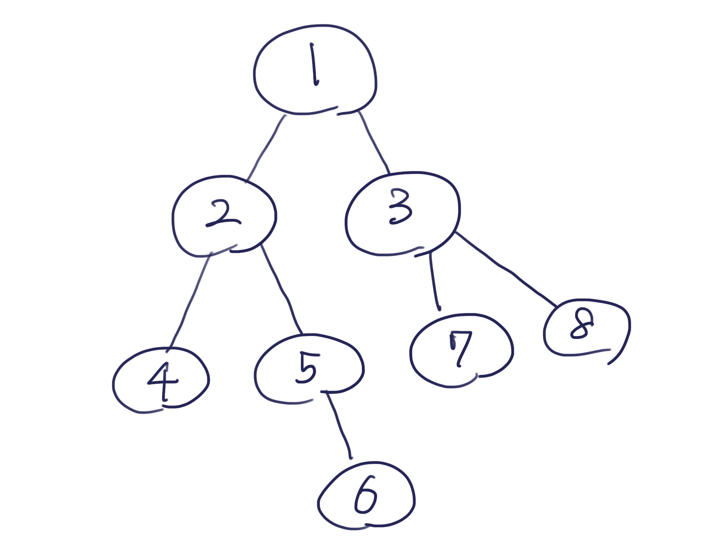

# データベース設計のアンチパターンを学ぶ4

## 課題1

### 問題点

- 取得する時
  - ツリーの取得が難しい (取得する深さだけ外部結合する必要がある)
  - ツリーを構成するために全件取得する必要がある
    - その場合、ツリーの構成はアプリケーション側で行う必要がある
- 追加する時
  - 先頭、中間に追加する時は
    - ノードを追加
    - 子になるノードのparent_message_idを更新
    - 子になるノードを特定して、その parent_message_id を変更する必要がある
- サブツリーの削除時、外部キーの参照整合性を確保するために末尾から順に削除しなければいけない (ON DELETE CASCADEで自動化可能)
- 非葉ノードのみの削除時、子ノードのparent_message_idを更新してから削除しなければならない (参照整合性確保のため)
- つまり
  - ツリー取得が難しい
  - ツリー操作が難しい

### 利点

- テーブルがシンプル
- 葉ノード(末尾)の追加が簡単
- 葉ノード、サブツリーの移動が簡単 (parent_message_idを更新するだけでよい
- SQL-99標準 (MySQL8.0, PostgreSQL8.4等) では再帰クエリ構文が使用可能であり、ツリーの取得が簡単にできる

## 課題2

「SQLアンチパターン」の解決策を参照する。

### 解決策1: 経路列挙モデル

メリット

- 先祖ノード・ツリーの取得が容易

デメリット

- DB側でパスの正しさを確保できない (参照整合性を確保できない)
- パスの検証は大変
- 文字列は有限のため、ツリーの深さも有限になる (?)
  - [漢(オトコ)のコンピュータ道: 限界までMySQLを使い尽くす!!](http://nippondanji.blogspot.com/2009/05/mysql.html) によると
    - 1文字の最大サイズ: 3バイト
    - 1行あたりの最大サイズ 64KB
  - 64000 / 3 = 21,333.33... (最大文字数)
  - → 大体深さ4500くらいが限界？ (区切り文字込みで)
  - 9 * (1 + 1) + 90(2 + 1) + 900(3 + 1) + 3500(4 + 1) = 21,388 文字



<details><summary>ER図コード</summary>

```plantuml
Entity Comment {
  + id: varchar [fk]
  --
  text: varchar
  path: varchar
}
```
</details>

| id | text | path |
| --- | --- | --- |
| 1 | hoge | 1/ |
| 2 | hogefuga | 1/2/ |
| 3 | hogefugafoo | 1/2/3/ |
| 4 | hogebar | 1/4/ |

### 解決策2: 入れ子集合



<details><summary>ER図コード</summary>

```plantuml
Entity Comment {
  + id: varchar [pk]
  --
  text: varchar
  nsleft: integer
  nsright: interger
}
```
</details>

メリット

- 子孫、先祖ツリーの取得が可能
- 非葉ノードの削除時に、親子関係が自動で維持される

デメリット

- 直近の親の取得など、クエリの一部が複雑になる
- 参照整合性を確保できない
- ツリー操作が複雑

サブツリーに対する操作は得意。ノードの挿入や移動は、クエリや計算が複雑になるため、不向き。

### 解決策3: 閉包テーブル



<details><summary>ER図コード</summary>

```plantuml
Entity Comment {
  + id: varchar [pk]
  --
  text: varchar
}

Entity TreePath {
  + (ancestor, descendant) [pk]
  --
  ancestor: varchar [fk]
  descendant: varchar [fk]
}

Comment ||--o{ TreePath
```
</details>

メリット

- 整合性を確保できる
- 検索、挿入が少ないクエリでできる
- ツリー構造を自由に変更できる
- ノードが複数のツリーへ所属できる

デメリット

- 直近の親、直近の子を取得するのが難しい
- スペースの消費が激しい

### 以下のようなツリーがあるときの実行イメージ



サブツリーを取得するクエリ

```sql
-- コメントid = 2より下のコメントをすべて取得する
select * from Commment
join TreePath ON Comment.id = TreePath.descendant
where TreePath.ancestor = 2;
```

実行後イメージ

| TreePath.ancestor | TreePath.descendant | Comment.id | Comment.text |
| --- | --- | --- | --- |
| 2 | 2 | 2 | (略) |
| 2 | 4 | 4 | |
| 2 | 5 | 5 | |
| 2 | 6 | 6 | |

### 感想・疑問

- 閉包テーブルで、どのようにツリーを復元する？ (depthを持たせる？)
- 実際にツリー構造を扱った場面はある？
  - Slackのスレッドは2階層以上になっていなさそう
  - 例えば、インターネット掲示板(?)ではより深いツリー構造を扱う必要がある？
- 解決策の中では、より汎用的な閉包テーブルを使うのが良さそう
- デメリットも、よほど大きいサービス・深いツリーを扱わなければ問題なさそう
  - そもそもレコード数は、最悪の場合でもメッセージの数 x50倍 くらいにしかならないので、問題にならなさそう
  - 実際に問題になったケースはある？
- NoSQLのデータベースを使う時に他の解決策があるか？ (FirebaseRDBでは、JSONツリーとしてデータを保存するので、ツリーをそのまま保存できる？)
