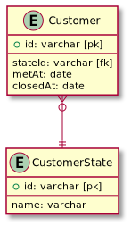
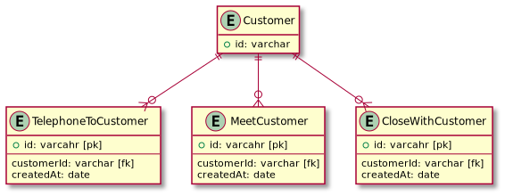

# データベース設計のアンチパターンを学ぶ5

## 課題1

### 問題点

- 顧客データ取得時に、全てのフラグを考慮したクエリを書く必要がある
  - 今回はフラグが3つしか無いので、そこまで困らないかも
- `metOnce` と `metAt`、 `closed` と `closedAt` が同時に更新されることをDB上で保証できない
- booleanはカーディナリティが低いので、(分布の偏りがない場合) インデックスを有効活用できない
- metAt, closedAtがNullになる
- カラムが多い (凝集度が低い)
- 電話をかけていないけど、成約済み、という顧客が存在し得る (知人の紹介で成約されるケースなどではありえると考えると、問題無い？)
- 履歴が残らない
  - 複数回電話をかけた・面談した場合など
- イベントに関わる情報を記録したくなった時、カラムがどんどん増えていく
  - 誰が電話をかけたのか？誰が面談したのか？を記録したくなったとき、`telephoneBy` , `metBy` などカラムを増やす必要がある
  - 複数回の電話を記録する場合、 `telephone2`, `telephone3` ... が必要になる
- 新たに「WEBからの申し込み」が増えたときに、カラムを増やす必要がある

### 参考

- [CQRSとイベントソーシングの使用法、または「CRUDに何か問題でも？」 | POSTD](https://postd.cc/using-cqrs-with-event-sourcing/)
- [イベント・ソーシングを知る](https://www.slideshare.net/shuheifujita90/ss-14294169)
- [データベースの不吉な臭い | system-enablers日記](http://www.system-sekkei.com/yamauchi/?p=174)
- [SQLアンチパターン 幻の第26章「とりあえず削除フラグ」](https://www.slideshare.net/t_wada/ronsakucasual)

## 課題2

### 案1: ステートカラム

顧客の状態を `新規` -> `電話済み` -> `面談済み` -> `成約済み` の順に遷移すると定義して、その状態のみ保持する



<details><summary>ER図コード</summary>

```plantuml
Entity Customer {
  + id: varchar [pk]
  --
  stateId: varchar [fk]
  metAt: date
  closedAt: date
}

Entity CustomerState {
  + id: varchar [pk]
  --
  name: varchar
}

Customer }o--|| CustomerState
```
</details>

改善点としては、取得クエリ実行時に考慮するカラムが stateカラムだけでよくなる。

ただし、履歴の保存やnullの存在など殆どの問題はそのまま。

### 案2: イベントソーシング



<details><summary>ER図コード</summary>

```plantuml
Entity Customer {
  + id: varchar
}

Entity TelephoneToCustomer {
  + id: varcahr [pk]
  --
  customerId: varchar [fk]
  createdAt: date
}

Entity MeetCustomer {
  + id: varcahr [pk]
  --
  customerId: varchar [fk]
  createdAt: date
}

Entity CloseWithCustomer {
  + id: varcahr [pk]
  --
  customerId: varchar [fk]
  createdAt: date
}

Customer ||--o{ TelephoneToCustomer
Customer ||--o{ MeetCustomer
Customer ||--o{ CloseWithCustomer

hide empty members
```
</details>

- 履歴: OK
- NULL: 無し
- 電話と電話した日は常に同時に記録される
- 電話をかけた社員を記録したい時は、各テーブルに社員IDを記録すればOK
- あらたなイベントが増えたときは、テーブルを追加するだけでOK (スキーマの変更が必要ない)
- ただし、複数条件での取得、最新の情報の取得が大変
  - 解決策として、ビューを使用する？

そういえば [mysql-employees](https://hub.docker.com/r/genschsa/mysql-employees) もこの形式で職種や給料を保存していたような :eyes:

### 疑問

- 最新の成約済み顧客とその日付を取得するクエリ、どう書く？
- さらに、各イベントテーブルに、付属情報があってそれも取得したい場合、どう書く？ (例: `MeetCustomer.面談時間`)

```sql
-- 日付のみならこれで良さそう
SELECT * FROM Customer
  JOIN (
    SELECT customerId, MAX(createdAt) AS latestCreatedAt
    FROM CloseWithCustomer
    GROUP BY customerId
  ) AS LatestClosedCustomer
  ON Customer.id = LatestClosedCustomer.customerId

-- これは、、、?
SELECT * FROM Customer
  JOIN (
    SELECT * FROM CloseWithCustomer
    WHERE createdAt = MAX(createdAt)
  ) AS LatestClosedCustomer
  ON Customer.id = LatestClosedCustomer.customerId
```
