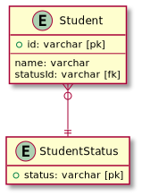

# データベース設計のアンチパターンを学ぶ6

## 課題1

### 問題点

- どんなデータを取りうるのか、メタデータ定義を見なければわからない
- ステータスを増やす時、CHECK制約の再定義が必要 (DBによっては再定義のためにテーブルを空にする必要がある (ETL))
- ステータス定義の削除・変更のときに困る (削除された定義を使用しているレコードはどうするのか問題)
- DBによってCHECK制約の仕様が異なる

## 課題2

ステータス定義のためのテーブルを用意する。



<details><summary>ER図コード</summary>

```plantuml
Entity Student {
  + id: varchar [pk]
  --
  name: varchar
  statusId: varchar [fk]
}

Entity StudentStatus {
  + status: varchar [pk]
}

Student }o--|| StudentStatus

hide empty members
```
</details>

- StudentStatusテーブルを見れば、どんなステータスがあるのかわかる
- ステータスを増やす時は、StudentStatusのレコードを増やせばOK
- ステータス定義の削除は、Studentから参照されている場合削除できない。
  - しかし、 `StudentStatus.active` 列を増やして廃止されたステータスを区別することが可能
- 参照のみを使うので、DBによって仕様が変わらない
