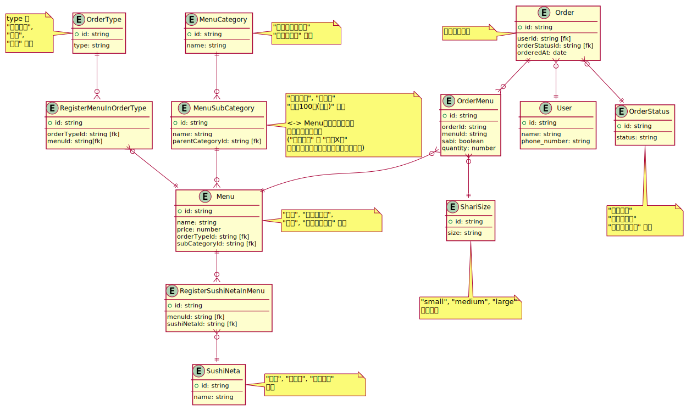
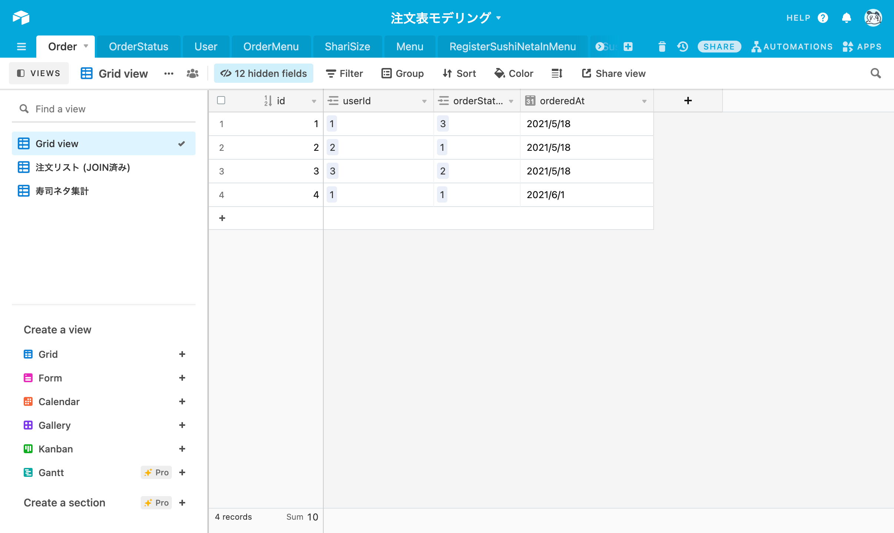
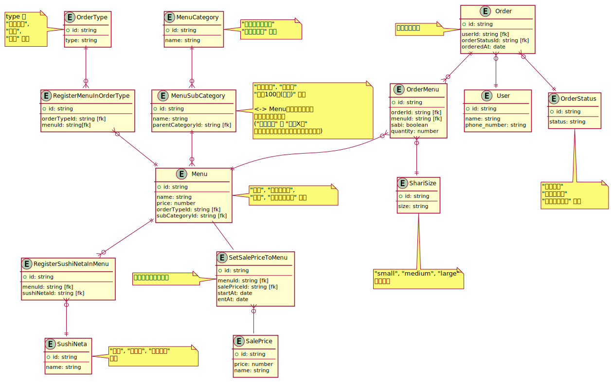

# DBモデリング

## 課題1

### 考え得るユースケース

- ユーザー
  - 注文する
  - 注文を取り消す
  - メニューを見る
  - 支払う
  - 商品を受け取る
- 店員
  - メニューを追加
  - 注文一覧を見る
  - 支払い状況を見る
  - 注文したユーザーに連絡する
  - 任意のメニューをお持ち帰り不可にする

### テーブル設計



<details><summary>ER図コード</summary>

```plantuml
Entity OrderType {
  + id: string
  --
  type: string
}
note left
type は
"持ち帰り",
"店内",
"配達" など
end note

Entity RegisterMenuInOrderType {
  + id: string
  --
  orderTypeId: string [fk]
  menuId: string[fk]
}

Entity MenuCategory {
  + id: string
  --
  name: string
}
note right
"セットメニュー"
"お好みすし" など
end note

Entity MenuSubCategory {
  + id: string
  --
  name: string
  parentCategoryId: string [fk]
}
note right
"盛り込み", "にぎり"
"一皿100円(税別)" など

<-> Menuは中間テーブル
にしても良いかも
("おすすめ" と "一皿X円"
に重複して表示したい場合がありそう)
end note

Entity Menu {
  + id: string
  --
  name: string
  price: number
  orderTypeId: string [fk]
  subCategoryId: string [fk]
}
note right
"はな", "海鮮ちらし",
"玉子", "炙りえんがわ" など
end note

OrderType ||--o{ RegisterMenuInOrderType
RegisterMenuInOrderType }o--|| Menu
MenuCategory ||--o{ MenuSubCategory
MenuSubCategory ||--o{ Menu

Entity SushiNeta {
  + id: string
  --
  name: string
}
note right
"玉子", "マグロ", "サーモン"
など
end note

Entity RegisterSushiNetaInMenu {
  + id: string
  --
  menuId: string [fk]
  sushiNetaId: string [fk]
}

Entity Order {
  + id: string
  --
  userId: string [fk]
  orderStatusId: string [fk]
  orderedAt: date
}
note left
注文のリスト
end note

Entity OrderMenu {
  + id: string
  --
  orderId: string [fk]
  menuId: string [fk]
  sabi: boolean
  quantity: number
}

Entity ShariSize {
  + id: string
  --
  size: string
}
note bottom
"small", "medium", "large"
のどれか
end note

Entity User {
  + id: string
  --
  name: string
  phone_number: string
}

Entity OrderStatus {
  + id: string
  --
  status: string
}
note bottom
"注文受付"
"支払い済み"
"受け渡し済み" など
end note

Order ||--o{ OrderMenu
Order }o--|| User
Order }o--|| OrderStatus
OrderMenu }o--|| Menu
OrderMenu }o--|| ShariSize

Menu ||--o{ RegisterSushiNetaInMenu
RegisterSushiNetaInMenu }o--|| SushiNeta
```
</details>

### テーブルのイメージ (AirTableにて作成)

[AirTable招待リンク (誰でも閲覧可です)](https://airtable.com/invite/l?inviteId=invJZIzyrPc8aoUs5&inviteToken=e957b30a1add18bae0c5c1e894a9cf492ae028c9a914b0d09e7e8157d7eab075)

イメージ↓



## 課題2

- `ShariSize` テーブルを追加
  - [注文表のイメージ (AirTable)](https://airtable.com/shrjjyUGqIFr71qFz)
- `SushiNeta` テーブルでメニューに紐づくネタを管理
  - [集計結果のイメージ (AirTable)](https://airtable.com/shrkkwl0U4UE3QrvD)

## 課題3

### ほかに発生しそうな追加仕様

- "お持ち帰り" 、 "店内" の他に新たに "配達" (ネット注文) に対応したい & ネット限定のメニューを作りたい
  - -> `OrderType` を作成して `Menu` と多対多で紐付けた
- 電話番号の代わりにメールアドレスで注文できるようにしたい
  - -> `User` テーブルに `email` を追加する
- セット割引
  - -> 新たに `Menu` を追加する?
- 一時的にセールしたい (わからず)
  - -> `Menu` に `salePrice` を追加する？

### 値引きの実装 (数量割引・シーズン毎・会員割引・テイクアウト割引)

以下を追加

- SalePrice
- SetSalePriceToMenu



<details><summary>ER図コード</summary>

```plantuml
Entity OrderType {
  + id: string
  --
  type: string
}
note left
type は
"持ち帰り",
"店内",
"配達" など
end note

Entity RegisterMenuInOrderType {
  + id: string
  --
  orderTypeId: string [fk]
  menuId: string[fk]
}

Entity MenuCategory {
  + id: string
  --
  name: string
}
note right
"セットメニュー"
"お好みすし" など
end note

Entity MenuSubCategory {
  + id: string
  --
  name: string
  parentCategoryId: string [fk]
}
note right
"盛り込み", "にぎり"
"一皿100円(税別)" など

<-> Menuは中間テーブル
にしても良いかも
("おすすめ" と "一皿X円"
に重複して表示したい場合がありそう)
end note

Entity Menu {
  + id: string
  --
  name: string
  price: number
  orderTypeId: string [fk]
  subCategoryId: string [fk]
}
note right
"はな", "海鮮ちらし",
"玉子", "炙りえんがわ" など
end note

OrderType ||--o{ RegisterMenuInOrderType
RegisterMenuInOrderType }o--|| Menu
MenuCategory ||--o{ MenuSubCategory
MenuSubCategory ||--o{ Menu

Entity SushiNeta {
  + id: string
  --
  name: string
}
note right
"玉子", "マグロ", "サーモン"
など
end note

Entity RegisterSushiNetaInMenu {
  + id: string
  --
  menuId: string [fk]
  sushiNetaId: string [fk]
}

Entity Order {
  + id: string
  --
  userId: string [fk]
  orderStatusId: string [fk]
  orderedAt: date
}
note left
注文のリスト
end note

Entity OrderMenu {
  + id: string
  --
  orderId: string [fk]
  menuId: string [fk]
  sabi: boolean
  quantity: number
}

Entity ShariSize {
  + id: string
  --
  size: string
}
note bottom
"small", "medium", "large"
のどれか
end note

Entity User {
  + id: string
  --
  name: string
  phone_number: string
}

Entity OrderStatus {
  + id: string
  --
  status: string
}
note bottom
"注文受付"
"支払い済み"
"受け渡し済み" など
end note

Entity SalePrice {
  + id: string
  --
  price: number
  name: string
}

Entity SetSalePriceToMenu {
  + id: string
  --
  menuId: string [fk]
  salePriceId: string [fk]
  startAt: date
  entAt: date
}
note left: セールの期間を設定

Menu -- SetSalePriceToMenu
SetSalePriceToMenu }o-- SalePrice

Order ||--o{ OrderMenu
Order }o--|| User
Order }o--|| OrderStatus
OrderMenu }o--|| Menu
OrderMenu }o--|| ShariSize

Menu ||--o{ RegisterSushiNetaInMenu
RegisterSushiNetaInMenu }o--|| SushiNeta
```
</details>
