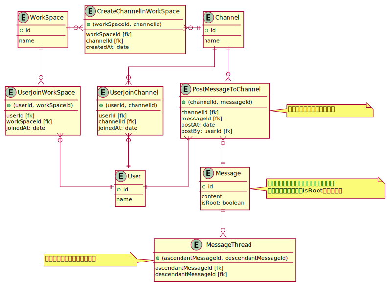

# DBモデリング1

## 課題1



<details><summary>UML図コード</summary>

```plantuml
skinparam linetype ortho

Entity User {
  + id
  --
  name
}

Entity WorkSpace {
  + id
  --
  name
}

Entity Channel {
  + id
  --
  name
}

Entity CreateChannelInWorkSpace {
  + (workSpaceId, channelId)
  --
  workSpaceId [fk]
  channelId [fk]
  createdAt: date
}

WorkSpace ||-o{ CreateChannelInWorkSpace
CreateChannelInWorkSpace }o-|| Channel

Entity UserJoinWorkSpace {
  + (userId, workSpaceId)
  --
  userId [fk]
  workSpaceId [fk]
  joinedAt: date
}

WorkSpace ||--o{ UserJoinWorkSpace
UserJoinWorkSpace }o--|| User

Entity UserJoinChannel {
  + (userId, channelId)
  --
  userId [fk]
  channelId [fk]
  joinedAt: date
}

Channel ||--o{ UserJoinChannel
UserJoinChannel }o--|| User

Entity Message {
  + id
  --
  content
  isRoot: boolean
}
note right
一覧表示の際にルートメッセージのみ
を表示するために、isRootを用意した
end note

Entity PostMessageToChannel {
  + (channelId, messageId)
  --
  channelId [fk]
  messageId [fk]
  postAt: date
  postBy: userId [fk]
}
note right: メッセージの投稿イベント

Channel ||--o{ PostMessageToChannel
PostMessageToChannel }o--|| Message
PostMessageToChannel }--|| User

Entity MessageThread {
  + (ascendantMessageId, descendantMessageId)
  --
  ascendantMessageId [fk]
  descendantMessageId [fk]
}
note left: メッセージの階層構造を保持

Message ||--o{ MessageThread
```
</details>

### あるチャネルに投稿されたメッセージ一覧を取得するクエリ

```sql
-- チャネル id = 1 に投稿されたメッセージ一覧を取得する (ユーザー名込み)
SELECT Message.*, User.* from PostMessageToChannel
  JOIN Message
  ON PostMessageToChannel.messageId = Message.id
  JOIN User
  ON PostMessageToChannel.userId = User.id
WHERE PostMessageToChannel.channelId = 1 AND Message.isRoot
ORDER BY PostMessageToChannel.postAt;
```

### あるメッセージに紐づくスレッドメッセージを取得するクエリ

```sql
-- メッセージid = 1 に紐づくスレッドメッセージを取得する
SELECT Message.* FROM MessageThread
  JOIN Message
  ON MessageThread.descendantMessageId = Message.id
  WHERE MessageThread.ascendantMessageId = 1;
```

### チャネルに所属しているユーザを取得するクエリ

これにより、所属チャネルによるメッセージの取得制限も可能になる。

```sql
-- チャネルid = 1 に参加しているユーザを取得する
SELECT User.* FROM User
  JOIN UserJoinChannel
  ON UserJoinChannel.userId = User.id
  WHERE UserJoinChannel.channelId = 1;
```

### メッセージの横断検索 (参加しているチャネルのみ)

```sql
-- userId = 1 のユーザが閲覧可能なメッセージの中から、
-- 'バグ' を含むメッセージ一覧を取得する
SELECT Message.* FROM Message
  JOIN PostMessageToChannel
  WHERE PostMessageToChannel.channelId IN (
    SELECT channelId FROM UserJoinChannel
    WHERE userId = 1
  ) AND Message.content LIKE '%バグ%';
```

## 疑問

- Message と Userの関連付けは 中間テーブルで行うようにした (Messageを独立させたかった・ユーザーがチャネルにメッセージを投稿すると考えるとその方が自然) が、Messageと関連付ける方法も考えられる。どちらが良いか？
- チャンネル・ワークスペースへの入退履歴は、別のサービスに保存する想定だが、これでよいか？
  - どのタイミングで保存する？
- 入れ替え可能な並び順、どう保存する？
  - orderカラムに数字を保存する以外の方法があるか？
