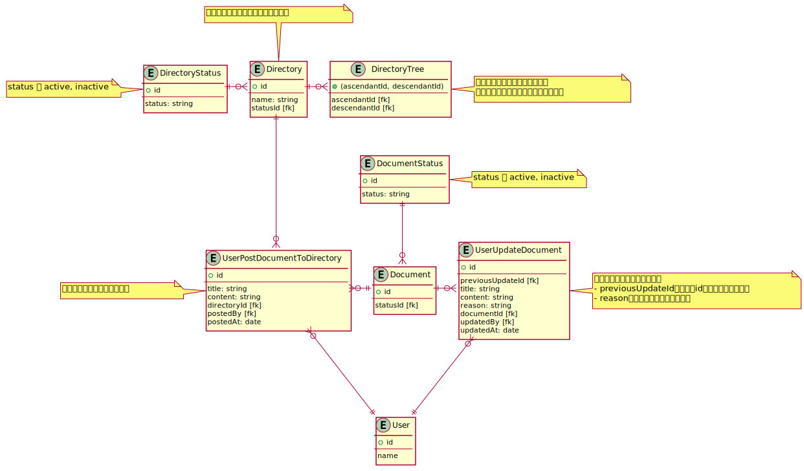

# DBモデリング3

## 課題1

ドキュメント管理システムのDB設計



<details><summary>ER図コード</summary>

```plantuml
entity User {
  + id
  ---
  name
}

entity Directory {
  + id
  ---
  name: string
  statusId [fk]
}
note top
空のディレクトリも作成可能とした
end note

entity DirectoryTree {
  + (ascendantId, descendantId)
  ---
  ascendantId [fk]
  descendantId [fk]
}
note right
閉包テーブルを使用することで
サブディレクトリを無制限に作成可能
end note

Directory ||-o{ DirectoryTree

entity DirectoryStatus {
  + id
  ---
  status: string
}
note left: status は active, inactive

DirectoryStatus ||-o{ Directory

entity Document {
  + id
  ---
  statusId [fk]
}

entity DocumentStatus {
  + id
  ---
  status: string
}
note right: status は active, inactive

DocumentStatus ||--o{ Document

entity UserPostDocumentToDirectory {
  + id
  ---
  title: string
  content: string
  directoryId [fk]
  postedBy [fk]
  postedAt: date
}
note left
ドキュメントの投稿イベント
end note

Directory ||---o{ UserPostDocumentToDirectory
UserPostDocumentToDirectory }o-|| Document
UserPostDocumentToDirectory }o---|| User

entity UserUpdateDocument {
  + id
  ---
  previousUpdateId [fk]
  title: string
  content: string
  reason: string
  documentId [fk]
  updatedBy [fk]
  updatedAt: date
}
note right
ドキュメントの更新イベント
- previousUpdateIdが自身のidと一致するなら最新
- reasonには変更理由を記載できる
end note

Document ||-o{ UserUpdateDocument
UserUpdateDocument }o---|| User
```
</details>

### 考えたこと

- [esa.io](https://docs.esa.io/)を主にイメージ
- [イミュータブルデータモデル - kawasima](https://scrapbox.io/kawasima/%E3%82%A4%E3%83%9F%E3%83%A5%E3%83%BC%E3%82%BF%E3%83%96%E3%83%AB%E3%83%87%E3%83%BC%E3%82%BF%E3%83%A2%E3%83%87%E3%83%AB) を参考に、なるべくUPDATEを発生させない設計にした
- ドキュメントの投稿と更新をイベントに切り出すことで、投稿者と更新者が別の場合や、更新者が複数存在する場合でも表現可能にした
  - 
- 「投稿」と「更新」はまとめずに別イベントとした
  - 更新の際にディレクトリを変更できてしまう (可能性がある)
  - 更新時に変更内容を記述したい場合があるかも (例: 「リンクのタイトル修正」)
- `ドキュメントは必ずディレクトリに属する` を表現するために `Document` に直接ディレクトリのidを持たせることも考えたが、updateとの兼ね合いでやめた
- `Document` には内容を持たせずに、イベントテーブルに内容を持たせるようにした
  - 前回のメンターセッションを参考: [155.注文明細に顧客IDを持たせる設計にした場合、ユーザー登録なしで注文できる仕様をどのように表現すればいいのか](https://hackmd.io/_koVUvhERguir1v7AVddQg#156%E5%95%86%E5%93%81%E3%83%9E%E3%82%B9%E3%82%BF%E3%82%84%E9%A1%A7%E5%AE%A2%E3%83%9E%E3%82%B9%E3%82%BF%E3%81%8C%E5%A4%89%E6%9B%B4%E3%81%95%E3%82%8C%E3%81%A6%E3%81%97%E3%81%BE%E3%81%86%E3%81%93%E3%81%A8%E3%82%92%E3%81%A9%E3%81%AE%E3%82%88%E3%81%86%E3%81%AB%E8%A8%98%E9%8C%B2%E3%81%99%E3%82%8B%E3%81%AE%E3%81%8B)
- 削除を表現するために `Document` , `Directory` それぞれに `status` 属性を付与

## その他

交差テーブルは多対多の関係を表すためだけではなく、それぞれが独立して存在できるようにする効果がある。

> よくある例が部門-社員のケースだ。
>
> 
>
> 部門と社員の関係性が1対多であるからといって、社員に部門IDを属性として持たせてしまうと、表現できないデータが存在することがある。
>
> - 部門配属前の新入社員
> - どの部門にも属さない役員
> 
> このようなデータのために部門IDをnullableにしておいて、配属時に更新するということをやってしまうことになる(またはシステム上部門IDにnullが入らないので、無理やり新入社員を人事部配属扱いにしたり、「役員」という部門を作ったりしているものもある)。
>
> このようにリソース間のリレーションシップを考えるにあたっては、「1対多」や「多対多」などのカージナリティだけに着目するのではなく、両者の依存関係を考えるようにしよう。上記例だと通常の企業であれば、「部門」は「社員」がいなくても存在できるし、「社員」は「部門」に配属されずとも存在できるだろう。そういう非依存のリレーションシップの場合は、間に交差エンティティを置く。
>
> [イミュータブルデータモデル - kawasima](https://scrapbox.io/kawasima/%E3%82%A4%E3%83%9F%E3%83%A5%E3%83%BC%E3%82%BF%E3%83%96%E3%83%AB%E3%83%87%E3%83%BC%E3%82%BF%E3%83%A2%E3%83%87%E3%83%AB)

## 疑問

[SQLアンチパターン 幻の第26章「とりあえず削除フラグ」](https://www.slideshare.net/t_wada/ronsakucasual) にある、 「そもそも削除も更新もしない」とはどういうことか？

参考

- [論理削除が云々について - mike-neckのブログ](https://mike-neck.hatenadiary.com/entry/2015/03/24/231422)
- [イミュータブルデータモデル - kawasima](https://scrapbox.io/kawasima/%E3%82%A4%E3%83%9F%E3%83%A5%E3%83%BC%E3%82%BF%E3%83%96%E3%83%AB%E3%83%87%E3%83%BC%E3%82%BF%E3%83%A2%E3%83%87%E3%83%AB)

例えば、今回のドキュメントの例だと、 `ドキュメント` というリソースと、 `ドキュメントを投稿` `ドキュメントを更新` `ドキュメントを削除` というイベントに分離し、 リソース・イベント両方とも UPDATE/DELETE をしないような設計になる？

実務で採用されることはあるのか？


<details><summary>ER図コード</summary>

```plantuml
entity Document {
  + id
}

entity PostDocument {
  + id
  ---
  documentId [fk]
  content: string
  postedAt: date
}
Document ||--o{ PostDocument

entity UpdateDocument {
  + id
  ---
  documentId [fk]
  content: string
  updatedAt: date
}
Document ||--o{ UpdateDocument

entity DeleteDocument {
  + id
  ---
  documentId [fk]
  deletedAt: date
}
Document ||--o{ DeleteDocument
```
</details>
