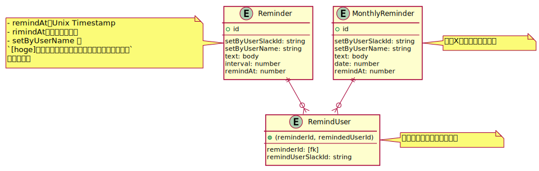

# DBモデリング4

## slack api の仕様など

参考: [Enabling interactivity with Slash Commands | Slack](https://api.slack.com/interactivity/slash-commands)

- `/[command-name] hogheoge` のメッセージで特定のURLにHTTP POSTリクエストを送信させることができる
- メッセージに含まれる リンク, User, Channel は エスケープされる (User, Channel は `their correlated IDs` に変換される)

送信されるリクエストは以下のような形式

```text
token=gIkuvaNzQIHg97ATvDxqgjtO
&team_id=T0001
&team_domain=example
&enterprise_id=E0001
&enterprise_name=Globular%20Construct%20Inc
&channel_id=C2147483705
&channel_name=test
&user_id=U2147483697
&user_name=Steve
&command=/weather
&text=94070
&response_url=https://hooks.slack.com/commands/1234/5678
&trigger_id=13345224609.738474920.8088930838d88f008e0
&api_app_id=A123456
```

## 課題1



<details><summary>ER図コード</summary>

```plantuml
entity Reminder {
  + id
  ---
  setByUserSlackId: string
  setByUserName: string
  text: body
  interval: number
  remindAt: number
}
note left
- remindAtはUnix Timestamp
- rimindAtを随時更新する
- setByUserName は 
`[hoge]さんからのリマインダーを伝えにきました！`
に使用する
end note

entity MonthlyReminder {
  + id
  ---
  setByUserSlackId: string
  setByUserName: string
  text: body
  date: number
  remindAt: number
}
note right
毎月X日のリマインダー
end note

entity RemindUser {
  + (reminderId, remindedUserId)
  ---
  reminderId: [fk]
  remindUserSlackId: string
}
note right
リマインドされるユーザー
end note

Reminder ||--o{ RemindUser 
MonthlyReminder ||--o{ RemindUser 
```
</details>

### リマインダーを設定

#### パターン1 (毎日)

`@UserA (hoge)` > `/penpen @UserB @UserC よろしくお願いします every day`

```sql
INSERT INTO Reminder VALUES (
  1,
  'UserA',    -- 設定したユーザー
  'hoge',
  'よろしくお願いします',
  86400,      -- interval: 60s * 60 * 24
  1623233148, -- remindAt: 設定された日時 + interval
);

INSERT INTO RemindUser VALUES
  (1, 'UserB'),
  (1, 'UserC');
```

#### パターン2 (毎週水曜日)

`@UserA (hoge)` > `/penpen @UserB よろしくお願いします every wednesday`

```sql
INSERT INTO Reminder VALUES (
  2,
  'UserA',    -- 設定したユーザー
  'hoge',
  'よろしくお願いします',
  604800,     -- interval: 86400s * 7
  1623233148, -- remindAt: 次の水曜日の同じ時刻を設定
);

INSERT INTO RemindUser VALUES
  (2, 'UserB');
```

#### パターン3 (毎月3日)

`@UserA (hoge)` > `/penpen @UserB よろしくお願いします every 3th`

```sql
INSERT INTO MonthlyReminder VALUES (
  3,
  'UserA',    -- 設定したユーザー
  'hoge',
  'よろしくお願いします',
  3,          -- 日付
  1623233148, -- remindAt: 次の月のX日の同じ時刻を設定
);

INSERT INTO RemindUser VALUES
  (3, 'UserB');
```

### リマインド

- 1時間毎にバッチが動く
- Reminder, MonthlyReminderからアクティブなリマインダー一覧を取得
  - `WHERE 現在時刻 >= remindAt` でリマインドするべきものを絞り込む
- 取得したリマインダーをもとに関連付けられたユーザーにメッセージを送信
- `Reminder` を UPDATE
  - `remindAt` に `interval` の値を足す
- `MonthlyReminder` を UPDATE
  - `remindAt` に 次の月の `date` 日の 同時刻のタイムスタンプを設定

### 完了報告

RemindUserテーブルから該当するユーザを削除する。 (リマインドされなくなる)

```sql
DELETE RemindUser
  WHERE reminderId = 1 AND remindUserSlackId = 'UserB';
```

## 疑問

- 毎月X日のリマインダー、もっといいやり方がありそう
- 1時間毎にリマインダーが動く関係上、1時間毎にしかメッセージを送信できないということでよいか？
- (penpenについて)
  - 複数のワークスペースにインストールされるが、ワークスペースによる区別は何か行ったのか？
  - 同時に送信できるメッセージの数に制限は無いのか？ ある場合、どのように制限を回避したか？
  - 削除されたユーザー等への対応はどうしたか？ (メッセージ送る側、送られる側)
