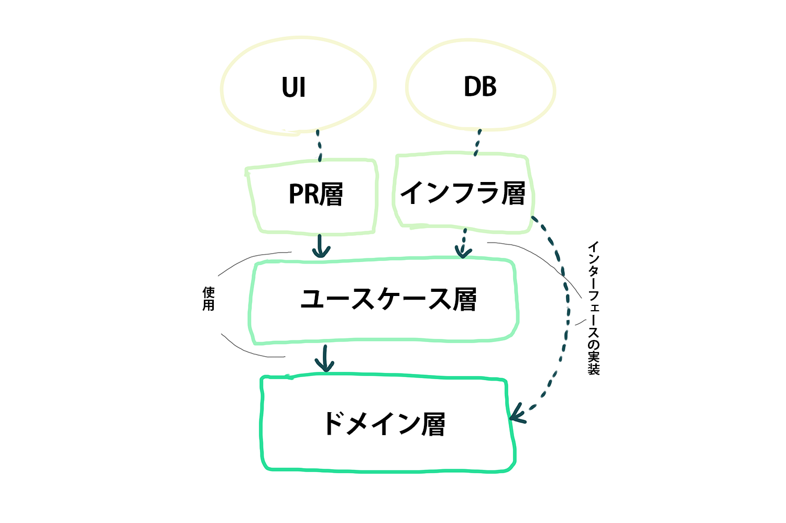

# オニオンアーキテクチャを学ぶ

## 課題1

### 1

### 図解

「ドメイン駆動設計 モデリング/実装ガイド P56」 を参考

### 詳細

- **ドメイン層** (ドメインサービス層と統合)
  - コアとなる知識を表現
  - ドメインオブジェクト (ドメインモデルを表現)
  - ドメインサービス (オブジェクトとしては表せないコアとなる概念)
    - ファクトリー (ドメインエンティティの生成)
  - リポジトリのインターフェース (ドメインオブジェクトの永続化)
- **ユースケース層** (= アプリケーション層)
  - ユースケース (ドメイン層で公開されたメソッドを組み合わせてアプリケーションのユースケースを実現する)
- **PR層** (= プレゼンテーション層)
  - 外部との入出力を行う
  - HTMLを描画する (= ユーザーインターフェース)
  - APIリクエストに対してレスポンスを返す -> クライアントが受け取る
- **インフラ層**
  - リポジトリの実装

### ドメインモデルとは

> 問題解決のために、物事の特定の側面を抽象化したもの (意訳)

> ドメインモデル： ドメインの問題を解決するためのモデル

「ドメイン駆動設計 モデリング/実装ガイド」より

### 2

ドメイン層がどの層にも依存しなくなることで、ドメイン層が他の変更やフレームワークの影響を受けなくなり、ビジネスモデルの変更に合わせて柔軟にドメインモデルを修正できるようになる。

> 最も重要なドメイン層を、独立させて修正しやすくするため
> 
> 「ドメイン駆動設計 モデリング/実装ガイド」 P70

### 3

層をまたぐ依存はインターフェースに対する依存のみ許可するメリット

- 各層の実装を柔軟に変更できる
  - インフラ層は他の層に大きな影響を与えることなく発行するクエリを自由に変更可能
- インフラ層が実装すべきインターフェースを先に定義しておくことで、(インフラ層を実装する前に) ビジネスロジックなど重要度の高いコードから実装していくことができる
- モックしやすくなる (テストが書きやすい)

### 4

「依存関係逆転の原則」が使われているポイント

- 各層をまたぐ依存はインターフェース (抽象) への依存のみになっている
- (DB操作を行う)リポジトリのインターフェースをドメイン層に、実装をインフラ層に置くことで、ドメイン層がインフラ層の影響を受けないようになっている

### 5

「特定のユーザにのみリソースの追加や更新を許すアクセス制限機能」はソフトウェアが存在しなくても成立する重要な概念であると考えるので、ドメイン層に記述したい。ドメインオブジェクトとして表現することは難しそうなので、ドメインサービスとして実装する ( `UserAccessPostDomainService` )。

### 6

MySQLからPostgreSQLに変更する場合、インフラ層の実装を変更するだけでよい。(インターフェースの変更がなければ、他の層は影響を受けない)

## 課題2 (クイズ)

### クイズ1

ドメイン層を依存の中心に置くと、ドメイン層の変更の影響を他の層が受けてしまいます。これにどう対処すべきでしょうか？

回答例

- ユースケース層にテストを書く
- 不用意にドメインオブジェクトに直接依存しない (ユースケース層でドメインオブジェクトの詰替を行う)

参考: 「ドメイン駆動設計 モデリング/実装ガイド」 P70, P78

### クイズ2

フレームワーク固有の処理はどの層に記述するべきでしょうか？

回答例

プレゼンテーション層 (ユースケース・ドメイン層以外) に記述するべき。

プレゼンテーション層にフレームワークへの依存を限定することで、ドメイン層・ユースケース層がフレームワークに依存してしまうことを防ぐ。

参考: 「ドメイン駆動設計 モデリング/実装ガイド」 P92

### クイズ3

プレゼンテーション層(UI)が直接ドメイン層のメソッドやドメインサービスを呼び出すことの問題点はどのようなものになるでしょうか？

回答例

- ドメインオブジェクトに、プレゼンテーションに関する処理が混入してしまう可能性がある
- ドメインオブジェクトの修正の影響を直接受ける

参考: 「ドメイン駆動設計 モデリング/実装ガイド」 P78

