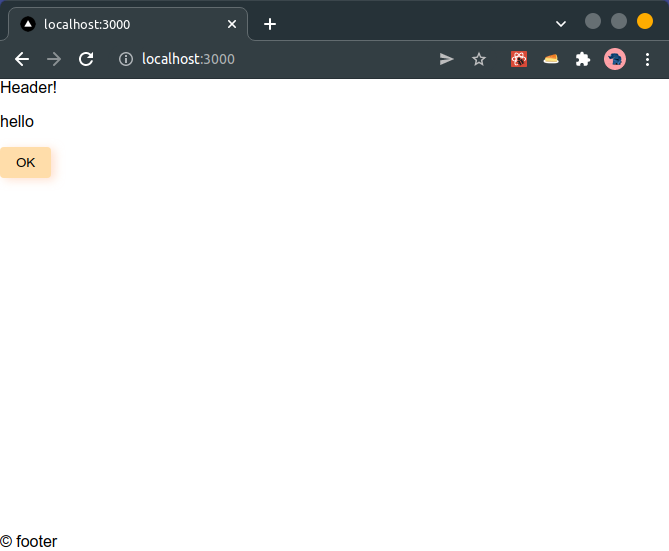

# Next.jsの環境を立ち上げよう

## 環境構築

[landing-page](../landing-page/README.md) ディレクトリにNext.jsの環境を作成しました。

- 自分の [github-template](https://github.com/sushidesu/assessment-jailbreak) を元に作成
  - eslint, prettier, stylelint (importの自動整列付き)
  - jest (with esbuild)
  - scaffdogによるコンポーネントの生成
  - など
- モノレポ用のgit hookを設定
  - 複数package.jsonがある環境なので既存のままだと動かなかった
    - git hookはリポジトリ単位でしか設定できない
    - -> サブディレクトリごとにGit hookを設定できない :cry:
  - [モノレポ on husky戦略 - ゆるふわ技術日誌](https://yurufuwa-tech.hatenablog.com/entry/2020/02/09/183553) を参考に設定した :wink:
    - ルートの [package.json](../../package.json) に設定
  - 直接 `.bin` ディレクトリを指定する代わりに `yarn --cwd` を使用した

## アプリの起動

```sh
cd 05_フロントエンド/landing-page
yarn install
yarn dev
```

起動した画面


