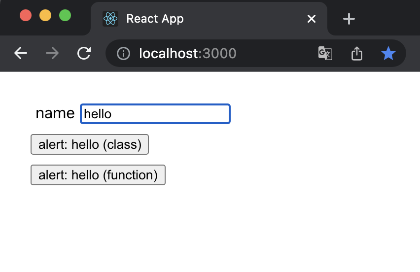

# 適切にコンポーネントを分割して1ページ作ってみよう

## 課題1

### 1

atomic designとは、デザインシステムを作成するための方法論のこと。5つの階層にコンポーネントを分類し、組み合わせてUIを構築する。

> Atomic design is methodology for creating design systems.

[Atomic Design Methodology | Atomic Design by Brad Frost](https://atomicdesign.bradfrost.com/chapter-2/) には、以下の利点が挙げられていた。

- 部分と全体の切り替え
  - 部分 (atomなど) と 全体 (templateなど) を交互に調整しながら作ることができる
  - > One of the biggest advantages atomic design provides is the ability to quickly shift between abstract and concrete. 
  - デザインの一部は全体に影響を与え、全体は一部に影響を与える
  - なので、部品を作りきってから組み合わせるのではなく、部品 -> 全体 -> 部品 -> 全体のように行き来しながら相互に作る
  - → 最終的なUIとその基盤となるデザインシステムを同時に作成することができる
- 構造とコンテンツの分離
  - 構造 (部品の並び方やレイアウト) と コンテンツは相互に影響し合う
  - 分けて考えることでより良いパターンを作成できる
- 階層を想像できる名前
  - コミュニケーションに役立つ

atomic design は厳格なものではなく、UIデザインシステムを作り上げることや、組織でのコミュニケーションを取ることに役立てるためのもの、ということらしい。

atomic designを使えば良い設計になる！というものではなく、良いデザイン・設計をするための議論や思考の元となるもの、というイメージ？

> But atomic design is not rigid dogma. Ultimately, whatever taxonomy you choose to work with should help you and your organization communicate more effectively in order to craft an amazing UI design system.

> しかし、アトミックデザインは硬直したドグマではありません。最終的には、どのような分類法であれ、あなたとあなたの組織が素晴らしいUIデザインシステムを作り上げるために、より効果的にコミュニケーションを取るのに役立つはずです。 (DeepL翻訳)

### 2

- atom
  - 基本的な要素
  - label, input ,buttonなど
  - 単体では役に立たない
- molecule
  - 原子を組み合わせたもの
  - 再利用のために構築された原子の単純な組み合わせ
  - > While molecules can be complex, as a rule of thumb they are relatively simple combinations of atoms built for reuse.
- organism
  - moleculesを組み合わせた、スタンドアロンで、ポータブルで、再利用可能なコンポーネント
  - > Building up from molecules to organisms encourages creating standalone, portable, reusable components.
- template
  - 抽象的なorganismsやmoleculesにコンテキストを提供する
  - 具体的なもの
- page
  - テンプレートの特定のインスタンス
  - 実際のコンテンツを流し込む

### 3

#### 違い

classコンポーネント、functionコンポーネントの違いはクラスと関数の違いと同じであり、その最大の違いはミュータビリティーである。

| | function components | class components |
| --- | --- | --- |
| 実態 | 関数 | クラス |
| ミュータビリティ | **イミュータブル** | **ミュータブル** |
| hooksの使用 | 可 | 不可 |
| 状態管理 | hooks | クラスのプロパティ |

コンポーネントは `props` を受け取ってそれをもとに `render` する。

関数はイミュータブルなので、 `render` 中にコンポーネント内の `props` が変更されることはない。コンポーネントに渡される `props` が変わっても、新たな `props` に対応する `render` が行われるのみで、古い `render` の `props` が変更されることはない。

しかし、クラスの場合は一度 `render` されたコンポーネント内にある `props` の変更が可能なので、意図しない動作が発生する場合がある。

#### 実例

3秒後に `name` を表示するコンポーネント作成した。



```tsx
// class component
class AlertButton extends React.Component {
  showAlert = () => {
    setTimeout(() => {
      window.alert(this.props.name)
    }, 3000)
  }

  render() {
    return <button onClick={this.showAlert}>{`alert: ${this.props.name} (class)`}</button>
  }
}

// function component
const AlertButton = (props) => {
  const showAlert = () => {
    setTimeout(() => {
      window.alert(props.name)
    }, 3000)
  }

  return <button onClick={showAlert}>{`alert: ${props.name} (function)`}</button>
}
```

`alert: hello` となっているボタンを押した後にアラートされるのは `hello` であるべき。しかしclassの場合、 `alert: hello` ボタンを押した後、アラートが表示される前に `hello` を `fuga` に変更すると、アラートされるのは `fuga` になってしまう。

[CodePen](https://codepen.io/sushidesu/pen/MWErjVq) で動作を確認できます。

#### その他の違い

- hooksによって凝集度が高まる
  - > ReactHooksのuseEffect関数により(時間的凝集が)擬似的な機能的凝集となる。
  - from: [オブジェクト指向のその前に-凝集度と結合度/Coheision-Coupling - Speaker Deck](https://speakerdeck.com/sonatard/coheision-coupling?slide=25)
- パフォーマンスには大きな違いはない
  - > 私たちの見てきた限り、最適化の戦略は少々異なるとはいえ、そのパフォーマンスの違いはわずかです。
  - from: [関数コンポーネントはクラスとどう違うのか? — Overreacted](https://overreacted.io/ja/how-are-function-components-different-from-classes/)
- 関数のほうが書き方がシンプル
  - > 関数コンポーネントの記述は短くシンプルです。つまり、開発、理解、テストがしやすいということです。
  - from: [React:関数コンポーネントとクラスコンポーネントの違い](https://www.twilio.com/blog/react-choose-functional-components-jp)
- 逆にclassを使う場合は？
  - hooksに実装されていないライフサイクルメソッドを使用したい場合
  - > まだ使用頻度の低い getSnapshotBeforeUpdate、getDerivedStateFromError および componentDidCatch についてはフックでの同等物が存在していませんが、すぐに追加する予定です。
  - from: [フックに関するよくある質問 – React](https://ja.reactjs.org/docs/hooks-faq.html#do-hooks-cover-all-use-cases-for-classes)

#### ビルド結果 (特に差は無し)

esbuildでビルドした結果を比較したが、クラスor関数以外の差はなかった。

```js
  // src/class-component.tsx
  var import_react = __toESM(require_react());
  var import_react_dom = __toESM(require_react_dom());
  var Input = class extends import_react.Component {
    render() {
      return /* @__PURE__ */ React.createElement("input", null);
    }
  };
  (0, import_react_dom.render)(/* @__PURE__ */ React.createElement(Input, null), document.getElementById("app"));
```

```js
  // src/function-component.tsx
  var import_react_dom = __toESM(require_react_dom());
  var Input = () => {
    return /* @__PURE__ */ React.createElement("input", null);
  };
  (0, import_react_dom.render)(/* @__PURE__ */ React.createElement(Input, null), document.getElementById("app"));
```

#### 参考

- [関数コンポーネントはクラスとどう違うのか? — Overreacted](https://overreacted.io/ja/how-are-function-components-different-from-classes/)
  - とても参考にしました
- [フックに関するよくある質問 – React](https://ja.reactjs.org/docs/hooks-faq.html)
- [オブジェクト指向のその前に-凝集度と結合度/Coheision-Coupling - Speaker Deck](https://speakerdeck.com/sonatard/coheision-coupling)
- [Differences between Functional Components and Class Components in React - GeeksforGeeks](https://www.geeksforgeeks.org/differences-between-functional-components-and-class-components-in-react/)
- [React:関数コンポーネントとクラスコンポーネントの違い](https://www.twilio.com/blog/react-choose-functional-components-jp)
- [Reactでクラスコンポーネントより関数コンポーネントを使うべき理由5選](https://tyotto-good.com/blog/reaseons-to-use-function-component)

## 課題2

### 1

https://tailwindcomponents.com/component/blog-page/landing を実装

### 2

ディレクトリの分け方

## その他 (書きたいことを書く)

- atomic designの良し悪し
- ディレクトリ構成
