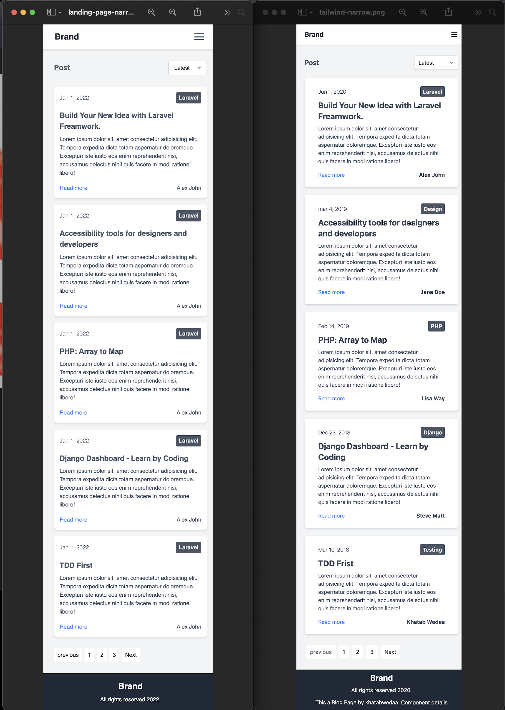

# 作ったページをレスポンシブ対応しよう

- 左: 作成したページ
- 右: 見本のページ
- media queryで `display: none` をつけたり外したりしてレスポンシブ対応しました
- Reactでレスポンシブ対応どれがいい？
  - `useMediaQuery` みたいなのを作って、ifなどでreturnするコンポーネントを切り替える
  - `useMediaQuery` みたいなのを作って、つける `className` を切り替える
  - CSSのみでやる (media queryを使用する)
- ↑使っているスタイルライブラリ、CSS等によって変わりそう :thinking:

