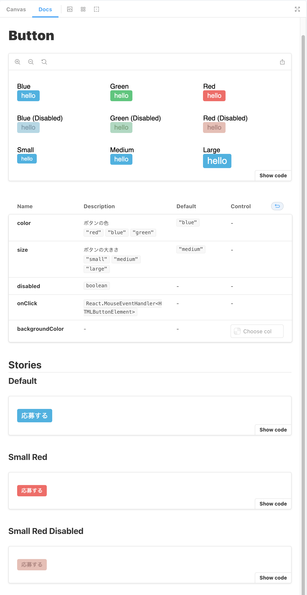

# よくあるボタンコンポーネントを作成する

## 課題1, 2

ボタンコンポーネント + Storyを作成しました。

- コンポーネント: [src/Button/Button.tsx](./src/Button/Button.tsx)
- ストーリーブック [src/Button/Button.stories.tsx](./src/Button/Button.stories.tsx)
- スタイルはcssで当てました [src/Button/Button.css](./src/Button/Button.css)

## 課題3

ボタンに表示するテキストをどのように受け取るべきか

- `children?: string` のように、 `children` を使う + なるべく受け付ける型を制限するべき
  - childrenを使用する理由
    - コンポーネントの中に表示されるんだな〜ということがわかる
    - コードの書き方から表示が予測しやすい
      - `<Button text="hello" />` よりも `<Button>{"hello"}</Button>` のほうが実際の表示に近い
  - 型を制限する理由
    - `テキスト` を受け取る想定なので、 `string` にするのは当然
    - 想定外のものが渡されるのを防ぐため
      - 想定外のものが渡されると、表示が崩れてしまう可能性がある
    - コンポーネントの責務を明確にするため 
      - 例えば、 `React.ReactNode` はコンポーネントならなんでも渡せてしまう
      - 型で許容されている限り、どんなものが渡ってきても対応できるような作りになっているべき
        - 例えば `boolean` を受け取る場合、 普通は `true`, `false` 両方の見た目を用意するはず
      - でもすべてのコンポーネントに対応することは不可能
    - 似てるかも？な話
      - > 外からclassNameを受け取るコンポーネントは「外からどんなスタイルが当てられようと、たとえdisplay: noneが来ようとmargin-top: -9999pxが来ようとこのコンポーネントは壊れずに責務を果たします」という力強い宣言なわけだが、自分はCSS力が足りないのでそんなコンポーネントは作れません (https://twitter.com/uhyo_/status/1340186475493658626)
      - [CSSとコンポーネント設計に対する考察 - uhyo/blog](https://blog.uhy.ooo/entry/2020-12-19/css-component-design/)
      - ↑上の記事に対するアンサー: [className を受け取らない制約は意味がない](https://zenn.dev/takepepe/articles/css-always-breaks)
  - その他のパターン
    - ボタンの中に文字 + アイコンを表示したい場合
      - `children?: string` のままで、`icon: IconType (Iconコンポーネント用に定義する)` を新たに受け取るようにしたい
