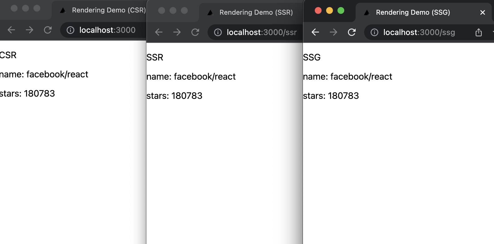

# フロントエンドのレンダリングパターンを学ぶ

## 課題1

- CSR
  - クライアントサイドレンダリング
    - サーバーからは主にJSファイルを返し、クライアントのブラウザにてデータ取得とレンダリング(DOMの構築)を行う
  - データ取得: クライアントのブラウザにレンダリングされた後
  - レンダリング(DOMの構築): リクエスト後、クライアントブラウザにて
  - 利点
    - JSによる柔軟なデータ取得
    - ページ遷移することなくJSにてページ全体を置き換えるため、インタラクションが高速
    - ページの生成がクライアントのブラウザで行われるため、ユーザーによって表示が変わるページや、認証が必要なページには有利
    - サーバーはHTML+CSSを配信するだけでいいので、デプロイ先の選択肢が増える
    - シンプル
  - 欠点
    - 大きなJSファイルを読み込むため、初期表示が遅い
    - ページ内容をキャッシュすることができないため、ページの表示速度は落ちる。SEO的に不利。
    - Googleの検索エンジンはJavaScriptを解釈してくれるが、完全ではないため、SEO的に不利。
    - 空のHTMLを返すため、動的なOGPをつけることができない
- SSR
  - サーバーサイドレンダリング
    - クライアントからのリクエストに応じて、サーバーにてレンダリングを行い、生成されたHTMLを返す
    - リクエストに応じて動的にページの内容を変えつつ、静的なHTMLを返すことができる
    - 従来のサーバーサイドアプリと同じ
  - データ取得: クライアントからリクエストが届いた後
  - レンダリング(DOMの構築): リクエスト後、サーバーにて
  - 利点
    - ページの内容をキャッシュできる
    - サーバーから配信されるのは主にHTMLファイルのため、CSRと比較してSEO的に有利
  - 欠点
    - リクエストが届いてからデータ取得・DOM構築を行うため、SSGに比べて応答速度が下がる
- SSG
  - スタティックサイトジェネレーション
    - あらかじめアプリケーション全体のHTMLファイルを生成しておき、それを返す
  - データ取得: アプリケーションのビルド時
  - レンダリング(DOMの構築): アプリケーションのビルド時
  - 利点
    - 応答速度、ページの表示速度ともに最速
    - キャッシュ可能
  - 欠点
    - ページの内容を更新するたびにアプリケーション全体をビルドし直さなければならないため、頻繁に更新されるサイトには向かない
- ISR
  - Incremental Static Regeneration
    - リクエスト時にバックグラウンドで静的HTMLを生成しつつ、クライアントには前回生成済みのHTML(キャッシュ)を返す
    - キャッシュの有効期限内であれば、HTMLの再生成は行われない
  - データ取得: キャッシュの有効期限が切れたあとのリクエスト時
  - DOMの構築: リクエスト時、サーバーにて
  - 利点
    - 生成済みのHTMLを返すため、レスポンスが高速
    - ページ単位でビルドが行われるため、SSGに比べてビルドコストが低い
    - キャッシュの有効期限内であればキャッシュ済みのデータを返すため、大量のリクエストにも強い
    - 一定期間でキャッシュを更新するため、SSGに比べて新しいデータを返すことができる
  - 欠点
    - 前回のリクエストでキャッシュ(生成)されたデータを返すため、最新のコンテンツを返すことができない
    - 基本的に Next.js+Vercel でしか使用できないため、ロックインされてしまう

### 参考

- [Next.jsのISRで動的コンテンツをキャッシュするときの戦略](https://zenn.dev/catnose99/articles/8bed46fb271e44)
- [図解 CSR, SSR, SG(SSG), ISR](https://zenn.dev/bitarts/articles/37260ddb28ae5d)
- [Vercel以外でNext.jsのISRをできるのか問題](https://zenn.dev/catnose99/scraps/f1c9a98c5651f1)
- [もう迷わないNext.jsのCSR/SSR/SSG/ISR](https://zenn.dev/a_da_chi/articles/105dac5573b2f5)

## 課題2

starデータを取得するサイトを作成。

- CSR: [src/pages/index.tsx](./rendering-strategies-demo/src/pages/index.tsx)
- SSR: [src/pages/ssr.tsx](./rendering-strategies-demo/src/pages/ssr.tsx)
- SSG: [src/pages/ssg.tsx](./rendering-strategies-demo/src/pages/ssg.tsx)



### ビルド結果

`yarn build` の出力結果

```sh
Page                                       Size     First Load JS
┌ ○ /                                      1 kB           71.2 kB
├   /_app                                  0 B            70.2 kB
├ ○ /404                                   194 B          70.4 kB
├ ● /ssg (463 ms)                          444 B          70.6 kB
└ λ /ssr                                   442 B          70.6 kB
+ First Load JS shared by all              70.2 kB
  ├ chunks/framework-6e4ba497ae0c8a3f.js   42 kB
  ├ chunks/main-1e7421553b9673ee.js        26.9 kB
  ├ chunks/pages/_app-8bca1288f7256d7f.js  494 B
  ├ chunks/webpack-514908bffb652963.js     770 B
  └ css/27d177a30947857b.css               194 B

λ  (Server)  server-side renders at runtime (uses getInitialProps or getServerSideProps)
○  (Static)  automatically rendered as static HTML (uses no initial props)
●  (SSG)     automatically generated as static HTML + JSON (uses getStaticProps)

✨  Done in 5.69s.
```

### 生成物 (CSR)

ファイル: `.next/server/pages/index.html`

初期表示 `loading...` の状態のHTMLが生成されている。ページから読み込むJSにてデータを取得し、ページを書き換えることが予想される。

```html
<!DOCTYPE html>
<html>
  <head>
    <meta name="viewport" content="width=device-width" />
    <meta charset="utf-8" />
    <title>Rendering Demo (CSR)</title>
    <link rel="icon" href="/favicon.ico" />
    <meta name="next-head-count" content="4" />
    <!-- 中略 -->
    <script
      src="/_next/static/chunks/pages/index-bf6bafea81b33c93.js"
      defer=""
    ></script>
    <!-- 中略 -->
  </head>
  <body>
    <div id="__next" data-reactroot="">
      <div>
        <main>
          <div>
            <p>CSR</p>
            <p>loading...</p>
          </div>
        </main>
      </div>
    </div>
    <!-- 一部略 -->
  </body>
</html>

```

### 生成物 (SSR)

ファイル: `.next/server/pages/ssr.js`

htmlとして出力されているものはなく、上記JSファイルをサーバー上で使用してHTMLを返していることが予想される。

### 生成物 (SSG)

ファイル `.next/server/pages/ssg.html`, `.next/server/pages/ssg.js`

データ取得した結果がhtmlとして出力されている。

```html
<!DOCTYPE html>
<html>
  <head>
    <meta name="viewport" content="width=device-width" />
    <meta charset="utf-8" />
    <title>Rendering Demo (SSG)</title>
    <link rel="icon" href="/favicon.ico" />
    <meta name="next-head-count" content="4" />
    <!-- 中略 -->
    <script
      src="/_next/static/chunks/pages/ssg-6e3722d1c38c060a.js"
      defer=""
    ></script>
    <!-- 中略 -->
  </head>
  <body>
    <div id="__next" data-reactroot="">
      <div>
        <p>SSG</p>
        <div>
          <p>name: facebook/react</p>
          <p>stars: 180783</p>
        </div>
      </div>
    </div>
    <!-- 一部略 -->
  </body>
</html>

```

## 課題3

どれを採用すべきか？

- 週1更新ブログ
  - → SSG
  - SEOが重要、動的なコンテンツも少なく、更新の頻度も多くはないので
- ユーザーのコメントが随時追加されるレシピ共有サービス
  - → SSRまたはISR (レシピ部分) + CSR (コメント部分)
  - SEOが重要だが、大量のユーザーが同時に複数のページを更新することが予想されるため、SSGは不向き
    - なので、SSG以外の SSRまたはISRが良さそう
  - コメント部分は投稿したらすぐ反映されてほしいので、CSRがよさそう
- 会計サービス
  - → 基本的にCSR, 一部SSG
  - 認証が必要なデータや個人情報が多く含まれていそう、そこまでSEOが重要ではないので CSRが良さそう
  - ランディングページや、利用規約等広く公開したいページはSSGが良さそう
- 経営指標を管理する社内サービス
  - → CSR
  - 社内向けのサービスで、SEOがそこまで重要ではないので CSRが良さそう
- 社内SNS
  - → CSR
  - かなり頻繁に更新されることが予想される
  - 投稿したらすぐ反映されてほしいので CSRが良さそう

### 参考

> catnose 2021/02/06に更新
>
> ※ 略語に馴染みがない方のために括弧で正式名称を書いておきます。
>
> 利用規約やプライバシーポリシー、AboutページなどはSSG（Static Site Generation）を使用しています。使い分けとしては
>
> - ダッシュボードなどのログインユーザーのみ閲覧ができるページ => CSR（Client Side Rendering）
> - SEO上重要かつページネーションが必要な一覧ページ => SSR（Server Side Rendering）
> - スクラップのように更新頻度が高いページ => SSR
> - 記事や本などの速度が重要なページ => ISR（Incremental Static Regeneration）
>
> という感じです。
>
> from: https://zenn.dev/link/comments/a34b65c6ddf486
