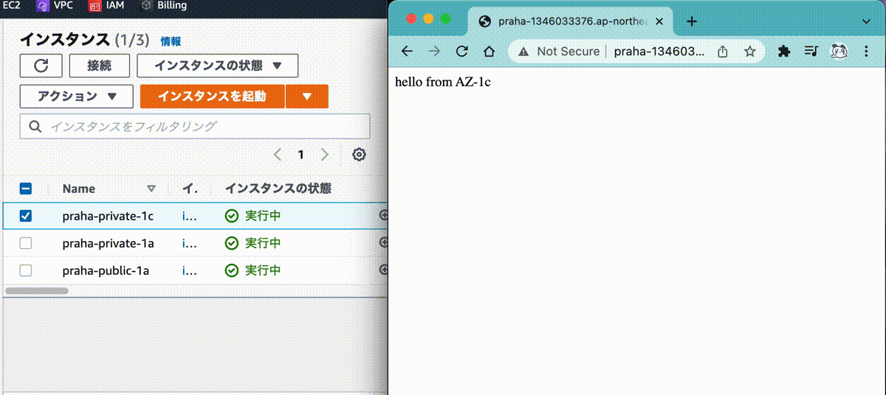

# 冗長化されたWebアプリケーションを作ってみよう

## 結果

アクセスするたびに表示されるサンプルページがランダムで変わる (交互に表示されている？)

片方のEC2を停止すると、落ちていない方のEC2インスタンスの画面が表示され続けている

## 構成

- Terraformで構築した
  - ファイル: [praha.tf](./praha.tf)
  - このディレクトリで `terraform apply` すると同じ構成が再現できます
    - `terraform.tfvars` ファイルに `aws_access_key`, `aws_secret_key` を用意しておく必要があります
    - nginxのインストールは手動で行う必要があります
      - terraformでできるようにしたかった
  - `terraform destroy` するとterraformで作成したもののみ全部削除できる (便利！！！)
- 構成
  - VPC
    - パブリックサブネット (ap-northeast-1a)
      - EC2 (テスト用)
      - ELB
    - プライベートサブネット (ap-northeast-1a)
      - EC2 (nginx)
    - パブリックサブネット (ap-northeast-1c)
      - (ELB)
    - プライベートサブネット (ap-northeast-1c)
      - EC2 (nginx)
  - などなど

## 参考など

- 全体的なネットワーク構成、Terraformの書き方の参考
  - [pei0804/aws-handson-with-terraform](https://github.com/pei0804/aws-handson-with-terraform)
  - VPC×1, パブリックサブネット×1, プライベートサブネット×1の構成のterraformがある
  - NATとSSMを使用してプライベートサブネット内のEC2に接続することもできる
  - YouTubeに動画もあり雰囲気を掴むのにとても良かった
    - [AWS 入門 - YouTube](https://www.youtube.com/playlist?list=PLQEyBW1FBVbKXb1-BH7uDmLsBV8WwNNgb)
  - ALBの設定、マルチAZの設定まではなかったのでそこは自分でやる必要があった
- ALBの導入、マルチAZ用の設定の参考
  - [パブリックなALBからプライベートなEC2にアクセスしてみた](https://zenn.dev/mn87/articles/b6a5e0e5b5ee4c)
  - ALBの設定はほぼこの通りにやればできた
  - セキュリティグループを使ってALBからの通信をまとめて許可する方法など参考になった
- nginxの導入の参考
  - [【AWS EC2】Amazon Linux2にnginxをインストールする方法 - Qiita](https://qiita.com/tamorieeeen/items/07743216a3662cfca890)
  - Amazon Linux には `apt-get` コマンドが使えないので少し手間取った
  - 代わりにextrasというものを使う (`yum` も使える)
  - 記事の通りにコマンドを打てばインストールできた

## 疑問など

- TerraformとAWS CloudFormationどっちを使う？
- ページの初回表示に異常に時間がかかった (1分以上)
  - どこかの設定がおかしいかも
  - 
