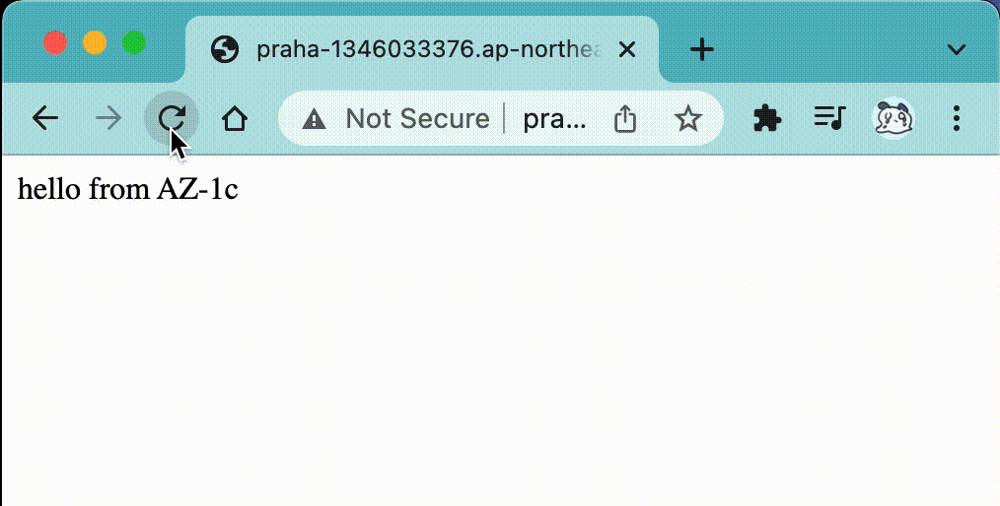

# 初回アクセスに時間がかかる件

## 現象

ALBのAレコードを指定してブラウザからアクセスすると、初回表示のみ1分ほどの時間がかかる。


一度接続できたあとのリロードは問題なく、別々のAZに構築したEC2の両方にアクセスできている。(リロードのたび交互に別のサイトが表示される)



## 原因

片方のパブリックサブネット (public-1c) がIGWとつながっていなかった。IGWへのルートテーブルを用意することで解消された。

以下はメモです。

## 調査ログ

### その1

curlコマンドでログを見ると、 `35.73.252.203` への接続に失敗し、その後 `54.65.67.141` へと接続し、ページが返ってきている。

```sh
~/dev/praha-challenge/prahachallenge/06_クラウドインフラ/03_冗長化されたWebアプリケーションを作ってみよう task/cloud_redundant_web_apps
❯ curl praha-1286382508.ap-northeast-1.elb.amazonaws.com --verbose
*   Trying 35.73.252.203...
* TCP_NODELAY set
* Connection failed
* connect to 35.73.252.203 port 80 failed: Operation timed out <--- 失敗している
*   Trying 54.65.67.141...
* TCP_NODELAY set
* Connected to praha-1286382508.ap-northeast-1.elb.amazonaws.com (54.65.67.141) port 80 (#0)
> GET / HTTP/1.1
> Host: praha-1286382508.ap-northeast-1.elb.amazonaws.com
> User-Agent: curl/7.64.1
> Accept: */*
> 
< HTTP/1.1 200 OK
< Date: Mon, 06 Dec 2021 10:04:01 GMT
< Content-Type: text/html
< Content-Length: 37
< Connection: keep-alive
< Server: nginx/1.20.0
< Last-Modified: Mon, 06 Dec 2021 10:01:10 GMT
< ETag: "61addf66-25"
< Accept-Ranges: bytes
< 
<html><body>Hello AZ1</body></html>

* Connection #0 to host praha-1286382508.ap-northeast-1.elb.amazonaws.com left intact
* Closing connection 0

```

### その2

digコマンドによると、上記2つのIPアドレスは、ALBのドメイン名のAレコードに指定されているIPアドレスのよう。

```sh
~
❯ dig praha-1286382508.ap-northeast-1.elb.amazonaws.com

; <<>> DiG 9.10.6 <<>> praha-1286382508.ap-northeast-1.elb.amazonaws.com
;; global options: +cmd
;; Got answer:
;; ->>HEADER<<- opcode: QUERY, status: NOERROR, id: 9387
;; flags: qr rd ra; QUERY: 1, ANSWER: 2, AUTHORITY: 4, ADDITIONAL: 9

;; OPT PSEUDOSECTION:
; EDNS: version: 0, flags:; udp: 4096
;; QUESTION SECTION:
;praha-1286382508.ap-northeast-1.elb.amazonaws.com. IN A

;; ANSWER SECTION:
praha-1286382508.ap-northeast-1.elb.amazonaws.com. 37 IN A 35.73.252.203 <- これ
praha-1286382508.ap-northeast-1.elb.amazonaws.com. 37 IN A 54.65.67.141  <- これ

(略)
```

### その3

直接IPアドレスを指定してcurlすると、やはり `35.73.252.203` の方のみ接続に失敗した。

```sh
❯ curl 35.73.252.203 --verbose
*   Trying 35.73.252.203...
* TCP_NODELAY set
* Connection failed
* connect to 35.73.252.203 port 80 failed: Operation timed out
* Failed to connect to 35.73.252.203 port 80: Operation timed out
* Closing connection 0
curl: (7) Failed to connect to 35.73.252.203 port 80: Operation timed out

❯ curl 54.65.67.141 --verbose
*   Trying 54.65.67.141...
* TCP_NODELAY set
* Connected to 54.65.67.141 (54.65.67.141) port 80 (#0)
> GET / HTTP/1.1
> Host: 54.65.67.141
> User-Agent: curl/7.64.1
> Accept: */*
> 
< HTTP/1.1 200 OK
(略)
```

### そして、、、

ここまで調べてからAWSコンソールのALBの詳細を見に行くと、「サブネットにIGWがアタッチされていませんよ」 と教えてくれた :rofl:


### 補足調査

ALBの画面からはどんなIPアドレスが割り当てられているかは確認できず、 `ネットワークインターフェース` 画面から確認できる。(参考: [ELB（ALB）のIPアドレスを確認する方法 | DevelopersIO](https://dev.classmethod.jp/articles/tsnote-alb-ip-001/))


以上により、 `接続のできないIPアドレス = IGWがアタッチされていないサブネット上にあるALBに割り当てられたIPアドレス` だとわかった！！！

## その他

- `Mapping` したサブネットの数だけIPアドレスが割り当てられている → 各サブネットにALBが設置されているっぽい？
- 片方のサブネットにあるALBが動いていなかったが、両AZにあるサイトが表示できていた
  - → ALBを `Mapping` するサブネットは一つでも問題ない (サイトを表示するだけなら)
  - ただし、セキュリティグループの書き方によっては、同AZ内からのアクセスしかできない場合もありそう
