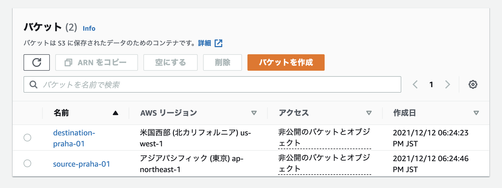

# S3を理解する

## 課題1

### 1

ストレージクラスの種類

- S3 Standard
  - アクセス頻度の高いデータ向け
  - 素早いアクセス
  - >アクセス頻度の高いデータ向けに高い耐久性、可用性、パフォーマンスのオブジェクトストレージを提供します。
- S3 Intelligent-Tiering
  - アクセス頻度が不明なデータ向け
  - アクセスされていないオブジェクトを自動で低コストの階層に移動させてくれる
    - 低コストの階層は Deep Archiveと同じパフォーマンス
  - >アクセスパターンをモニタリングし、アクセスされていないオブジェクトを自動で低コストの階層に移動させることができます。
- S3 Standard-IA
  - アクセス頻度が低いデータ向き
  - S3 Standardと同等の素早いアクセス
  - S3 Standardよりも低コストだが、データの読み出しに応じての課金あり
  - >アクセス頻度は低いが、必要に応じてすぐに取り出すことが必要なデータに適しています。S3 Standard-IA は、S3 Standardと同じ高い耐久性、高スループット、低レイテンシーを低価格のストレージ料金 (GB 単位) および取り出し料金 (GB 単位) で提供します。
- S3 One Zone-IA
  - アクセス頻度が低いデータ向き
  - 1つのAZのみにデータを保存するので、Standard-IAよりもコストが低い
  - >S3 1 ゾーン – IA はひとつの AZ にデータを保存するため、S3 標準 – IA よりもコストを 20% 削減できます。
- S3 Glacier Instant Retrieval
  - 長期アーカイブデータ向け
  - S3 Standardと変わらないミリ秒単位のアクセス
  - Standard-IAよりもコストが低い (最大32%ほど)
  - >アクセスされることがほとんどなく、ミリ秒単位で取得する必要がある、長期間有効なデータ用に最低コストのストレージを提供するアーカイブストレージクラスです。 (英語版をGoogle翻訳)
  - >S3 Glacier Instant Retrievalは、S3StandardおよびS3Standard-IAストレージクラスと同じスループットとミリ秒のアクセスで、アーカイブストレージへの最速のアクセスを提供します。 (英語版をGoogle翻訳)
- S3 Glacier Flexible Retrieval
  - 長期アーカイブデータ向け
  - Glacier Instant Retrievalよりも10%コストが低い
  - 取得に数分から数時間かかる
  - 無料の一括検索機能がある
  - 以前はこれが S3 Glacier と呼ばれていた
  - >1年に1〜2回アクセスされ、非同期で取得されるアーカイブデータに対して、（S3 Glacier Instant Retrievalよりも）最大10％低いコストのストレージを提供します。バックアップやディザスタリカバリのユースケースなど、すぐにアクセスする必要はないが、大量のデータセットを無料で取得する柔軟性が必要なアーカイブデータの場合、S3 Glacier Flexible Retrieval（以前のS3 Glacier）は理想的なストレージクラスです。 (英語版をGoogle翻訳)
- S3 Glacier Deep Archive
  - 最も低コスト
  - 長期保管向き
  - 最大12時間のデータ取得
  - >Amazon S3 の最も低コストのストレージクラスであり、1 年のうち 1 回か 2 回しかアクセスされないようなデータを対象とした長期保存やデジタル保存をサポートします。
- S3 Outposts
  - オンプレミスでS3の機能を使用できる
  - >オンプレミスの AWS Outposts 環境でのオブジェクトストレージが提供されます。

ほとんどアクセスされないバケットを作成する場合は、 最もコストの低い `S3 Glacier Deep Archive` を使用するとよい。ほとんどアクセスされないが、すぐに取得したいデータの場合は `S3 Glacier Instant Retrieval` が良さそう。

#### 参考

- [ストレージクラス - Amazon S3 ｜AWS](https://aws.amazon.com/jp/s3/storage-classes/)
- [Object Storage Classes – Amazon S3](https://aws.amazon.com/s3/storage-classes/)
- [6つのS3ストレージクラスの選択に迷った時みるチャートをつくってみた | DevelopersIO](https://dev.classmethod.jp/articles/should_i_choice_s3_storage_class/)
- [Amazon S3のストレージクラスを今一度整理 - ForgeVision Engineer Blog](https://techblog.forgevision.com/entry/2019/02/27/094449)

### 2

ライフサイクルとは、オブジェクトのグループに適用するアクションを定義するルールのこと。アクションには `移行アクション` (ストレージクラスを移動する) と、 `失効アクション` (オブジェクトの有効期限を定義する) がある。

>S3 ライフサイクル設定は、Amazon S3 がオブジェクトのグループに適用するアクションを定義するルールのセットです。

### 3

作成から30日立つと安いストレージクラスに移動するライフサイクルを作成

設定内容: [./lifecycle-transition.tf](./lifecycle-transition.tf)

### 4

作成から90日経ったら自動的に消えるライフサイクルを作成

設定内容: [./lifecycle-expiration.tf](./lifecycle-expiration.tf)

### 参考

- [ストレージのライフサイクルの管理 - Amazon Simple Storage Service](https://docs.aws.amazon.com/ja_jp/AmazonS3/latest/userguide/object-lifecycle-mgmt.html)

### 補足: プレフィックス

S3はkey-Value形式でデータを保存する。そのため `hoge` フォルダにある `foo.txt` ファイルのキーは、 `hoge/foo.txt` のように表される。プレフィックス `hoge/` を指定して検索することで、 `hoge` フォルダ以下にあるデータを検索できる。

特定のプレフィックスに一致するもののみライフサイクルを適用することもできる。

> Amazon S3の基礎技術は、単純なKVS（Key-Value型データストア）でしかありません。

[Amazon S3における「フォルダ」という幻想をぶち壊し、その実体を明らかにする | DevelopersIO](https://dev.classmethod.jp/articles/amazon-s3-folders/)

## 課題2

### 1

- バージョニング
  - バケット内でバケットの履歴を保存する
  - > Amazon S3 のバージョニングとは、同じバケット内でオブジェクトの複数のバリアントを保持する手段のことです。S3 のバージョニング機能を使用すると、バケットに保存されたすべてのオブジェクトのすべてのバージョンを、保存、取得、復元することができます。
  - 使い道
    - 意図しない操作や障害からの復旧
- レプリケーション
  - 別のバケットにオブジェクトをコピーする
  - > レプリケーションを使用すると、Amazon S3 バケット間でオブジェクトを自動で非同期的にコピーできます。
  - クロスリージョンレプリケーション (CRR): 異なるリージョンのバケットにオブジェクトをコピーする
  - 同一リージョンレプリケーション (SRR): 同一リージョン内のバケット間でオブジェクトをコピーする
  - 使い道
    - 遠く離れた場所に保存する必要がある場合 (CRR)
    - よりユーザーに近い場所にデータを配置することで、オブジェクトへのアクセスを早くする (CRR)
    - ログを1つのバケットに集約する (SRR)
    - テスト環境に本番環境のデータをコピーする (SRR)

### 2 (レプリケーション)

クロスリージョンのS3を作成する事ができなかったので手動でやりました。 [BucketRegionError: incorrect region, the bucket is not in 'us-east-2' region at endpoint '' · Issue #14544 · hashicorp/terraform-provider-aws](https://github.com/hashicorp/terraform-provider-aws/issues/14544)

クロスリージョンレプリケーションを作成

コピーされていることを確認

### 3 (バージョニング)

レプリケーションの際に使用したバケットを使用して確認。

ファイルを削除すると削除マーカーが作成される

削除マーカーを削除することでファイルを復旧した

### 参考

- [S3 バケットでのバージョニングの使用 - Amazon Simple Storage Service](https://docs.aws.amazon.com/ja_jp/AmazonS3/latest/userguide/Versioning.html)
- [オブジェクトのレプリケーション - Amazon Simple Storage Service](https://docs.aws.amazon.com/ja_jp/AmazonS3/latest/userguide/replication.html)
- [絵で見て 3分でおさらいする Amazon S3 のバージョニングとライフサイクル | DevelopersIO](https://dev.classmethod.jp/articles/3minutes-s3-versioning-lifecycle/)
