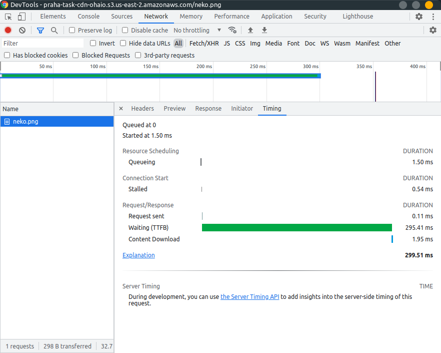
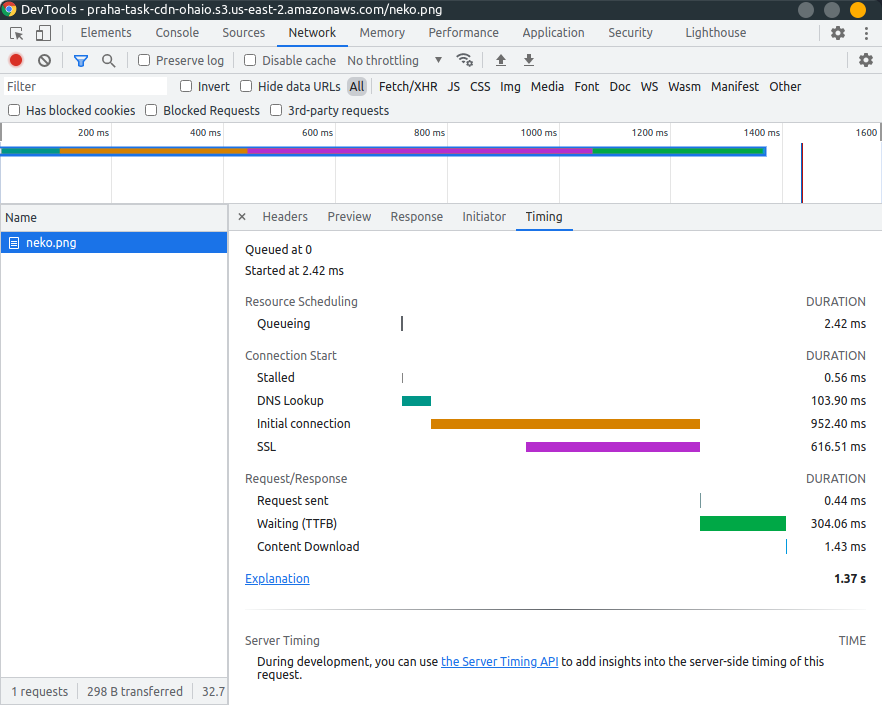
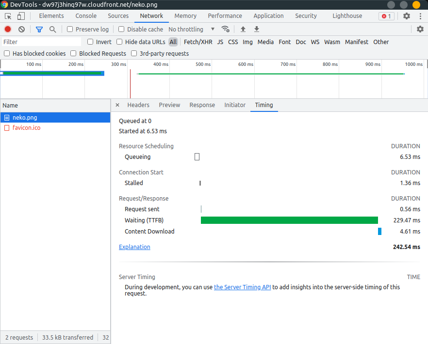
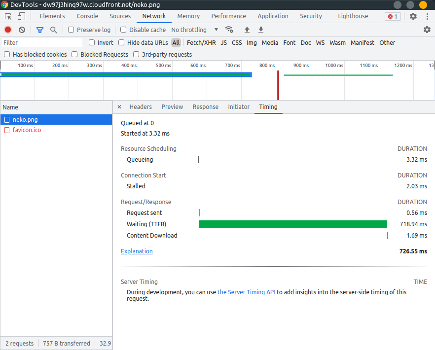
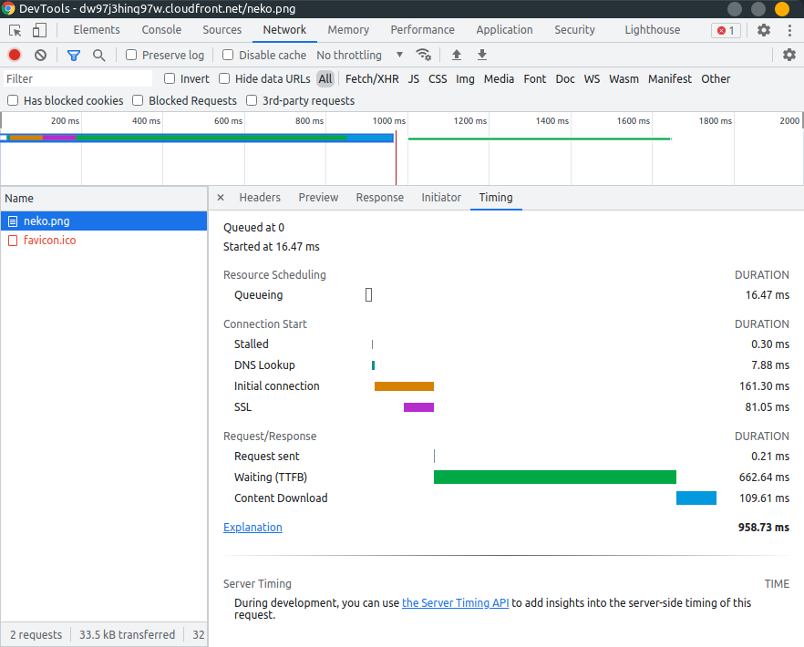
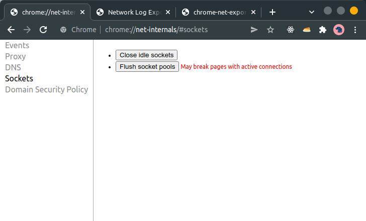

# CDNについて理解して使ってみよう

## 課題1

### CDNとは？

CDNとは、Contents Delivery Networkの略で、コンテンツを効率よく配信するためのネットワークのことを指す。

> コンテンツ配信ネットワーク（CDN）とは、インターネットコンテンツを高速配信するために連携する地理的に分散されたサーバーのグループを指します。
>
> [What is a CDN? | How do CDNs work? | Cloudflare](https://www.cloudflare.com/ja-jp/learning/cdn/what-is-a-cdn/)

Webホスティングと違い

- 直接コンテンツを持たないという点で、Webホスティングとは異なる
- ネットワークEdgeにコンテンツをキャッシュする
  - ネットワークEdge
    - 地理的にデバイスに近い場所にあるネットワークやサーバーのこと
    - 近いほうが通信量を抑えられる -> 速い

> CDNはコンテンツをホストせず、必要とされる適切なWebホスティングサービスの代わりにはなりませんが、ネットワーク Edgeでコンテンツをキャッシュするために役立ち、それがWebサイトのパフォーマンスを向上させています。
>
> [What is a CDN? | How do CDNs work? | Cloudflare](https://www.cloudflare.com/ja-jp/learning/cdn/what-is-a-cdn/)

利点

- ロード時間の短縮
  - ユーザーは近い場所にあるCDNサーバーと通信するので、速い
- キャッシュにより帯域幅を減らす
  - CDNサーバーがコンテンツをキャッシュするのでオリジンサーバーの通信の量が減る
- 分散による可用性・冗長性の向上
  - 分散したCDNサーバーによってコンテンツを配信するので、大量のトラフィックやハードウェア障害に強い
- セキュリティを向上させる
  - DDoSを軽減する仕組みがある

欠点

- リアルタイム性が損なわれる
  - キャッシュの更新の頻度によっては古い情報が表示されてしまう
- キャッシュ事故の発生
  - キャッシュ設定のミス、CDNサービスの設定のミスによりキャッシュしたくないコンテンツがキャッシュされてしまう可能性がある

参考

- [What is a CDN? | How do CDNs work? | Cloudflare](https://www.cloudflare.com/learning/cdn/what-is-a-cdn/)
- [【図解】CDNとは？仕組みと技術の基礎知識 - カゴヤのサーバー研究室](https://www.kagoya.jp/howto/it-glossary/web/cdn/)
- [CDN切り替え作業における、Web版メルカリの個人情報流出の原因につきまして | メルカリエンジニアリング](https://engineering.mercari.com/blog/entry/2017-06-22-204500/)
- [「LINE」タイムラインにおけるシステム不具合に関するお知らせ | LINE Corporation | セキュリティ＆プライバシー](https://linecorp.com/ja/security/article/169)

### 1

なぜCDNを使うとパフォーマンス改善になるのか？

世界中に分散したCDNサーバーにコンテンツをキャッシュし、それを返すため直接ユーザーがWEBサーバーと通信する必要がなくなり、WEBサーバーの負荷が軽減される。また、ユーザーに近いCDNサーバーからレスポンスを返すため、通信距離が近くなるため通信時間が短縮される。

### 2

- オリジンサーバー
  - オリジナルのサーバー
  - コンテンツを保持している
- エッジサーバー
  - CDNサービスによって管理されているサーバー
  - オリジンサーバーにリクエストを送り、コンテンツをキャッシュする

### 3

| | ブラウザキャッシュ | CDN |
| --- | --- | --- |
| キャッシュできるか | できる | できる |
| キャッシュのコントロール | HTTPヘッダーを使用する | HTTPヘッダーまたはサービス側での設定(サービスによる違いあり) |
| キャッシュの保存場所 | 各ユーザーのブラウザ | CDNサービスのサーバー |
| 複数ユーザー間のキャッシュの共有 | **できない** | **できる** |
| ユーザーによるキャッシュのクリア | できる | できない |
| キャッシュできるもの | HTTPレスポンスならなんでも | 左に同じ |
| その他 | | 世界中に分散したエッジサーバー・ファイル圧縮機能・DDoS軽減機能 |

- CDNの利点 (ブラウザキャッシュとの比較)
  - CDNの場合、ユーザー間でキャッシュを共有できるため、ブラウザキャッシュに比べてキャッシュのヒット率が高くなる。そのため、ユーザーが増えた場合でもオリジンサーバーの負荷を抑えられる。大量のユーザーが見込まれる場合はCDNのほうが良さそう。
  - CDNのキャッシュはCDNプロバイダーによって最適化されたネットワークによってエッジサーバー間で共有されるため、オリジンサーバーが遠い地域にある場合や、複数の国をターゲットにするサービスにも効果的。
  - ファイル圧縮機能やDDoSの軽減機能
- CDNの欠点
  - 費用
    - ただしCloudFlareのみ個人向けの無料プランがある
    - CloudFlare: 無料プランあり
    - fastly: 無料トライアルあり
    - AWS CloudFront: 12ヶ月間無料の対象
    - GCP Cloud CDN: 無料トライアルあり
  - 各サービスによってキャッシュのコントロール方法が異なるので注意が必要
  - あまり思いつかなかった

参考: [HTTP キャッシュ - HTTP | MDN](https://developer.mozilla.org/ja/docs/Web/HTTP/Caching)

## 課題2

### 準備

- 遠いリージョンのS3に画像保存
  - `us-east-2` にバケットを作成
    - 匿名ユーザーに対してgetObjectを許可するポリシーを付与
    - ACLはprivateとした
  - 画像を保存
    - 30kbほどの画像ファイル (neko.png)
    - https://praha-task-cdn-ohaio.s3.us-east-2.amazonaws.com/neko.png
- CloudFrontとS3を接続
  - 画像を表示できるように設定
  - https://dw97j3hinq97w.cloudfront.net/neko.png

### リクエスト/レスポンス速度を比較

#### S3 (us-east-2)

応答時間: 300ms ~ 1500msくらい。①300msのときと②1秒以上かかるときがある。この原因については (#補足 (応答速度のばらつきについて)) に書きました。

- ①
  - 
- ②
  - 

#### CloudFront

応答速度: 250ms ~ 1000msくらい。

こちらは、①200ms程度のとき、②650ms程度のとき、③1000ms程度のときがあった。③についてはコネクションの再利用が関係していると思われるが、①と②についてはわからなかった。リロードを連打すると、①と②がほとんど交互に来る。どのエッジサーバーに接続するかによって変わっている？

- ①
  - 
- ②
  - 
- ③
  - 

#### 結果

CDNを使用したほうが、コネクションの確立にかかる時間が大幅に短縮された。しかし全体の時間で見ると、あまり変わらなかった。検証に使用した画像のファイルサイズが30kbと小さすぎた？

| 時間 | S3 (us-east-2) | CloudFront |
| --- | --- | --- |
| 全体 | 300ms ~ 1500ms | 250ms ~ 1000ms |
| コネクションの確立 | 1000ms | 250ms |
| TTFB | 300ms | 250ms ~ 650ms |

TTFB: Time to first byte の略。HTTPリクエストを送信してから、レスポンスの最初の1バイトを受信するまでの時間のことを指す。

参考: [Time to first byte - Wikipedia](https://en.wikipedia.org/wiki/Time_to_first_byte)

## 補足 (Terraformのリージョンエラーについて)

今回もリージョンがらみのエラーが出た。

```sh
│ Error: Error putting S3 policy: BucketRegionError: incorrect region, the bucket is not in 'ap-northeast-1' region at endpoint ''
│       status code: 301, request id: , host id: 
│ 
│   with aws_s3_bucket_policy.allow_access_from_all_users,
│   on s3-with-cdn.tf line 24, in resource "aws_s3_bucket_policy" "allow_access_from_all_users":
│   24: resource "aws_s3_bucket_policy" "allow_access_from_all_users" {
│ 
```

しかしよく読むと `aws_s3_bucket_policy` のリージョンが `bucket` と違いますよということが書いてある。確かにbucketにのみ `provider = aws.ohaio` を設定しており、policyには設定していなかったのだが、bucketとpolicyは同じリージョンに作成する必要があるということみたい。

`aws_s3_bucket_policy` にも `provider = aws.ohaio` を追加するとエラーは解消された。[前の課題](../04_S3を理解する/04_S3を理解する.md)のエラーもおそらく同じ原因だと思われます。

## 補足 (応答速度のばらつきについて)

S3、CloudFrontともに応答速度が早いときと遅いときのばらつきがある。これは Chromeによる コネクションプールの再利用が関係している。

### 状況

遅い時の「Timing」


早い時の「Timing」


遅いときはInitial connection+SSLに時間がかかっており、早い時はスキップされている。前回のリクエストから30秒ほど開けてリクエストを送ると、再度Initial connectionが始まる。

### 原因

Chromeにはコネクションをプールしておき、再利用できるようにする最適化がある。この機能によりコネクションの確立がスキップされ、応答速度が早くなっていた。

> First, Chrome checks its socket pools to see if there is an available socket for the hostname, which it may be able to reuse - keep-alive sockets are kept in the pool for some period of time, to avoid the TCP handshake and slow-start penalties. If no socket is available, then it can initiate the TCP handshake, and place it in the pool. Then, when the user initiates the navigation, the HTTP request can be dispatched immediately.
>
> [High Performance Networking in Google Chrome - igvita.com](https://www.igvita.com/posa/high-performance-networking-in-google-chrome/#tcp-pre-connect)

ちなみに`chrome://net-internals#sockets` からプールしているコネクションを強制的に閉じることができる。`Close Idle sockets` ボタンを押してコネクションを閉じた後にリクエストを送ると、確かに毎回SSLコネクションの確立が行われた。



### 参考

- [windows - Force Chrome to close/re-open all TCP/TLS connections when profiling with the Network Panel - Stack Overflow](https://stackoverflow.com/questions/37170812/force-chrome-to-close-re-open-all-tcp-tls-connections-when-profiling-with-the-ne)
- [High Performance Networking in Google Chrome - igvita.com](https://www.igvita.com/posa/high-performance-networking-in-google-chrome/#tcp-pre-connect)

## その他

- キャッシュのパージのやり方
- それぞれの違い
  - AWS (CloudFront)
  - GCP (Cloud CDN)
  - Fastly
    - パージが速い (いつかのメンターセッションで聞いた)
- それぞれの使い方
- CDNは基本画像ファイルに使う？
  - キャッシュによるミスが怖いので
