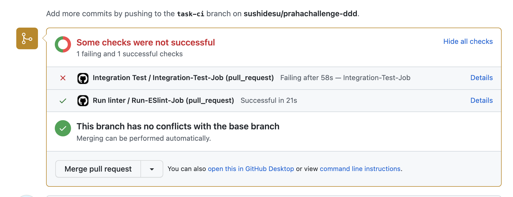
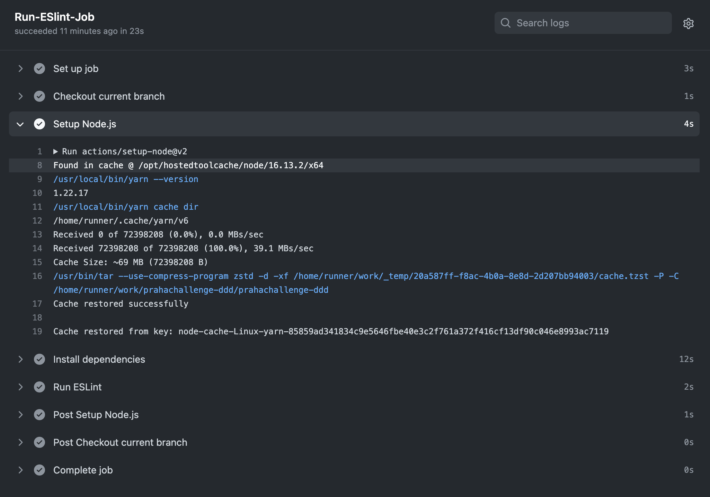
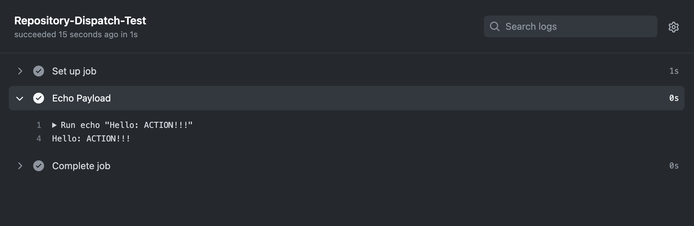
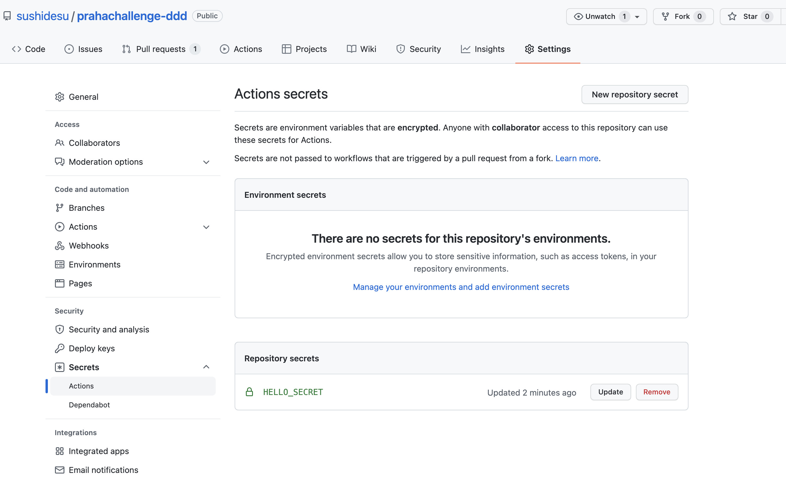

# CI環境を整備してみよう

## 課題1 (実装)

CI上でESLintを実行するworkflowを作成した。

- 実際の動作: https://github.com/sushidesu/prahachallenge-ddd/pull/22
- コード (レビュー用): [./run-linter.yml](./run-linter.yml)



## 課題2 (実装)

CI上で統合テストを実行するworkflowを作成した。

- 実際の動作: https://github.com/sushidesu/prahachallenge-ddd/pull/22
- コード (レビュー用): [./run-integration-test.yml](./run-integration-test.yml)

## 課題3 (質問)

### 1

CI実行時間の短縮

- node_modulesのキャッシュを有効化する ([GitHub Actions: Setup-node now supports dependency caching |](https://github.blog/changelog/2021-07-02-github-actions-setup-node-now-supports-dependency-caching/))
- jobの並列化
  - jobsに書いたものは並列に実行される
  - `[job].needs` にjobを指定することで、実行順序を制御することもできる

ESLint実行時にキャッシュを有効化してみた。 `Cache restored successfully` メッセージにより有効になっていることが確認できる。



参考: [GitHub Actions の Workflow を高速化する - Qiita](https://qiita.com/qualitia_cdev/items/407b0df9c0a0f0f45bbc)

### 2

`repository_dispatch` または `workflow_dispatch` イベントを使用することで、github外のイベントをフックにワークフローを実行できる。

作成したworkflowのコード: [./run-from-dispatch.yml](./run-from-dispatch.yml)

curlコマンド経由で実行できた。

```sh
curl -H "Accept: application/vnd.github.everest-preview+json" \
    -H "Authorization: token <token>" \
    --request POST \
    --data '{"event_type": "hello", "client_payload": { "text": "ACTION!!!"}}' \
    https://api.github.com/repos/sushidesu/prahachallenge-ddd/dispatches
```

実行結果



参考

- [Manually Trigger A GitHub Actions Workflow - goobar](https://goobar.dev/manually-trigger-a-github-actions-workflow/)

- Authorizationヘッダーに指定するtokenの作成方法: [Creating a personal access token - GitHub Docs](https://docs.github.com/en/authentication/keeping-your-account-and-data-secure/creating-a-personal-access-token)
- このworkflowを実行するために一時的にデフォルトブランチを変更した: [GitHub Actionsのworkflow_dispatchが表示されない場合はデフォルトブランチの設定を確認しよう | DevelopersIO](https://dev.classmethod.jp/articles/github-actions-workflow-dispatch-default-branch/)

### 3

特定のディレクトリ配下が変更されたときのみワークフローを実行するためには、 `push.paths` イベントを設定する。

`paths-ignore` を使用することで特定のディレクトリを除外することもできる。


```yml
# docsディレクトリが変更されたときのみ実行される
# README.md更新時のみ実行しない
on:
  push:
    paths:
      - 'docs/**'
    paths-ignore:
      - 'docs/README.md'
```

参考

- [Github Actions チートシート](https://zenn.dev/masaaania/articles/c930f2f755a577)
- [GitHub Actions のベストプラクティス](https://zenn.dev/snowcait/scraps/9d9c47dc4d0414)

### 4

他のjobの完了を待ってから実行するためには、 `<job>.needs` を設定する。

```yml
jobs:
  run-test:
    # テスト実行前に、lintを実行する
    needs: run-linter
    runs-on: ubuntu-latest
    steps:
      - name: run test
        run: yarn test
  run-linter:
    runs-on: ubuntu-latest
    steps:
      - name: run linter
        run: yarn lint

```

参考: [GitHub Actions の Workflow を高速化する - Qiita](https://qiita.com/qualitia_cdev/items/407b0df9c0a0f0f45bbc)

### 5

秘匿性の高い情報は、リポジトリ設定の「Secrets」に保持することができる。



設定した値には、`secrets.<NAME>` でアクセスできる。

```yml
steps:
  - name: deploy
    env:
      DEPLOY_KEY: ${{ secrets.DEPLOY_KEY }}
    run: yarn deploy

```

参考

- [How to use an SSH key inside GitHub actions - Max Schmitt](https://maxschmitt.me/posts/github-actions-ssh-key/)
- [Encrypted secrets - GitHub Docs](https://docs.github.com/en/actions/security-guides/encrypted-secrets)
