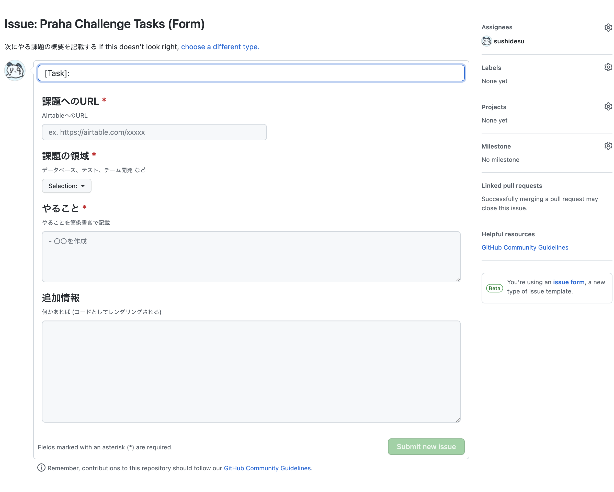

# チーム開発を円滑にするコツを覚えよう

## 課題1 (質問)

### 1

PRの粒度

- レビューしやすくなる
  - >PRの粒度が大きくなってしまうと、1つのPRに複数の目的が混ざってしまったり、コード差分が大きくなってしまったりします。そうすると、どこを中心にレビューして良いかが分かりづらく、レビュアーの負担が大きくなってしまいます。 [より良いコードレビューを依頼するために学んだこと - Tech Blog - Recruit Engineer](https://engineer.recruit-lifestyle.co.jp/techblog/2017-02-07-code-review/)
- リリースのためのテストが簡単になる
- 原因の特定、ロールバックが容易
- → リリース頻度・デプロイ頻度が上がる
- コードの問題点にレビュアーが早く気づくことができる

参考

- [「巨大プルリク1件vs細かいプルリク100件」問題を考える（翻訳）｜TechRacho by BPS株式会社](https://techracho.bpsinc.jp/hachi8833/2018_02_07/51095)
- [より良いコードレビューを依頼するために学んだこと - Tech Blog - Recruit Engineer](https://engineer.recruit-lifestyle.co.jp/techblog/2017-02-07-code-review/)
- [プルリクエストを作ってコードレビューをしてもらう際に気をつけていること - てくすた](https://texta.pixta.jp/entry/2017/12/05/123000)

### 2

コードのコメント

#### コードのコメントに書くこと

- Why not (あえてやっていないこと、なぜ別のやり方を採用しなかったのか) を書く
  - 「やったこと」はコードからわかるが、「やらなかったこと」はわからない
  - > コードには How
テストコードには What
コミットログには Why
コードコメントには Why not
を書こうという話をした
  - [Takuto WadaさんはTwitterを使っています 「コードには How テストコードには What コミットログには Why コードコメントには Why not を書こうという話をした」 / Twitter](https://twitter.com/t_wada/status/904916106153828352)
- コードブロックの目的 (?)
  - 読みやすくなる
  - > 数行に渡っている一連の処理の目的は、コメントに書きましょう。コードをを読む人の手助けになります。 [コードのコメントには何を書くのか - Qiita](https://qiita.com/ndxbn/items/8aa0c2a3c7ef1f044ffb)
  - 自分もこのようなコメントをたまに書くが、本当に必要なのかは疑問。
  - コメントをつけたくなるほどの一連の処理なら、関数に切り出して適切な名前をつけるべきではないか？
- 難しい前提知識の説明
  - > 普通は知らないであろう知識を要求する場合は、その知識を得られる場所をコメントで明記しましょう。 [コードのコメントには何を書くのか - Qiita](https://qiita.com/ndxbn/items/8aa0c2a3c7ef1f044ffb)

#### コードのコメントに書くべきではないこと

- 重複する知識
  - コードの再翻訳など
  - >悪いコメントとは「書くと二重管理になるもの」
二重管理は悪です。逆に「他のなにかで管理できないものをコメントで書く」ということができていれば及第点だと思います。
  - [コードのコメントには何を書くのか - Qiita](https://qiita.com/ndxbn/items/8aa0c2a3c7ef1f044ffb)

#### 疑問

- 意図が伝わる命名ができていれば、コメントはほとんど必要なくなる？ (コメントはなるべく少ないほうが理想的？)

#### 参考

- [Takuto WadaさんはTwitterを使っています 「コードには How テストコードには What コミットログには Why コードコメントには Why not を書こうという話をした」 / Twitter](https://twitter.com/t_wada/status/904916106153828352)
- [コードのコメントには何を書くのか - Qiita](https://qiita.com/ndxbn/items/8aa0c2a3c7ef1f044ffb)

### 3

#### コミットコメントに書くべきこと

- Why (なぜコードを変更したのか)
  - どう変更したかは変更履歴でわかる
  - しかしその意図はわからない
  - [Takuto WadaさんはTwitterを使っています 「コードには How テストコードには What コミットログには Why コードコメントには Why not を書こうという話をした」 / Twitter](https://twitter.com/t_wada/status/904916106153828352)
- = 変更にまつわるコンテキスト
  - > Re-establishing the context of a piece of code is wasteful. 
コードの一部のコンテキストを再確立することは無駄です。(google翻訳)
[Who-T: On commit messages](http://who-t.blogspot.com/2009/12/on-commit-messages.html)
- prefixをつける
  - [AngularJS Git Commit Message Conventions](https://gist.github.com/stephenparish/9941e89d80e2bc58a153)
- 短くてすぐに意味がわかるものにする
  - > コミットログにはWhyを書くべきだ、というのを何かで見かけたので because とか since を使ったログがどの程度あるかを調べたが、8540件のうち22件だった。基本的に短く、シンプルに、一目で意味が取れるログが好まれる傾向がある。
  - [[転載] gitにおけるコミットログ/メッセージ例文集100](https://gist.github.com/mono0926/e6ffd032c384ee4c1cef5a2aa4f778d7)

やはり [AngularJS Git Commit Message Conventions](https://gist.github.com/stephenparish/9941e89d80e2bc58a153) のように、一行目にどのような変更なのかが一目でわかるタイトルをつけて、3行目以降にその理由 (動機づけ) をかくのが良さそう？

Q: コミットコメントを複数行にしたことがあまりないが、要約(タイトル)+理由(本文)の形式で複数行書いたほうが良い？

A: 短くすむ場合はタイトルのみでもよさそう

> Firstly, not every commit requires both a subject and a body. Sometimes a single line is fine, especially when the change is so simple that no further context is necessary.
> まず、すべてのコミットがサブジェクトとボディの両方を必要とするわけではありません。 特に変更が非常に単純で、それ以上のコンテキストが必要ない場合は、1行で問題ない場合があります。(google翻訳)
> [How to Write a Git Commit Message](https://cbea.ms/git-commit/)

#### コミットコメントに書くべきではないこと

- 長過ぎる (50文字以上) 件名
  - 50文字に収まらない場合、コミットが大きすぎる可能性がある
  - > Tip: If you’re having a hard time summarizing, you might be committing too many changes at once. Strive for atomic commits (a topic for a separate post).
ヒント：要約するのに苦労している場合は、一度にコミットする変更が多すぎる可能性があります。 アトミックコミットに努めます（別の投稿のトピック）。(google翻訳)
[How to Write a Git Commit Message](https://cbea.ms/git-commit/)
- 形式がそろっていない、構造化されていない文章
  - `git log`, `git blame`, `revert`, `rebase` などgitコマンドが使用しづらくなる
  - → 過去に発生した変更の理由を調査できない
  - → 保守性が下がる
  - > But a well-cared for log is a beautiful and useful thing. git blame, revert, rebase, log, shortlog and other subcommands come to life. 
しかし、手入れの行き届いた丸太は美しくて便利なものです。 git blame、revert、rebase、log、shortlog、およびその他のサブコマンドが機能します。
[How to Write a Git Commit Message](https://cbea.ms/git-commit/)
- 本来一つのコミットにまとめるべきもの
  - 例: (変更理由は同じなのに、)ファイルごとに分割されたコミット
  - 例: 「その他の修正とクリーンアップ」のような前のコミットに付随するコミット
  - > Impossible to find when a bug was introduced, hard to bisect and makes it harder for anyone else to keep track of what's happening in the project.
バグがいつ発生したかを見つけることができず、二分するのが難しく、プロジェクトで何が起こっているのかを他の人が追跡するのが難しくなります。(google翻訳)
[Who-T: On commit messages](http://who-t.blogspot.com/2009/12/on-commit-messages.html)

良いコミットメッセージを書くためには、適切な粒度でコミットする必要がある。文章力で解決できることではなく、設計力(?)が必要そう。`git log`, `git blame` `revert` などgitコマンドで扱いやすいようにコミットを構成するという観点は考えたことがなかった。

## 課題2 (実装)

### 1

#### PRテンプレートを作成した

コード: [pull_request_template.md](./pull_request_template.md)

- いつもレビュー用に手動で作成しているものをテンプレート化してみた
- デフォルトブランチの `.github` ディレクトリ、 `docs` ディレクトリ、ルートディレクトリに `pull_request_template.md` を追加することで使用できる
- 複数テンプレートを作成して、URLクエリでテンプレートを指定してPRを作成することもできる
- [リポジトリ用のプルリクエストテンプレートの作成 - GitHub Docs](https://docs.github.com/ja/communities/using-templates-to-encourage-useful-issues-and-pull-requests/creating-a-pull-request-template-for-your-repository)

### 2

#### Issueテンプレートの作成

コード: [praha-challenge-tasks.md](./praha-challenge-tasks.md)

- `.github/ISSUE_TEMPLATE` に作成する
- ファイルを手動で作成する方法はレガシーらしく、Issueテンプレートビルダーを使用する方法が推奨されている
  - > アップグレードされた複数 Issue のテンプレートビルダー または Issue フォーム を使用して Issue テンプレートを作成することをお勧めします。
  - バリデーションやプレビューができて便利だった
- 参考: [リポジトリ用に Issue テンプレートを設定する - GitHub Docs](https://docs.github.com/ja/communities/using-templates-to-encourage-useful-issues-and-pull-requests/configuring-issue-templates-for-your-repository#creating-issue-templates)

#### Issueフォームも作成 (ついでに)

コード: [praha-challenge-tasks-form.yml](./praha-challenge-tasks-form.yml))

- `.yml` で書く必要がある
- ベータ版なので、publicのリポジトリでしか使用できないらしい
- `input`, `textarea`, `dropdown`, `checkbox` などが使えて便利！
- 各項目を必須にできるのも良い
- 
- 参考: [リポジトリ用に Issue テンプレートを設定する - GitHub Docs](https://docs.github.com/ja/communities/using-templates-to-encourage-useful-issues-and-pull-requests/configuring-issue-templates-for-your-repository#creating-issue-forms)

## 課題3

円滑にするための取り組み
