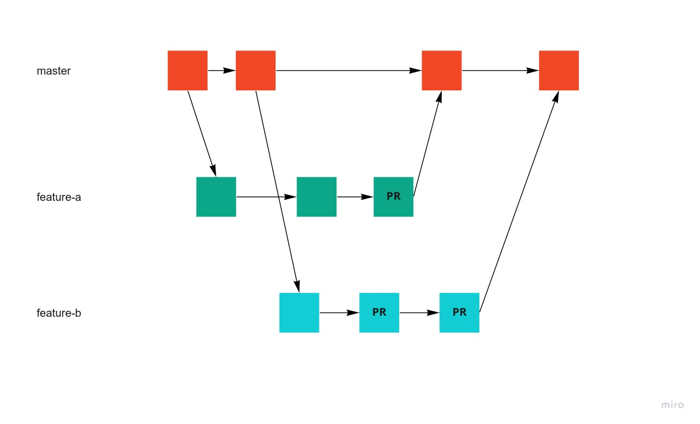
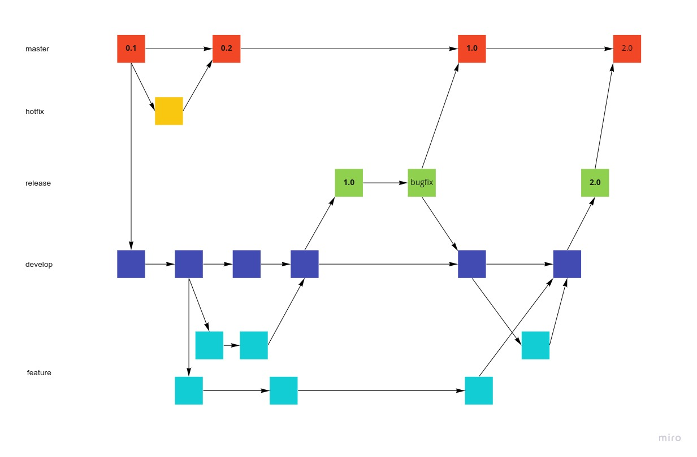
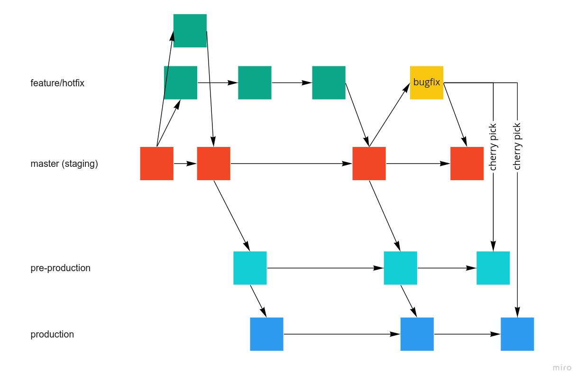

# ブランチ戦略を学ぼう

## 課題1

### Github Flow

- 各ブランチの説明
  - **master**
    - 本番環境
    - 常にデプロイできるようにする
    - masterにマージするためにはレビューやテストが必要
    - デプロイ作業を自動化する
  - **work branches**
    - 最新のmasterから作成される
    - 機能の追加/改修を行う
    - 開発後は直接masterにマージする
    - integration branchesを作成し複数のwork branchesを統合してマージしてもよい
- メリット
  - CI/CDフレンドリー
  - シンプル
  - 単一バージョンで運営するときに便利
- デメリット
  - 本番環境のコードが不安定になりやすい
  - 計画的なリリースが必要な時には不便

### Gitflow

- 各ブランチの説明
  - **master**
    - 本番環境
    - releaseまたはhotfixからのみマージされる
  - **hotfix**
    - 重大な不具合があった場合、masterから作成される
    - 不具合の修正を行い、masterにマージする
  - **release**
    - featureブランチをマージ後のdevelopから作成される
    - 不具合の修正があれば行い、masterにマージする
  - **develop**
    - 最新のmasterから作成される
    - 機能の開発を行う
    - リリースのタイミングで、releaseを作成する
  - **feature**
    - 最新のdevelopから作成される
    - 機能の開発を行い、developにマージする
- メリット
  - ブランチの命名が体系的なため、理解しやすい
  - 拡張機能がある (https://github.com/nvie/gitflow)
  - 複数のバージョンが必要なプロダクト向き?
- デメリット
  - git履歴が読みづらくなる
  - 運用が複雑

### GitLab Flow

- 各ブランチの説明
  - **feature/hotfix**
    -	最新のmasterから作成される
    -	機能開発/改修を行う
    -	masterにマージする
    -	不具合修正の場合はmasterにマージして問題なければ、pre-production、productionにも直接マージ(cherry-pick?)する
  - **master**
    - メインのブランチ
    - ステージング環境にデプロイされる
    - リリースのタイミングでpre-productionにマージする
  - **pre-production**
    -	プリプロダクション環境にデプロイされる
    -	問題なければ、productionにマージする
  - **production**
    -	本番環境
- メリット
  - ブランチの切り方だけでなく、CI/CDのルールが定められている
    - masterに直接コミットしない、全てのコミットをテストするなど
  - Gitの履歴が読みやすくなる
- デメリット
  - GitHub Flowよりも複雑
  - ステージング環境/ぷりプロダクション環境など用意が大変そう

### どれを選ぶか？

シンプルなので、GitHub Flow。GitLab FlowのようにCI/CDのルールも定めておくと良さそう。

### 参考
- [4 branching workflows for Git. In this article, we will cover the most… | by Patrick Porto | Medium](https://medium.com/@patrickporto/4-branching-workflows-for-git-30d0aaee7bf)
- [Gitlab-flowの説明 - Qiita](https://qiita.com/tlta-bkhn/items/f2950aaf00bfb6a8c30d)
