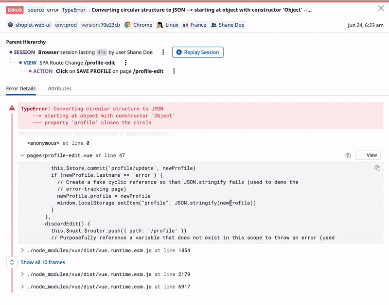

# サービスのモニタリングを考える

## 課題1 (質問)

### フロントエンドの監視まとめ

| SaaS | しきい値によるアラート | エラー時のアラート |
| --- | --- | --- |
| Datadog | ◯ | ◯ (見ていたページや、クリック状況がわかる) |
| LogRocket | ◯ | ◎ (直前の操作状況が動画でわかる) |
| Sentry | ◎ (変化率を元にしたアラート有) | △ (操作状況がわかるかは不明) |
| Bugsnag | ◎ (マイルストーンによるアラート有) | △ (操作状況がタイムライン表示できるかも？) |
| Rollbar | ? (不明) | △ (操作状況がわかるかは不明) |

### フロントエンドが一定期間で一定数以上クラッシュ時に通知

#### Datadog

設定した期間としきい値でアラートを出すことができる。

> Audit Logs monitors alert you when a specified type of audit log exceeds a user-defined threshold over a given period of time.
>
> [Audit Logs Monitor](https://docs.datadoghq.com/ja/monitors/create/types/audit_logs/)

#### LogRocket

同じく。

> Alerts on Timeseries charts allow you to trigger notifications when the value of one of your timeseries metrics exceeds or drops below a threshold that you have configured. You can create up to 10 alerts and distribute them across any combination of your metrics.
>
> [Timeseries Alerting](https://docs.logrocket.com/docs/metrics-alerting)

### Sentry

しきい値の他に、変化率を元にしたアラートも作成できる。

> Sentry provides several configuration options to create a metric alert based on your organization's needs.
> (中略)
> 
> There are two threshold types:
> - Count: A fixed threshold, such as when there are 100 errors in a period of time.
> - Percent change: A dynamic threshold, such as when there are 10% more errors in a time period compared to a previous period. These are also referred to as Change Alerts.
>
> [Metric Alert Configuration | Sentry Documentation](https://docs.sentry.io/product/alerts/create-alerts/metric-alert-config/#thresholds)

#### Bugsnag

しきい値の他に、マイルストーン (10個目、 1000個目ごと) によるアラートも作成できる。

> An error occurs frequently will alert you when an error receives x events in y hours that match your filters, where you can define the number of events (x) and the time interval (y).
>
> [Bugsnag docs › Product › Integrations › Incident management](https://docs.bugsnag.com/product/integrations/incident-management/#configuring-alerts)

### フロントエンドのエラー時に、ユーザーの状況とともに通知

#### LogRocket

動画で操作状況がわかる！

> - JSのエラーが発生していないか
> - あるユーザのブラウザにどのように表示されていたか(動画のように表示される)
> - 勿論エラー発生前後の画面の様子も見れる
> - どういったHTTPリクエストがあったのか(所謂Networkパネル、ヘッダーも見れる)
> - ユーザーはどういったブラウザ・OS環境なのか
>
> [フロントエンドのクラウドロガー・レコーダー、LogRocketの感想 - uzullaがブログ](https://uzulla.hateblo.jp/entry/2018/12/05/151947)

#### Datadog

ドキュメントの画像を見たところ、直前まで見ていたページや、クリック状況を確認できそう。

> エラー追跡を使用して、外れ値およびエラー、タイムアウト、クラッシュのグループに関する自動アラートを取得し、MTTR を大幅に削減します。
>
>[リアルユーザーモニタリング](https://docs.datadoghq.com/ja/real_user_monitoring/)

#### Sentry

エラーログ、環境の情報は収集できるが、ユーザーの作業手順までは収集してくれない？

> エラーログだけでなく、OSの種類やバージョンも一緒に記録されます。特定のデバイスでしか発生しないようなエラーまで検知して、整理して表示できるようになるんです。
>
> [フロントエンドのエラーを「Sentry」で可視化！技術力の向上にも効果的な、その活用法 | SELECK [セレック]](https://seleck.cc/778)

#### Rollbar

スタックトレース、リクエストパラメータ、ローカル変数、影響を受けるユーザーとIPアドレス、ブラウザとOS、デプロイされたコードバージョンなどを取得できる。こちらも作業手順までは収集できない？

> Rollbar automatically collects all the data you need to replicate and debug an error, presented in ways optimized for debugging speed.
>
> Works with JavaScript source maps. Get stack traces, request parameters, local variables, affected users and IP addresses, browsers and OSes, deployed code versions, and more.
>
> [Javascript Error Tracking with Rollbar - Rollbar](https://rollbar.com/platforms/javascript-error-tracking/)

#### Bugsnag

ユーザーのクリック状況などがタイムライン表示できる？ (詳しいことはわからず)

> Efficiently reproduce errors with a timeline of user and system events leading up to each error, like clicks, console logs and errors, page load, and more.
>
> [JavaScript Error Monitoring & Reporting | Bugsnag Platform](https://www.bugsnag.com/platforms/javascript)

---

ここからバックエンド

### バックエンドのクラッシュ時に再起動&通知

#### AWS CloudWatch

EC2アクションというものを設定することで、再起動できる。

> CloudeWatchは、サーバの情報を監視し、問題が発生したら管理者にメール等で通知する事ができます。他にも、「インスタンスの再起動」 等のEC2の状態を変更させる事も出来ます。
>
> [【AWS】【CloudWatch】異常で止まったインスタンスを自動で再起動させる - websandbag ブログ](https://blog.websandbag.com/entry/2019/01/10/025849)

参考: [【新機能】CloudWatchのアクションにEC2インスタンスの再起動が追加されました！ | DevelopersIO](https://dev.classmethod.jp/articles/added-ec2reboot-cw-action/)

### APIのレスポンスタイムを可視化

#### Datadog

レスポンス時間の他に、ステータスコードやヘッダー、ボディーの内容のチェックもできる。

> HTTP テストを使用すると、アプリケーションの API エンドポイントに HTTP リクエストを送信して、リクエストに応答していること、および全体的な応答時間、ステータスコード、ヘッダーまたは本文のコンテンツなどの定義した条件を満たしていることを確認できます。
>
> [HTTP テスト](https://docs.datadoghq.com/ja/synthetics/api_tests/http_tests/?tab=%E3%83%AA%E3%82%AF%E3%82%A8%E3%82%B9%E3%83%88%E3%82%AA%E3%83%97%E3%82%B7%E3%83%A7%E3%83%B3)

#### Sentry

各マイクロサービスでの処理を見ることができる？ (よくわからず)

> 2020年7月からJavascriptとPython向けにパフォーマンス監視機能を提供し、その後も対応言語や機能を増やしています。
>
> [Sentryのパフォーマンス監視機能とPythonで使える便利設定 — HACK The Nikkei](https://hack.nikkei.com/blog/advent20211224/)

#### mackerel

レスポンスタイム、ステータスコード、レスポンスボディのチェックが可能。

> 外形監視とは、指定したURLに定期的にリクエストを送り、ステータスコードやレスポンスボディの中身、レスポンスにかかった時間などを監視する機能です。対象URLへアクセスするプロトコルがHTTPSの場合は、SSL証明書の有効期限を監視することもできます。
>
> [製品 - 機能・特長 - 高度な監視 - Mackerel（マカレル）: 新世代のサーバー管理・監視サービス](https://ja.mackerel.io/product/features/advanced-monitoring)

### スロークエリを可視化

#### Datadog

平均レイテンシ、総実行時間、クエリされた行数などのデータも収集できる。

> 実行計画を分析し、パフォーマンスを低下させる非効率的なクエリパターンを特定
>
>[データベース モニタリング | Datadog](https://www.datadoghq.com/ja/product/database-monitoring/)

#### AWS Lambda + CloudWatch

CloudWatchにスロークエリログを流し、それをlambda経由でslackに通知している例。

- [Amazon Aurora のスロークエリを Slack に通知する - enomotodev’s blog](https://enomotodev.hatenablog.com/entry/2018/12/12/224648)
- [RDSのスロークエリ増加をLambdaでSlackに通知 - Qiita](https://qiita.com/nanakenashi/items/0e63716a205b6d9a08a8)

CloudWatchから直接slackに通知はできないのかな？

できそう？ → [CloudwatchのアラートをSlackへ通知する｜株式会社しずおかオンライン](https://www.esz.co.jp/blog/2874.html)

### WEBアプリケーションの安定稼働のために監視しておいたほうが良さそうなメトリクス

- インタラクションのレスポンス
  - 例: レンダリング回数、クリックしてから画面の表示が変わるまでの時間
  - フォームなどで意図しないレンダリングが発生して極端に画面の反応が悪くなっているときがあった。
  - 開発中には気づきづらい+重大な問題なので、監視しておきたい
