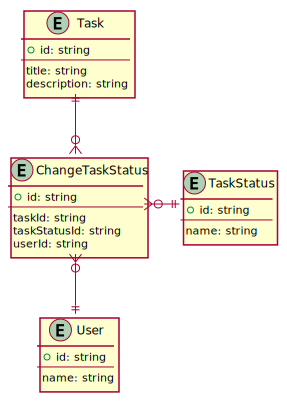
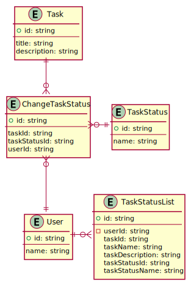
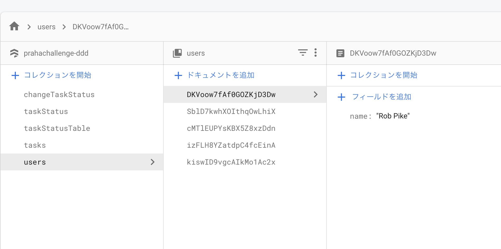
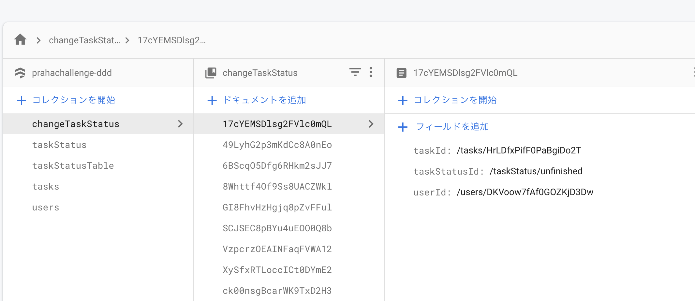
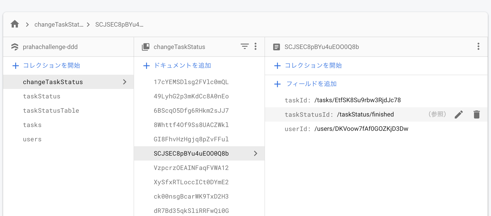
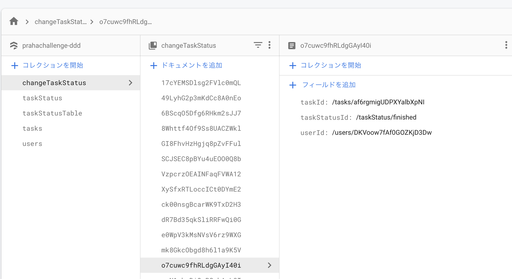

# Firestoreを使ってリレーショナルDB以外にも慣れる

## 課題1 (モデリング)

### prahachallengeをモデリング

- 以下のエンティティとプロパティが存在しています
  - ユーザー
    - 名前
  - 課題
    - タイトル
  - 課題ステータス
    - 未完了
    - 完了

> DynamoDBのデータベース設計はRDBとは異なります。RDBは柔軟にクエリが可能であるため、データへのアクセスパターンを考慮せずに、最初に正規化されたテーブルを設計します。一方、DynamoDBはクエリが限定的であるために、初めにデータへのアクセスパターンを決めて、それに基づいてテーブル設計を行います。
>
> https://zenn.dev/higashimura/articles/74c6e6bf63a133#%E3%83%87%E3%83%BC%E3%82%BF%E3%83%99%E3%83%BC%E3%82%B9%E8%A8%AD%E8%A8%88

この手順で設計する

#### 1. モデリング



<details><summary>ER図コード</summary>

```plantuml
entity Task {
  + id: string
  --
  title: string
}

entity User {
  + id: string
  --
  name: string
}

entity TaskStatus {
  + id: string
  --
  name: string
}

entity ChangeTaskStatus {
  + id: string
  --
  taskId: string
  taskStatusId: string
  userId: string
}

Task ||--o{ ChangeTaskStatus
ChangeTaskStatus||--o{ User
ChangeTaskStatus ||-o{ TaskStatus
```
</details>

#### 2. Read Light / Write Heavy を考える

Airtableのように、タスク一覧+ユーザーごとのタスクステータスをReadしやすいようにする

現在の設計では課題一覧の取得は以下のような流れになる。問い合わせ回数が多く取得処理が複雑になっている。

1. ChangeTaskStatusからTask/Userごとに最新のtaskStatusIdを取得する
1. Taskを取得する
1. Userを取得する
1. TaskStatusを取得する
1. マージする
1. Taskのid順に並び替える

そこで、 `TaskStatusList` テーブルを作成し、少ない問い合わせ回数で課題位一覧を取得できるようにする。

`TaskStatusList` では、タスクごとにユーザーの情報・ステータスの情報を非正規化して保持している。



<details><summary>ER図コード</summary>

```plantuml
entity TaskStatusTable {
  + id: string
  --
  taskId: string
  userId: string
  userName: string
  taskStatusId: string
  taskStatusName: string
}

entity Task {
  + id: string
  --
  title: string
}

Task ||-|| TaskStatusTable

entity User {
  + id: string
  --
  name: string
}

entity TaskStatus {
  + id: string
  --
  name: string
}

entity ChangeTaskStatus {
  + id: string
  --
  taskId: string
  taskStatusId: string
  userId: string
}

Task ||--o{ ChangeTaskStatus
ChangeTaskStatus||--o{ User
ChangeTaskStatus ||-o{ TaskStatus
```
</details>

### 初期データ投入

[./initData.ts](./initData.ts) で投入した

#### 実行コマンド

```sh
$ deno run --allow-env --allow-read --allow-net initData.ts
```

#### 実行結果

ユーザーが3人以上登録されている



1人のユーザーにつき3個の課題が「完了」か「未完了」の状態で紐づけられている (画像は `users/DKVoow7fAf0GOZKjD3Dw` のユーザー)





## 課題2 (実装)

## 課題3 (質問)
