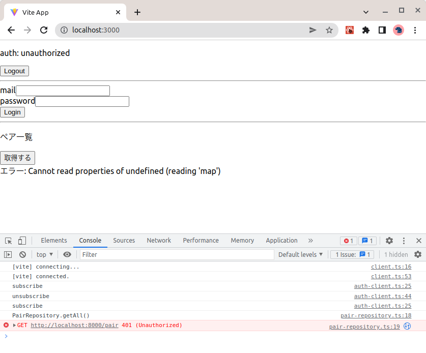
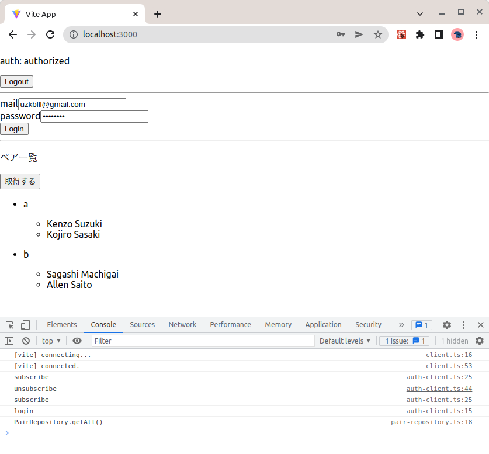

# FIrebase Authentication（IDaaS）を使ってみる

## 課題1 (実装)

特大課題」でモデリングしたプラハチャレンジのサービスに認証機能を追加

### ユーザーが新規登録/ログインするための画面を作成

- [該当PR](https://github.com/sushidesu/prahachallenge-ddd/pull/24)
  - フロントエンド ( [/frontend/src/App.tsx](https://github.com/sushidesu/prahachallenge-ddd/pull/24/files#diff-e56cb91573ddb6a97ecd071925fe26504bb5a65f921dc64c63e534162950e1eb) )
    - Viteで作成した
    - FirebaseUIは使わずに、Reactでフォームを作成した (楽しいので)
    - 特に見てほしい部分 [`useAuth.ts`](https://github.com/sushidesu/prahachallenge-ddd/pull/24/files#diff-e14ade60875e09462d152f0e8459689cc1c6b496664a094a6dd8f32dba86eb74)
      - フロントエンドで認証処理を実装している部分
      - 最近はこういう書き方に落ち着いている
  - バックエンド ( [/src/controller/pair-controller.ts](https://github.com/sushidesu/prahachallenge-ddd/pull/24/files#diff-311bdde1d7a56c31b60373a2bd6fb0aecffb3229d974727e575b850bde5ce999) )
    - ペア一覧を取得するエンドポイントに認可機能を追加した
    - 特に見てほしい部分 [`pair-controller.ts`](https://github.com/sushidesu/prahachallenge-ddd/pull/24/files#diff-311bdde1d7a56c31b60373a2bd6fb0aecffb3229d974727e575b850bde5ce999)
      - 認可 -> レスポンスまでの一連の流れを実装している部分
        - 一連の流れに違和感がないか
      - 認可処理はプレゼンテーション層 (controller) に [インターフェース](https://github.com/sushidesu/prahachallenge-ddd/pull/24/files#diff-442efffbc7719798665ed507b8ca66251d98ab1ab46bce57204b6cf54abd2a02) を置いて、インフラ層に [実装](https://github.com/sushidesu/prahachallenge-ddd/pull/24/files#diff-300fa48448474dfe120bb518abcd8367df856f61b6e69b6937384e139177f591) を書いた
        - 成功・失敗を好きな形で表現できる
        - DIしているのでテストしやすい

### APIに認可機能を加える

#### 非ログイン時 (401が返る)



#### ログイン時 (ペア一覧を取得できる)



## 課題2 (質問)

### 前提

> バックエンド用のFirebase adminにはアクセストークンとセッションクッキーを交換するためのメソッドも用意されています

について調べる。


#### `交換するメソッド`

IDトークンを送信することでセッションクッキーを生成できる (事前にCSRFトークンによる検証も必要)

[Firebaseのドキュメント](https://firebase.google.com/docs/auth/admin/manage-cookies#create_session_cookie) より

> 指定された ID トークンと引き換えにセッション Cookie を生成するには、HTTP エンドポイントが必要です。トークンをエンドポイントに送信し、Firebase Admin SDK を使用してカスタムのセッション継続時間を設定します。クロスサイト リクエスト フォージェリ（CSRF）攻撃を防止するための適切な措置が必要です。

```ts
  getAuth()
    .createSessionCookie(idToken, { expiresIn })
    .then(
      (sessionCookie) => {
        // Set cookie policy for session cookie.
        const options = { maxAge: expiresIn, httpOnly: true, secure: true };
        res.cookie('session', sessionCookie, options);
        res.end(JSON.stringify({ status: 'success' }));
      },
```

#### アクセストークン？

「課題1で使用したもの」・「セッションクッキーの生成に必要なもの」は、アクセストークンではなく**IDトークン**で、両者は明確に区別されるものではないか？

- アクセストークン
  - リソースにアクセスできるか？という認可情報
  - > 認可（リソースへのアクセスコントロール＝あるリソースへの権限（readやwriteなど）を持っているかどうか確認すること）
- IDトークン
  - 誰なのか、どうやって認証したかなどの認証情報
  - > IDトークンは(OAuth認証に欠けている)認証イベントに関する情報を JWT(JSON Web Token) と言う仕組みで署名をつけたり暗号化してクライアントに渡すための仕組み

参考

- [OAuth認証とは何か?なぜダメなのか - 2020冬 - r-weblife](https://ritou.hatenablog.com/entry/2020/12/01/000000)
- [【OAuth 2.0 / OIDC】アクセストークンとIDトークンの違い ＋ OIDC誕生の歴史 - yyh-gl's Tech Blog](https://yyh-gl.github.io/tech-blog/blog/id_token_and_access_token/)

---

ここから本題

### アクセストークンとセッションクッキーの使い分け

> アクセストークンの代わりにセッションクッキーを認証に使うことも出来そうですが、どのような状況で使うと良さそうでしょうか？

上に書いた通り、そもそも両者は別の目的を持つものである。なのでここではIDトークンとセッションクッキーの使い分けについて答える。

- IDトークン
  - ステートレス
  - (トークンをローカルストレージに保存する場合) 悪意のあるサードパーティライブラリによって不正にアクセスされる可能性がある
  - トークンの取り消しが困難
    - > Firebase ID トークンはステートレス JWT であるため、トークンの取り消しの判定は、Firebase Authentication バックエンドからトークンのステータスを要求するしかありません。 (https://firebase.google.com/docs/auth/admin/manage-sessions#detect_id_token_revocation)
  - 結論: SPAのときに使うと便利
- セッションクッキー
  - ステートフル
  - △ CSRFのリスクがある
    - SPAの場合、CSRFトークンを毎回サーバーから受け取る必要がある
  - ◯ JSからのアクセスは防ぐことが可能 (http-only属性)
  - ◯ クッキーの属性を使用してよりセキュアにできる
    - > ドメイン、パス、セキュア、httpOnly など、アプリケーションの要件に基づいて Cookie ポリシーを適用できる柔軟性。
  - ◯ 取り消しやすい
     - > トークンの盗用が疑われる場合に、既存の更新トークン取り消し API を使用してセッション Cookie を取り消す機能。
  - 結論: SSRするアプリのとき便利

参考

- [SPA認証トークンはlocalStorageでもCookieでもない、Auth0方式はいいねというお話 - @mizumotokのブログ](https://mizumotok.hatenablog.jp/entry/2021/08/04/114431)
- [Web Authentication: Cookies vs. Tokens | by Chameera Dulanga | Bits and Pieces](https://blog.bitsrc.io/web-authentication-cookies-vs-tokens-8e47d5a96d34)

### トークンが盗まれた場合の対応

> 万が一にもアクセストークンが盗まれて不正ログインされてしまった時

(アクセストークン = リソースへのアクセス権なので、不正ログインはされなさそう)

#### アクセストークン

無効化が難しい。

> 一方でアクセストークンの無効化は、アクセストークンを JWT で実装するといったケースでは非常に困難なものになります。このようなケースでは、アクセストークンの有効期限を短くして対応することになるでしょう。
>
> [OAuth 2.0の認可権限無効化の仕様 - 理系学生日記](https://kiririmode.hatenablog.jp/entry/20170225/1488013978)

リフレッシュトークン (アクセストークンを更新するためのトークン) は無効化できるため、アクセストークンの期限を短くしておく + リフレッシュトークンを無効化する で対応する。

> トークンの無効化という文脈には以下の 2 つがあります。
>
> - リフレッシュトークンの無効化
> - アクセストークンの無効化
>
> このうち、絶対に実装せよ(MUST) とされているのはリフレッシュトークンの無効化です。
>
> [OAuth 2.0の認可権限無効化の仕様 - 理系学生日記](https://kiririmode.hatenablog.jp/entry/20170225/1488013978)

#### IDトークン

(Firebaseの場合) サーバー負荷がかかるため、セキュリティルールで無効化を確認する方法が推奨されている。

> Firebase ID トークンはステートレス JWT であるため、トークンの取り消しの判定は、Firebase Authentication バックエンドからトークンのステータスを要求するしかありません。そのため、このチェックをサーバーで実行すると、ネットワークで追加のラウンドトリップを必要とする負荷の大きい処理となります。

##### セキュリティールールで取り消しを確認する

> Admin SDK を使用してチェックを行うのではなく、取り消しを確認する Firebase セキュリティ ルールを設定することで回避できます。
>
> https://firebase.google.com/docs/auth/admin/manage-sessions#detect_id_token_revocation

1. データベースに トークン取り消しのタイムスタンプを保存する
1. データのアクセス時にトークンが取り消されているかをセキュリティールールで確認する

##### サーバーで取り消しを確認する

`verifyIdToken` の第二引数に `true` を渡すことでも取り消しを確認することができる。

> ユーザーの ID トークンを検証するときは、追加の checkRevoked ブール値のフラグを verifyIdToken に渡す必要があります。
>
> https://firebase.google.com/docs/auth/admin/manage-sessions#detect_id_token_revocation_in_the_sdk
